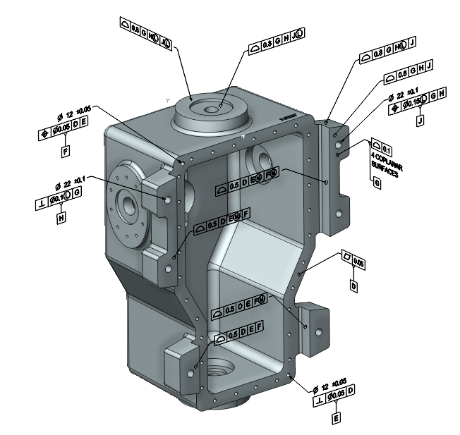
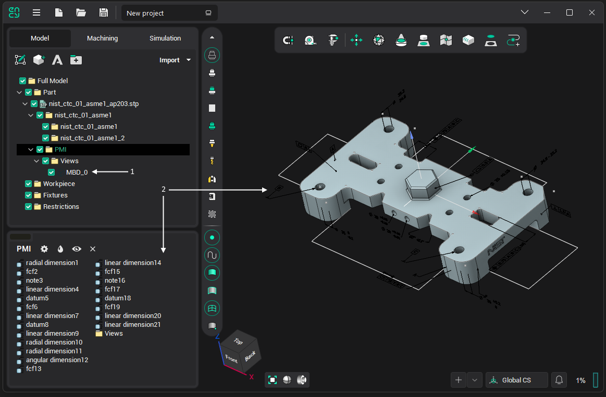
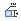

# PMI

 PMI （Product and manufacturing information） 製品および製造に関する情報。とは、特定の3Dモデル要素に関連するさまざまな寸法と注記を指します。

PMIはモデルと共にインポートされ、モデルフォルダ内に保存されます。

[幾何モデル構成ウィンドウ](718.md) では、PMIは以下のオブジェクトとして表現されます。

1. <strong>ビュー</strong> 
2. <strong>PMIノード</strong> 

いくつかの <strong>PMIノード</strong> は3Dモデルオブジェクトにと関連付け（接続）されています。 <strong>PMIノード</strong>を選択すると、それらのノードもハイライトされます。

<strong>ビュー</strong> を選択すると、 <strong>ビュー</strong>の座標系に従ってモデルが回転します。 <strong>ビュー</strong>の表示/非表示を変更すると、関連付けされた <strong>PMIノード</strong> の表示状態も変更されます。

PMIインポートはStep, JT、 Prt(NX)形状に対応しています。
