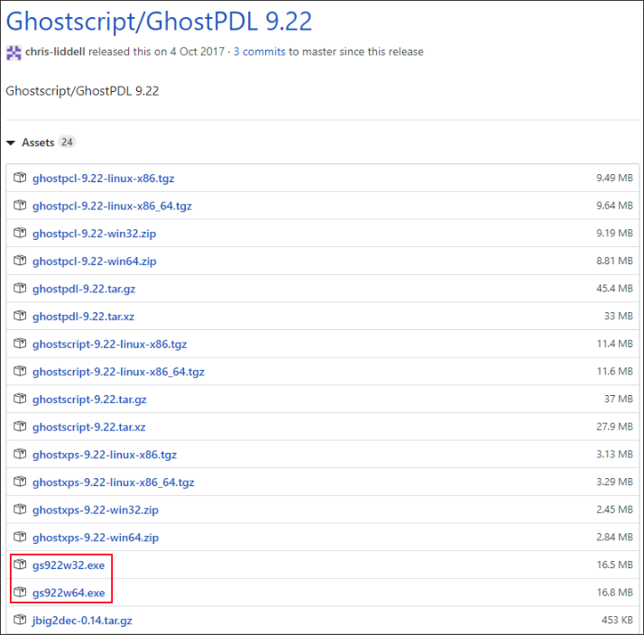
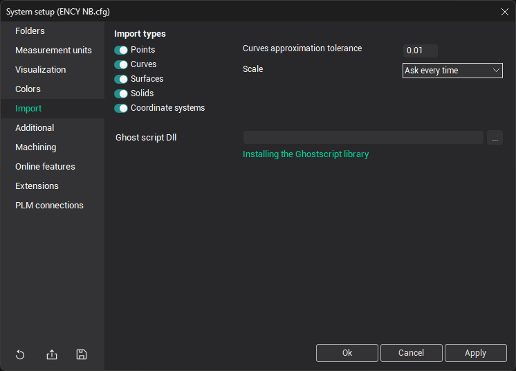

# Installing the GhostScript Library

Ghostscript software is required to import PostScript files. This library was developed by [Artifex Software, Inc.](https://www.ghostscript.com/index.html) and is not included in the CAM system distribution due to licensing restrictions. But you can download and install it for personal use.

CAM system supports the Ghostscript library of version not older than 9.22.

<strong>[Download Ghostscript 9.22](https://github.com/ArtifexSoftware/ghostpdl-downloads/releases/tag/gs922)</strong>

The GitHub repository window will open - select compatible windows version (64 bit):

<em><strong>Note:</strong> You must select - Ghostsript 64 bit.</em>

After installation, you must specify the path to the library: gsdll32.dll or gsdll64.dll (32 or 64 bit). It is located in the directory where you installed the software Ghostscript, in the bin folder. This can be done either by using the <strong>System setup</strong> tab <strong>Import</strong>:

