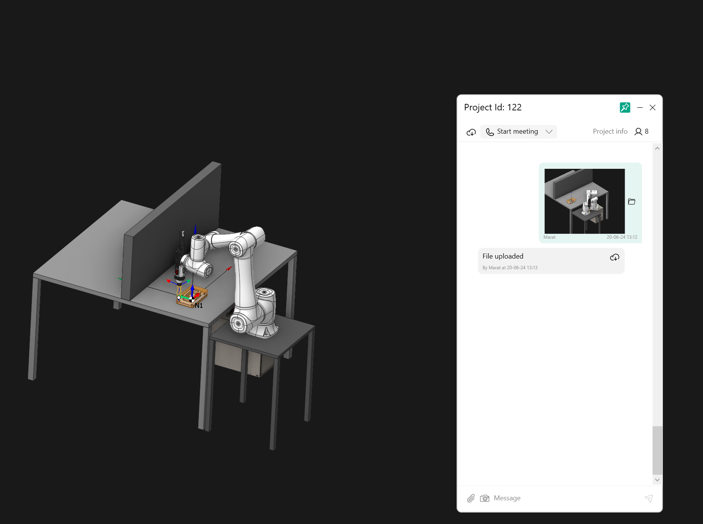
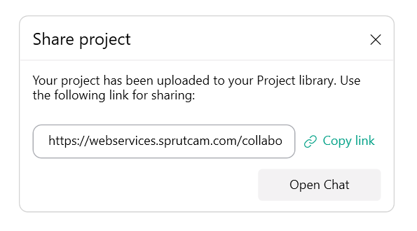
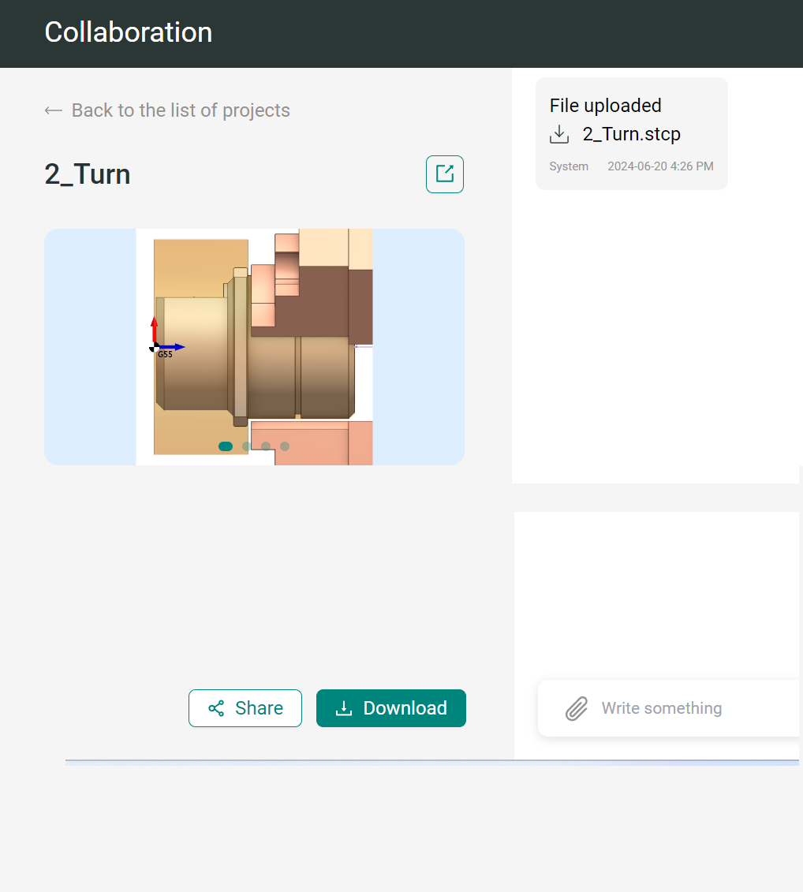
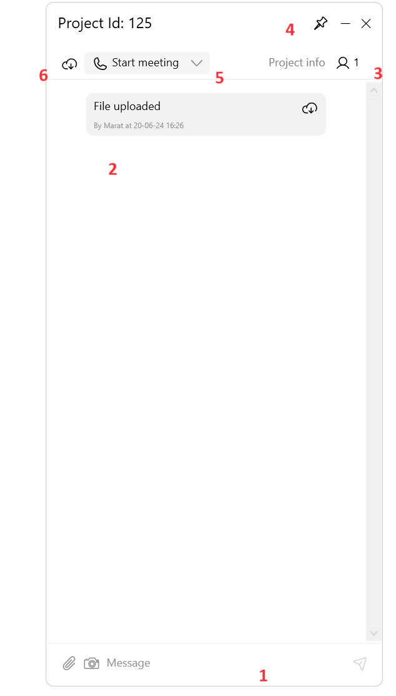
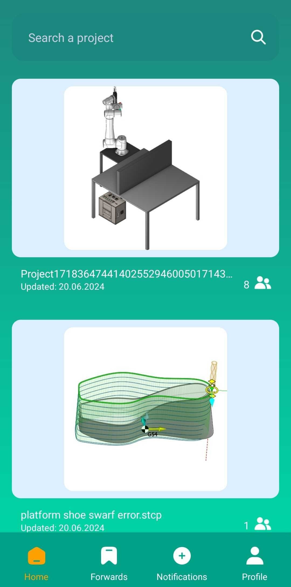

# Work with a team in the cloud

## Application area:

Working with a team in the cloud, emphasizing the chat, shared project access, and cross-device compatibility. Imagine a workspace where distance is irrelevant. Where teams, geographically dispersed or simply in different rooms, can seamlessly collaborate on projects, share ideas in real time, and stay connected no matter where they are. This is the power of cloud-based collaboration.

## The peculiarities of working with a team in the cloud:

<strong>1.Shared you project.</strong> When you open a project, you can see a tick in its name to share your project with another person.

You'll be presented with a window to share your project. Send the link to your team

This link will grant your team access to a downloadable file on our website. The file provides information on the processing technology, and they can access it after authentication

<strong>2. Discuss things, share screenshots and videos, and work together to get things done.</strong>

The system supports data sharing through chat. Explore the various features available to optimize your workflow:

1. The chat supports the sharing of a wide variety of data, from project files to images and videos.
2. The chat history feature allows you to easily reference past discussions and stay informed about previous conversations.
3. You have the ability to see who has access to your collaboration.
4. The chat window can be pinned to ensure it remains visible above all other windows.
5. You can give your conversation partner a call.
6. Saving your project to the cloud enables your team to access and view the intermediate results. This action is automatically executed when saving the project within the CAM system.

<strong>3.Maintain communication with others regardless of location through the use of this application.</strong>

