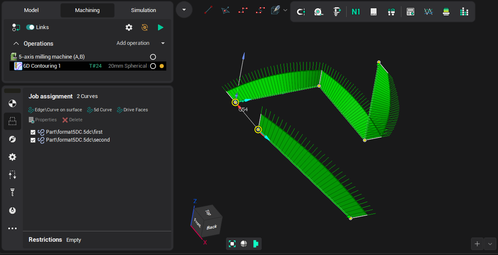
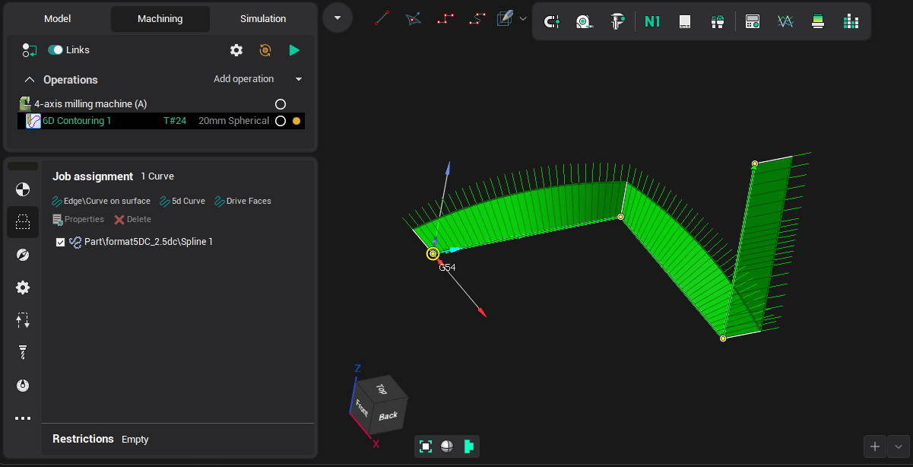

# Importing objects from 5DC files

**5DC** format allows loading a splines as a set of points(xyzijk). The main features:

- maintained only text format UTF-8 encoded
- allows to contain multiple splines: as a separator, use the symbol ";" (semicolon) on a new line. After the symbol, you can specify the name of the curve.
- minimum number of spline points(lines) should not be less than 2
- the first line of the file instead of dots may contain settings

If the first line of the file does not contain any settings, then for each line including the first one:

- coordinate numbers are separated by a space
- point is provided as 6 numbers: "X Y Z NX NY NZ", when (X,Y,Z) - coordinates of a point, (NX,NY,NZ) - normal vector

If the first line of the file contains the settings, then for each line except the first one:

- the number of coordinates is separated by the separator specified in the settings line
- the point is represented as multiple numbers, according to the format specified in the settings line

If the settings line is set, it must contain three mandatory parameters and may contain six optional parameters. The parameters should be separated by a space.

Mandatory parameters:

- Point number format:

|   | Format | Description | Number of points in a line |
|---|---|---|---|
| 1 | tffNormalVector | Coordinates of the point and normal | 6 |
| 2 | tffQuaternion | Coordinates of the point and quaternion X Y Z W | 7 |
| 3 | tffEulerXYZ | Coordinates of the point and Euler angles Rx Ry Rz with rotations around the movable axes | 6 |
| 4 | tffEulerXZY | Coordinates of the point and Euler angles Rx Rz Ry with rotations around the movable axes | 6 |
| 5 | tffEulerYXZ | Coordinates of the point and Euler angles Ry Rx Rz with rotations around the movable axes | 6 |
| 6 | tffEulerYZX | Coordinates of the point and Euler angles Ry Rz Rx with rotations around the movable axes | 6 |
| 7 | tffEulerZXY | Coordinates of the point and Euler angles Rz Rx Ry with rotations around the movable axes | 6 |
| 8 | tffEulerZYX | Coordinates of the point and Euler angles Rz Ry Rx with rotations around the movable axes | 6 |
| 9 | tffEulerXYX | Coordinates of the point and Euler angles Rx Ry Rx with rotations around the movable axes | 6 |
| 10 | tffEulerXZX | Coordinates of the point and Euler angles Rx Rz Rx with rotations around the movable axes | 6 |
| 11 | tffEulerYXY | Coordinates of the point and Euler angles Ry Rx Ry with rotations around the movable axes | 6 |
| 12 | tffEulerYZY | Coordinates of the point and Euler angles Ry Rz Ry with rotations around the movable axes | 6 |
| 13 | tffEulerZXZ | Coordinates of the point and Euler angles Rz Rx Rz with rotations around the movable axes | 6 |
| 14 | tffEulerZYZ | Coordinates of the point and Euler angles Rz Ry Rz with rotations around the movable axes | 6 |
| 15 | tffFixedABC | Coordinates of the point and Euler angles Rx Ry Rz without rotations around the movable axes | 6 |
| 16 | tffFixedXZY | Coordinates of the point and Euler angles Rx Rz Ry without rotations around the movable axes | 6 |
| 17 | tffFixedYXZ | Coordinates of the point and Euler angles Ry Rx Rz without rotations around the movable axes | 6 |
| 18 | tffFixedYZX | Coordinates of the point and Euler angles Ry Rz Rx without rotations around the movable axes | 6 |
| 19 | tffFixedZXY | Coordinates of the point and Euler angles Rz Rx Ry without rotations around the movable axes | 6 |
| 20 | tffFixedZYX | Coordinates of the point and Euler angles Rz Ry Rx without rotations around the movable axes | 6 |
| 21 | tffFixedXYX | Coordinates of the point and Euler angles Rx Ry Rx without rotations around the movable axes | 6 |
| 22 | tffFixedXZX | Coordinates of the point and Euler angles Rx Rz Rx without rotations around the movable axes | 6 |
| 23 | tffFixedYXY | Coordinates of the point and Euler angles Ry Rx Ry without rotations around the movable axes | 6 |
| 24 | tffFixedYZY | Coordinates of the point and Euler angles Ry Rz Ry without rotations around the movable axes | 6 |
| 25 | tffFixedZXZ | Coordinates of the point and Euler angles Rz Rx Rz without rotations around the movable axes | 6 |
| 26 | tffFixedZYZ | Coordinates of the point and Euler angles Rz Ry Rz without rotations around the movable axes | 6 |
| 27 | tffTwoAngAB | Coordinates of the point and two angels AB | 5 |
| 28 | tffTwoAngAC | Coordinates of the point and two angels AC | 5 |
| 29 | tffTwoAngBA | Coordinates of the point and two angels BA | 5 |
| 30 | tffTwoAngBC | Coordinates of the point and two angels BC | 5 |
| 31 | tffAxisAngleRad | Coordinates of the point and axis-angle in radians | 6 |
| 32 | tffAxisAngleDeg | Coordinates of the point and axis-angle in degrees | 6 |

- The angles are specified in degrees: True (degrees)/False (radians). Relevant for the formats in paragraphs 3-30.
- Separator-Always one character.

Optional parameters (additional transformation):

- Transformation along the X-axis. X=N, where N is offset value
- Transformation along the Y-axis. Y=N, where N is offset value
- Transformation along the Z-axis. Z=N, where N is offset value
- Rotation to a A-angle. A=N, where N - rotation angle value
- Rotation to a B-angle. B=N, where N - rotation angle value
- Rotation to a C-angle. C=N, where N - rotation angle value

Example of a file that does not contain settings line:

```
                    format5DC.5dc
; first
0.000000 0.000000 0.000000 -1.000000 0.000000 0.000000
0.000000 50.000000 0.000000 0.000000 0.000000 1.000000
50.000000 50.000000 0.000000 0.000000 1.000000 0.000000
50.000000 50.000000 50.000000 1.000000 0.000000 0.000000
; second
25.000000 0.000000 0.000000 0.000000 0.000000 1.000000
50.000000 50.000000 -50.000000 0.000000 1.000000 0.000000
```

The result of adding a curves in <strong>Job assignment</strong> by the button in [5D Contouring](10129.md) operation is shown on the following image:



Example file, with settings line:

```
                    format5DC_2.5dc
tffEulerXYZ true , A=0.00 B=0.00 C=0.00
0.000,0.000,0.000,0.000,-90.000,0.000
0.000,50.000,0.000,0.000,0.000,90.000
50.000,50.000,0.000,-90.000,0,0.000
50.000,50.000,50.000,-90.000,0,0.000
```

The result of adding such a curve in <strong>Job assignment</strong> by the button in [5D Contouring](10129.md) operation is shown on the following image:


