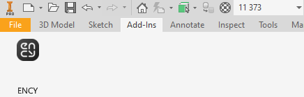
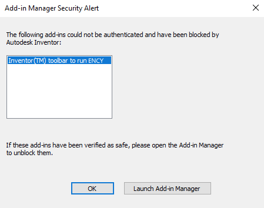
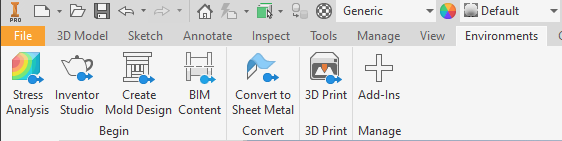
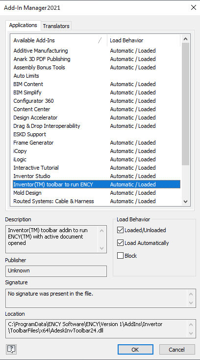

# Autodesk Inventor™ toolbar & import addin

The toolbar allows you to export geometric data from Autodesk Inventor Professional™. You can view the version of the supported CAD system. [Details](10039.md)

The addin allows you to import <strong>Autodesk Inventor Professional™</strong> project files.

Supported file extensions: IAM, IDW, IPT, IPN, IDE, PRT, ASM, SAT, STE, STEP, DWG, DXF, IGES, IGS.

The required application (<strong>Autodesk Inventor Professional™</strong>) must be installed on your computer for this option to work.

<strong>Autodesk Inventor Professional™2021</strong> may have problems installing the toolbar:

If at startup the following window appears:

you must manually enable the toolbar in <strong>Autodesk Inventor Professional™2021</strong>. To do this, start the Add-in Manager in this window, or find the button on the ribbon panel:

In the window that opens, you need to find the CAM system toolbar and set the parameters as shown in the following screenshot:

Then the CAM system toolbar should appear on the ribbon panel.
