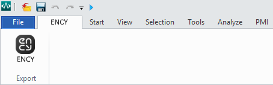

# CADbro™ toolbar

The toolbar allows you to export geometric data from <strong>CADBro™</strong>. You can view the version of the supported CAD system. [Details](10039.md)

The required application (CADbro ™) must be installed on your computer for the correct work of this option.
