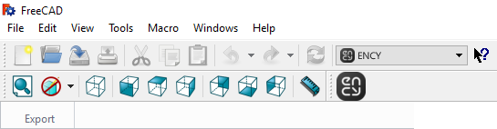

# FreeCAD™ toolbar & import addin

The toolbar allows you to export geometric data from FreeCAD™. You can view the version of the supported CAD system. [Details](10039.md)

The addin allows you to import <strong>FreeCAD™</strong> project files.

Supported file extensions: FCSTD, BREP, BRP, DAT, SVG, SVGZ, UNV, MED, BDF, IFC, IV, AST, BMS, OBJ, OFF, PLY, OCA, GCAD, CSG, ASC, POV, INC. The required application (FreeCAD™) must be installed on your computer for this option to work.
