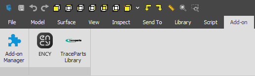

# Alibre Design™ toolbar & import addin

The toolbar allows you to export geometric data from Alibre Design™. You can view the version of the supported CAD system. [Details](10039.md)

The addin allows you to import <strong>Alibre</strong> <strong>Design™</strong> project files.

Supported file extensions: AD_PRT, AD_ASM, AD_SMP. The required application (Alibre Design™) must be installed on your computer for this option to work.
