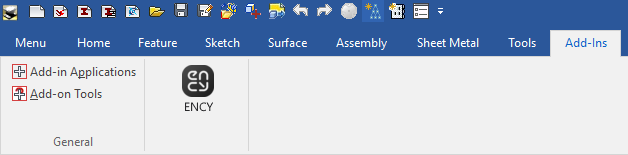
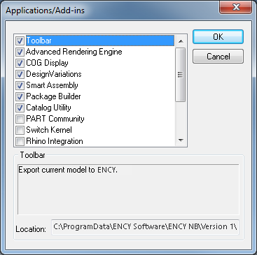

# IronCAD™ toolbar

The toolbar allows you to export geometric data from IronCAD™. You can view the version of the supported CAD system. [Details](10039.md)

Once installed, the toolbar may not appear in IronCAD™. Then you need to press

in the dialog box to activate it:

Supported file extensions: ICS, IC3D, ICSW, ICD, EXB. The required application (IronCAD™) must be installed on your computer for this option to work.
