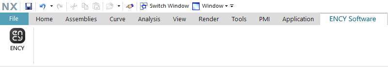

# NX™ toolbar & import addin

The toolbar allows you to export geometric data from <strong>NX™</strong>. You can view the version of the supported CAD system. [Details](10039.md)

The addin allows you to import <strong><strong>NX™</strong></strong> project files.

Supported file extensions: PRT. The required application (NX™) must be installed on your computer for this option to work.
