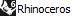
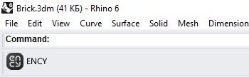

# Rhinoceros toolbar & import addin

The toolbar allows you to export geometric data from Rhinoceros™. You can view the version of the supported CAD system. [Details](10039.md)

The addin allows you to import <strong>Rhinoceros™</strong> project files.

Supported file extensions: 3DM, RWS, 3DS, STP, STEP, RAW, WRL, VRML, AI, EPS, LWO, SPL, VDA, DWG, DXF, DGN, SLDPRT, SLDASM. The required application (<strong>Rhinoceros™</strong>) must be installed on your computer for this option to work. The <strong>Rhinoceros™</strong> application must be running and closed at least once in order for the data to be recorded in the registry. Otherwise, the toolbar will not be able to install.
