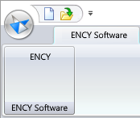

# SolidEdge™ toolbar & import addin

The toolbar allows you to export geometric data from SolidEdge™. You can view the version of the supported CAD system. [Details](10039.md)

The addin allows you to import <strong>SolidEdge™</strong> project files.

Supported file extensions: ASM, DFT, PAR, PSM, MDS, PWD, DGN, DXF, DWG, PRT, SAT, STP, STEP, X_B, X_T.

The required application (SolidEdge™) must be installed on your computer for this option to work.
