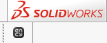

# SOLIDWORKS™ toolbar & import addin

The toolbar allows you to export geometric data from SOLIDWORKS™. You can view the version of the supported CAD system. [Details](10039.md)

The addin allows you to import project files SOLIDWORKS™.

Supported file extensions: SLDASM, ASM, SLDPRT, PRT, SLDDRW, DRW, X_B, X_T, STP, STEP. Starting in July 2026, a separate license will be required to use the SolidWorks module (see [Changes to ENCY–SOLIDWORKS Integration Licensing – ENCY CAD/CAM software](https://encycam.com/news/ency-solidworks-integration-licensing/)), The required application (SOLIDWORKS™) must be installed on your computer for the correct work of this option.
