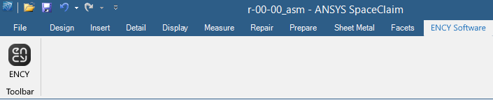

# SpaceClaim™ toolbar & import addin

The toolbar allows you to export geometric data from SpaceClaim™. You can view the version of the supported CAD system. [Details](10039.md)

The addin allows you to import <strong>SpaceClaim™</strong> project files.

Supported file extensions: SLDASM, ASM, SLDPRT, PRT, SLDDRW, DRW, X_B, X_T, STP, STEP. The required application (SpaceClaim™) must be installed on your computer for the correct work of this option.
