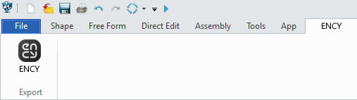

# ZW3D™ toolbar & import addin

The toolbar allows you to export geometric data from ZW3D™. You can view the version of the supported CAD system. [Details](10039.md)

The addin allows you to import ZW3D™ project files.

Supported file extensions: Z3. The required application (ZW3D™) must be installed on your computer for this option to work.
