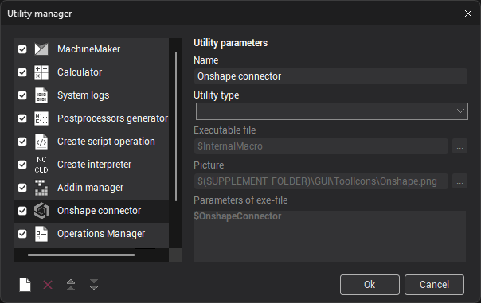
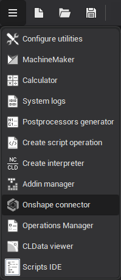

# Onshape™ connector

<strong>Onshape™</strong> is a new generation of full-cloud CAD designed specifically for modern agile design teams. You can view the version of the supported CAD system. [Details](10039.md)

To use the <strong>Onshape connector plugin</strong>, it must first be enabled in the <strong>Configure utilities</strong> window.

Once enabled, the plugin can be launched by clicking the <strong>Onshape</strong> icon on the toolbar.

After signing into your Onshape account, the plugin will display a list of available models. Selecting a model from this list will initiate the import process. If the imported model is later updated in Onshape, the connector plugin will prompt you to reimport the model. The <strong>Onshape connector plugin</strong> maintains model [associativity](10057.md), ensuring updates are reflected in your workspace.
