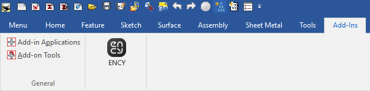

# CAXA 3D™ toolbar

The toolbar allows you to export geometric data from <strong>CAXA 3D™</strong> to CAM system. You can view the version of the supported CAD system. [Details](10039.md)

Once installed, the toolbar may not appear in <strong>CAXA 3D™</strong>. Then you need to press

in the dialog box to activate it:

Supported file extensions: ICS, IC3D, ICSW, EXB. The required application (<strong>CAXA 3D™</strong>) must be installed on your computer for this option to work.
