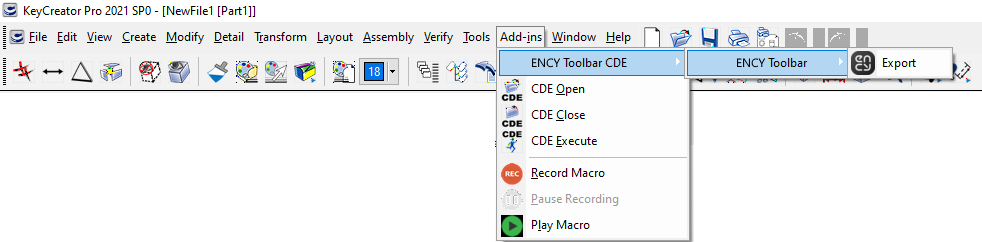

# KeyCreator™ toolbar

The toolbar allows you to export geometric data from <strong>KeyCreator™</strong>. You can view the version of the supported CAD system. [Details](10039.md)

Supported file extensions: CKD. The required application (<strong>KeyCreator</strong><strong>™</strong>) must be installed on your computer for this option to work.
