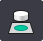
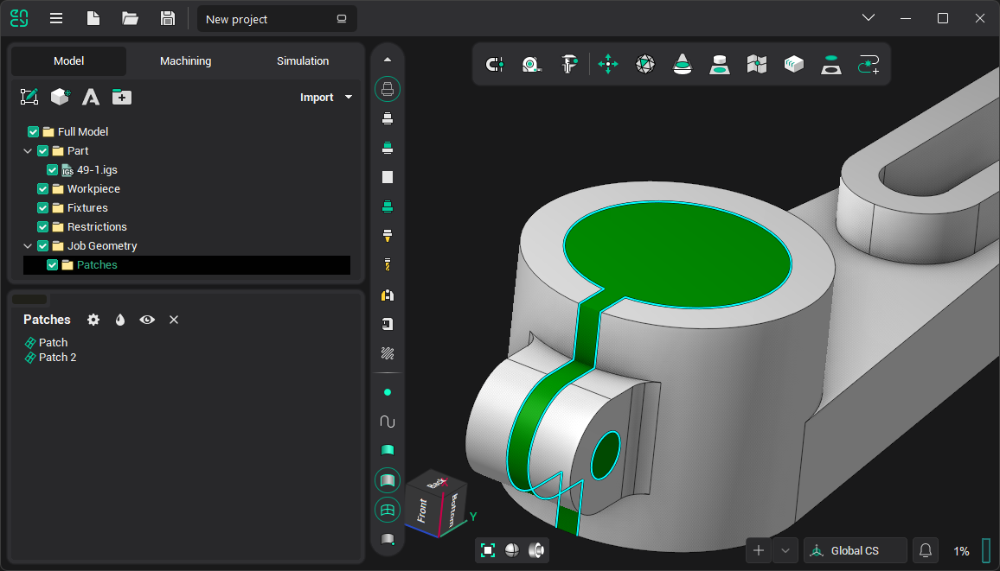
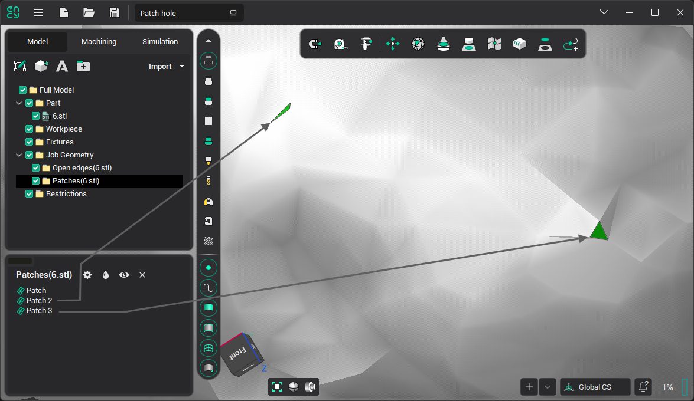

# Patch hole

The patching holes function allows you to generate triangulation of the selected edges or meshes. This function is called by pressing this button - , on the "Model" page. By default, the button is not active. To activate it, you need to select edges or meshes for which you want to patch the holes in the graphics window or in the model tree.

The work of the function for edges and meshes is different:

1. <strong>Edges</strong>. First, closed and open edges are determined. For closed ones, triangulation is generated immediately. And based on all the other edges a closed one is formed, for which triangulation is also generated. 
2. <strong>Meshes</strong>. In meshes, first, a topology check is performed. If open edges were found, then closed contours are formed. Then triangulation is generated for all contours. Unlike the first option, here, in addition to new meshes, the closed contours along which the triangulation was generated are added to the model tree. 
