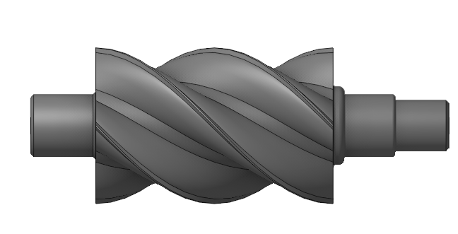
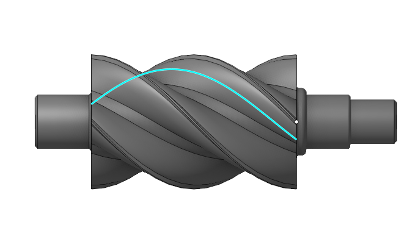
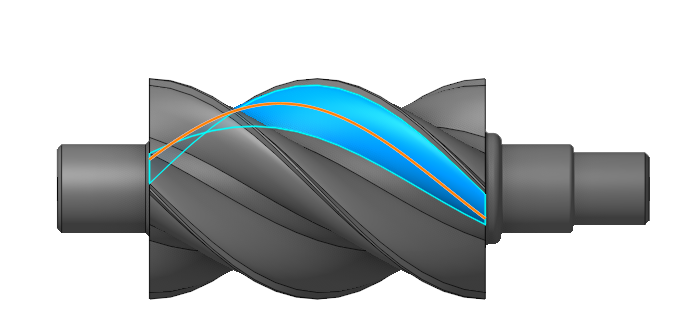
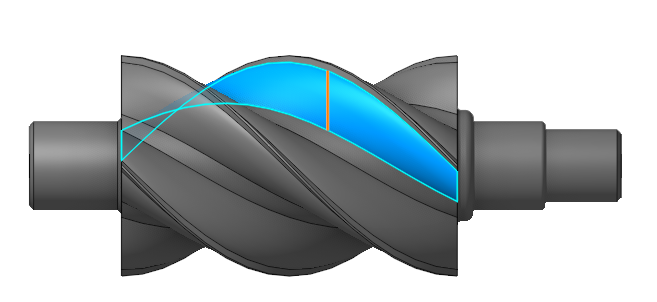
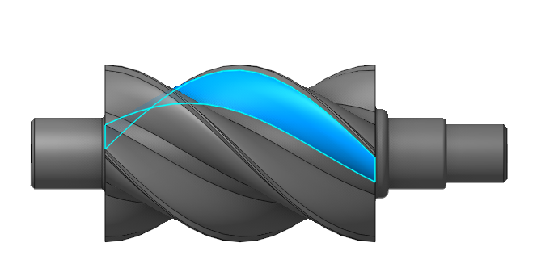
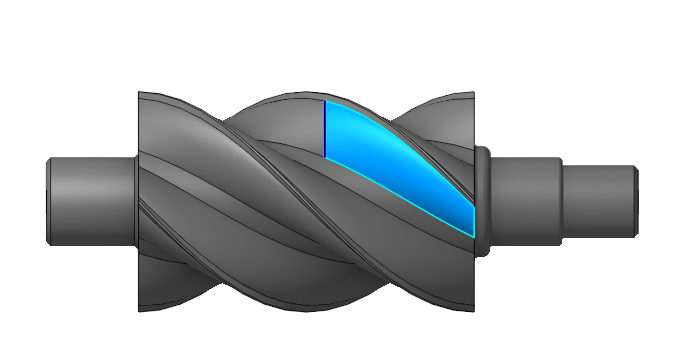
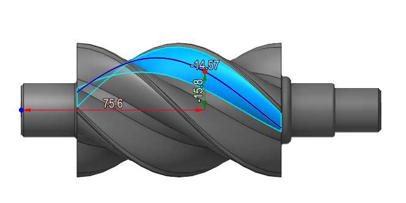
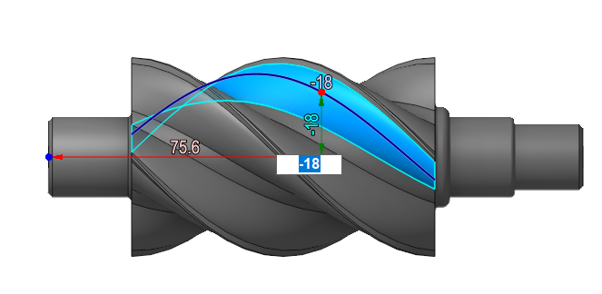

# Extract isolines

 

## Application area:

The Extract Isolines tool extracts isolines from a surface. It activates after selecting a face on the <strong>Model tab</strong>. The editing panel lets you create a spline, change the isoline direction, or split the face. Use the <strong>Measure tool</strong> for precise spline positioning.

-  to form a spline from the isoline.

 

-  to change a isoline direction.

 

-  split one face into two, with or without preserving the common (not split) face

 

- Use the <strong>Measure tool</strong> to accurately define a spline. You can move the point to any location on the part to bind it to a specific position. Once the endpoint is anchored, you can modify the spline's position.

.

 
