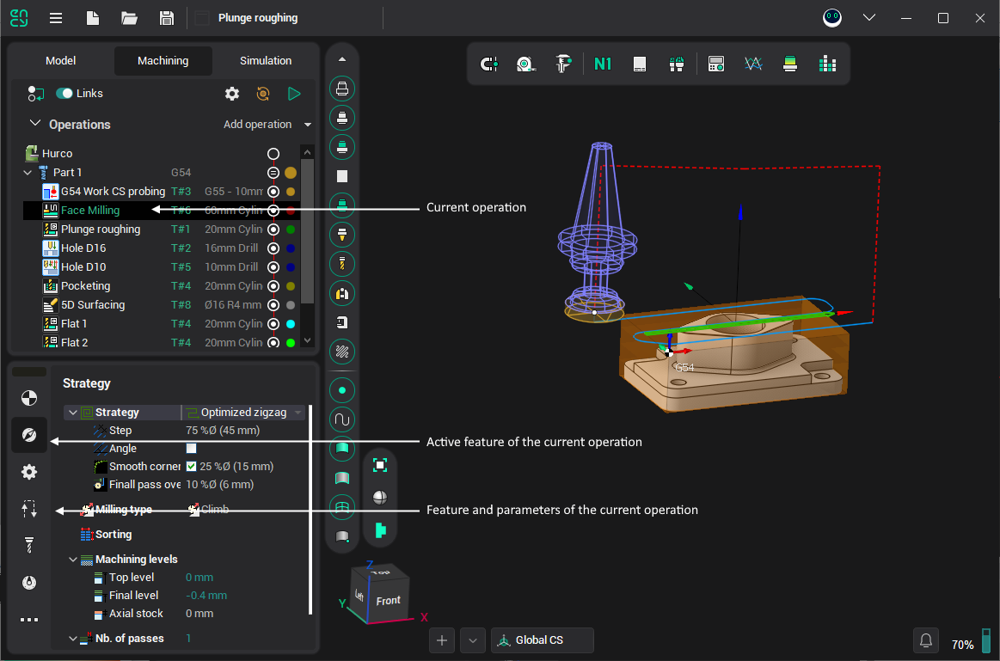

# Operations setup

The parameters of an operation define what is to be machined and the way it is to be machined. Selecting a parameter node inside the operation tree changes the bottom side of the tab to display the tools used to define and edit the parameter properties.

