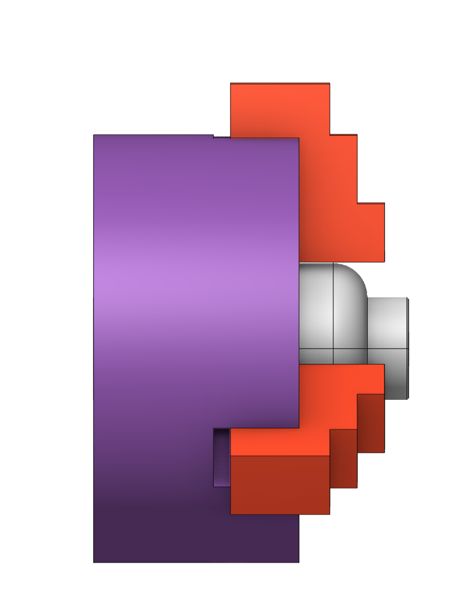
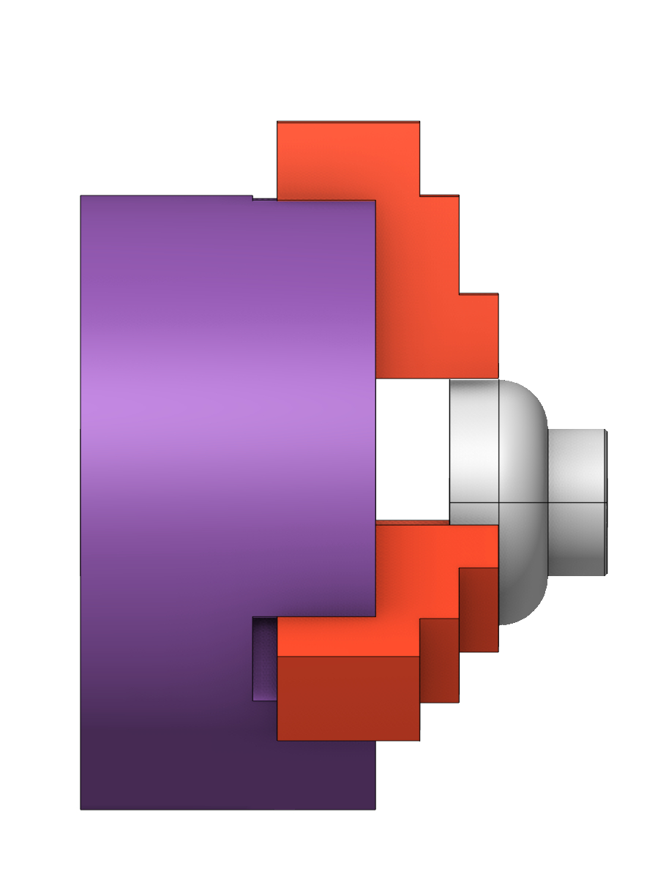

# Positioning of part at machine (Workpiece setup)

 

## Application area:

The position of the part at the machine is determined by the Workpiece Setup parameter in the Setup panel ([Details](1022.md)).

## Principles of working with a window.

To change the workpiece setup just click on the ellipses button next to the parameter. The workpiece setup dialog should appear.

In this dialog you can set the Geometry CS of the workpiece and the additional workpiece transformations composed of the translation along the machine X, Y, Z axes and the rotation around the same machine axes.

The Geometry CS determines the initial setup: the workpiece is attached to the workpiece connector in such a way the Geometry CS of the workpiece coincides with the joint LCS of the workpiece connector determined by the <strong>Machine CS</strong> parameter.

The Offset option is used to shift the workpiece along the XYZ axes.

The Rotation option is used to rotate the workpiece around the XYZ axes. The way of rotations depend on machine schema settings.

The most easiest way to change the workpiece location is to use the mouse wheel to change the values of the Translate and Rotate boxes. The workpiece position is immediately updated in the graphic view after each parameter change.

Another convenient way is to interactively drag and drop a workpiece in the graphics window. Grab the highlighted anchor points and drag or rotate in the desired direction until you reach the desired position. Or click on the square on the desired side to put the workpiece with this side on the table (machine connector's up side).
