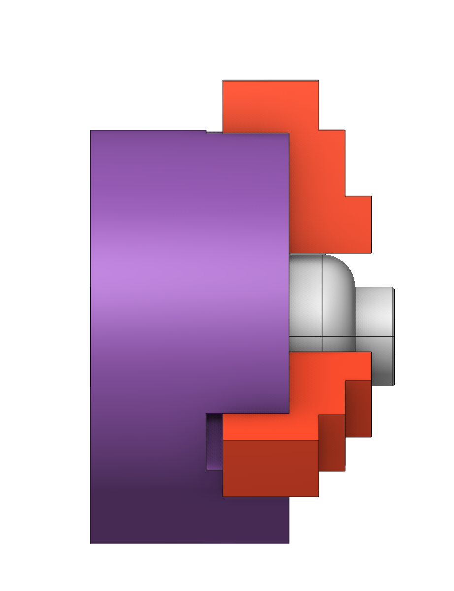
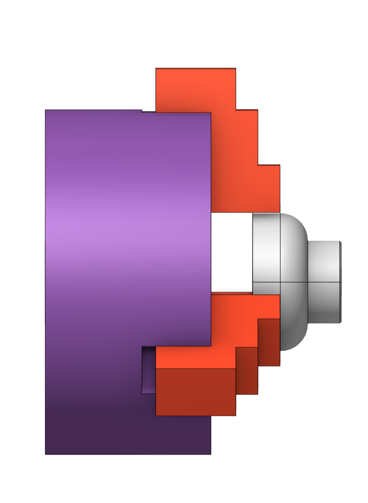

# マシンでのパーツの位置決め（ワークセットアップ）

 

## 適用分野：

機械上でのパーツの位置は、[セットアップ]パネルのワークセットアップパラメータ（[詳細を見る](1022.md)）によって決定されます。

## ウィンドウ操作の基本原則

パラメータの横の省略記号（…）ボタンをクリックすると、<strong>ワークセットアップ</strong>ダイアログが表示されます。

このダイアログでは、ワークの<strong>図形座標系</strong>と、機械X、Y、Z軸に沿った平行移動と同じ機械軸を中心とした回転で構成されるワークの追加変換を設定することができます。

<strong>図形座標系</strong>は初期設定を決定します。ワークは、ワークコネクタのジョイントローカル座標系が、<strong>Machine CS</strong>（マシン座標系）パラメータで定義された位置において、ワークの図形座標系と一致するように取り付けられます。

オフセットオプションは、ワークをXYZ軸方向に移動させるために使用します。

回転オプションは、ワークをXYZ軸周りに回転させるために使用します。回転の方法は、機械のスキーマ設定によります。

ワークの位置を変更する最も簡単な方法は、マウスホイールを使って「移動」および「回転」ボックスの値を変更することです。各パラメータ変更後、ワーク位置はグラフィックビューで即座に更新されます。

別の方法として、グラフィックスウィンドウ内でワークを直接ドラッグ＆ドロップして配置することが可能です。ハイライトされたアンカー点をつかみ、希望の位置に達するまでドラッグするか、希望の方向に回転してください。または、希望する側の四角をクリックし、この側をテーブル（マシンコネクタの上側）にしてワークを置いてください。
