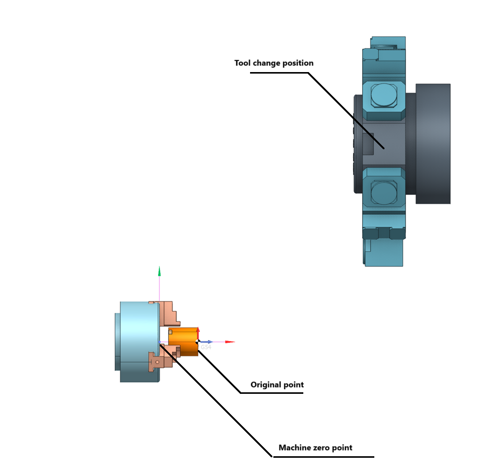
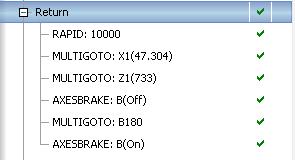
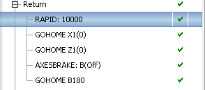
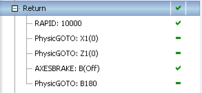
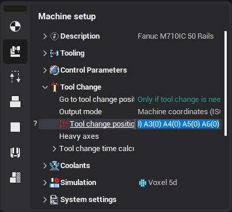

# Tool change position


## Application Area:

Tool change position is the machine position in which tool changing is performed. In CAM system you can specify a default tool change position for a whole job list and override this setting in individual operations as you need. The tool change position is specified under the Approach/Return section in the operation Setup panel. Defining a tool change position is not obligatory. If you not define a tool change position, then in the Simulation mode tool changing is not simulated. A tool is just appearing in the beginning of an actual operation and disappearing in the end of an operation. This setting is usually used for conventional 3 axis milling when there is no risk to damage a machine or a part while tool interchanging. However for complex machines like five axis milling centers and mill-turn machines specifying a valid tool change position is crucial for safe and time-efficient machining.

A tool change position is defined as a set of machine coordinates (e.g. at the above picture X1(0) Y1(0) Z1(0)...) in the machine coordinate system (G53). Those coordinates are the physical coordinates, not the coordinates of the tool tip in the workpiece coordinate system. So for a mill-turn machine those coordinates are the coordinates of the turret head center point.



For an actual operation you can select a tool change position from the list of the following options

1. From the previous operation - the tool change position is inherited from the previous operation.

2. From machine - the tool change position is inherited from the position specified under the machine node.

3. Custom. If you select this item, a tool change position dialog appears.

The tool change position dialog is used to define a tool change position as well as the tool change behavior for an actual operation in an interactive mode. Here you can set:

1. Mode (way of assignment) (Avoid colision, Short, From root, From the previous operation and Custom).

2. Using of tool change position.

- Auto (go to position for the tool change). If this option is selected the tool change position is used only when two neighboring operations use different tools with different tool numbers. If two neighboring operations use the same tool then no NC code is generated for the tool change, the second operation just starts machining in the last point of the preceding operation. This is the default behavior.
- Use anyway. When the option is selected, a tool unconditionally goes to the tool change position in the end of the operation.
- Do not use. The tool does not go to the tool change position in the end of machining.

3. Tool change output mode.

- Tool Tip coordinates. CAM system generates the tool change movements using regular GOTO and MULTIGOTO commands, representing the coordinates of the tool tip in the workpiece coordinate system.



- Reference point (ISO G28). When selected the option forces CAM system to generate the GOHOME commands for the tool change positioning. The GOHOME commands represent coordinates in the machine coordinate system and can be used in the postprocessor to generate "Go to reference point" commands (ISO G28).



- Machine coordinates (ISO G53). When selected the option forces CAM system to generate the PhysicGOTO commands for the tool change positioning. The PhysicGOTO commands represent coordinates in the machine coordinate system and can be used in the postprocessor to generate "Go to machine coordinate" commands (ISO G53).



4. Coordinates of the tool change position.

The coordinates are specified in the list. To define a tool change position you should check the boxes near the appropriate axes and set the values for the axes. You can set the axes coordinates both in the machine (G53) and the workpiece (G54) coordinate systems. The result is displayed on the screen. A convenient way to define a tool change position is to use the mouse wheel to change axes coordinates while looking at the result in the graphic view.

The default tool change position can be specified in the machine parameters panel



and in a machine configuration file under the **ToolChangeMachineState** tag.

```
<SCType ID="TMyMachine" type="AbstractMachine" Enabled="true">
```

`SimulateToolChange DefaultValue="true"/`

`ToolChangeMachineState DefaultValue="X1(0) Y1(0) Z1(0) B180 A0 X2(0) Z2(0)"/`

`/SCType`
