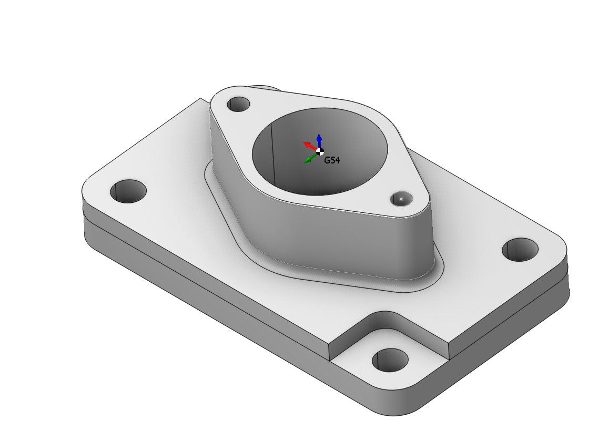
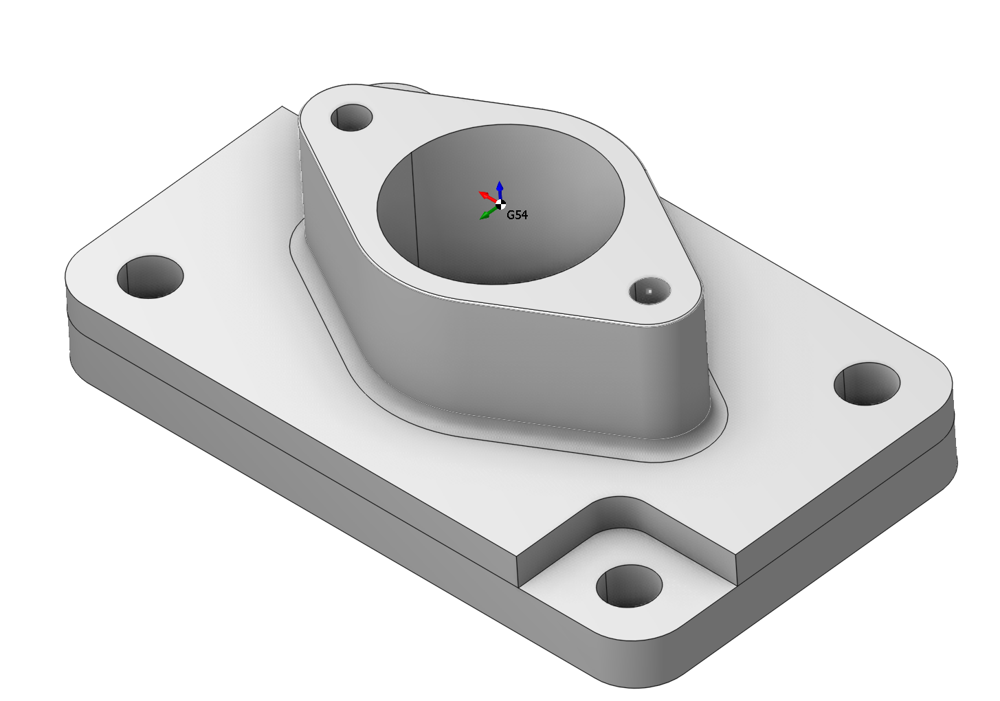
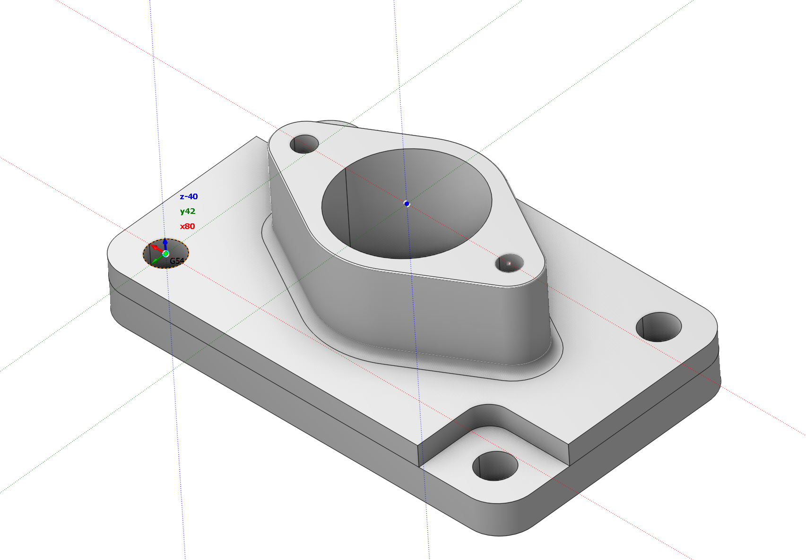

# Workpiece coordinate system (G54 - G59)

## Application area:

Workpiece coordinate system (WCS, G54 – G59) defines the NC-program "zero" on the workpiece. You can always see the Workpiece CS on the screen while working in the Technology and the Simulation modes.

## Principles of working with a window.

There are two ways you can define the Workpiece CS. You can select the Workpiece CS from the drop down list and you can set the Workpiece CS in the interactive mode by clicking on the ellipses button.

The drop down list contains the following options.

1. Off - the workpiece coordinate system is disabled. It means the workpiece zero coincides with the machine zero point G53.

2. From previous - the workpiece coordinate system is taken from the previous operation.

3. The list of geometrical [coordinate systems](753.md) of the project. You can use a geometrical coordinate system as the workpiece coordinate system. In this case only the origin of the geometrical coordinate system is used, the axes orientation of a geometrical coordinate system play no role for the Workpiece CS definition.

You can specify the WCS in the interactive mode by clicking on the ellipses button next to the WCS parameter.

In the interactive mode you can change the position of the WCS origin in the graphic view using the standard <strong>drag&drop</strong> technique. Just hover the mouse pointer over the WCS on the screen. It should become highlighted. Than click on it with the left button to start dragging. After that you can change the location of the coordinate system by snapping either to the part or to the workpiece geometry. In the interactive mode you can also change the WCS number (54-59 etc.).

 

Note that CAM modifies operation header CLData according to your changes. The `ORIGIN G54` command is added to the header in the example:

