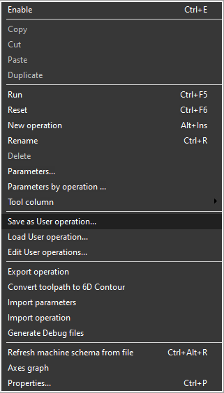
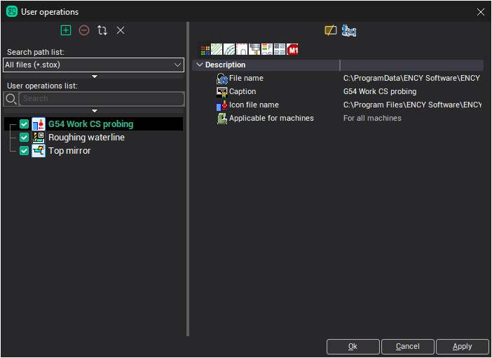
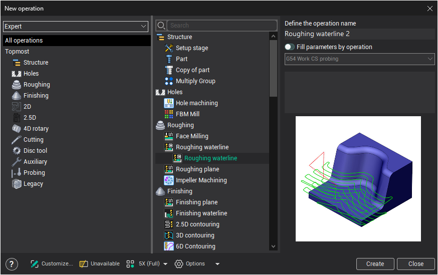
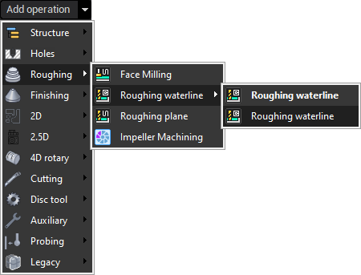

# User operations

Every technological operation of CAM system have the rich parameters' kit, which allow you to build flexible machining strategy for the complex technological processes for the exact parts. After creation the operation already has some predefined parameters values – it is so called "system default parameters". So the operation is ready for toolpath calculation.

Developing of technology process generally includes the following steps:

- Determining machining strategy for a specific element of a part.
- Determining operation which is able to implement the proper strategy.
- Creating operation and specifying the machined part's element as it's job assignment.
- Calculating toolpath.
- Analyzing toolpath.
- Modifying technological parameters of the operation to achieve better results.
- The latter three steps should be repeated until the desired result will reached.

To provide universal and versatile approach CAM system operations have a lot of parameters. Therefore the process of the operation customizing may take a long time and significant effort. CAM system provide the **User operations** feature to reduce the required time to design operations. It allows to specialize the universal CAM system's operations

After setting up the operation for specific purposes it is possible to save it's parameters set under the certain name to the external *.stox file. When processing the next similar element possible to download this set of parameters and, thereby, greatly reduce the time for setting up the operation. As a user operation can be saved not only the individual operations but also several operations. For this purpose these operations are placed in the group and this group is saved as the user operation.

User operations can easily be imported to another computer by simply transferring *.stox files of the corresponding operations.

To save and load default parameters use the pop-up-menu of operations in the **List of technological operations** on the **Technology** tab.

After choosing the `Save as User operation...` item the current operation's parameters will be saved in special *.stox file independently from the current project and, so they can be used in other projects. Before saving the User operations window will open in which you can set some properties.

In the left part of the window there are the Search path list to search for files of user operations, the list of available user operations and the filter panel. Filter allows you to quickly find the operation by the location of the file, by the operation type, by the machine or simply by name.

To control the lists should use the buttons above them at the top left of the window.

-  Opens the folder selection dialog and allows you to add the selected folder to the list of paths intended to the search for the user operations' files (*.stox).
-  Removes the selected folder from the search path list. Physically the folder is not deleted.
-  Allows you to force restart the searching the user operation *.stox files in folders that are specified in the list of search paths.
-  Physically deletes the selected user operation file from the hard drive and exclude it from the list. The check box next to the name of the operation in the list allows you to turn off the visibility and accessibility of user operations without deleting the file.

From the right side of the window there is the properties inspector that displays parameters of the selected user operation grouped by tabs. The first tab  has the following basic parameters.

- **File name** - the full name of the *.stox file. Depending on where you save the file, the operation can be accessed by any user of this computer, or only the current user. By default, files are saved in a special folder for user operations available for all users. However, you can choose a completely arbitrary name and location to save the file, including the network location.
- **Caption** - name of the user operation, which will be displayed in a list and assigned by default when adding operation to technological process.
- **Icon file name** - image file name of any of the common image formats that will appear next to the name of operation.
- **Applicable for machines** - option allows you to limit the scope of operation and allows to make it inaccessible to add to the technological process, depending on the currently active machine. This option can be useful when working with multiple machines on single computer. When selecting **For all machines** item the operation will be available regardless of the selected machine. If the **For selected machines** item specified then a list of machines becomes available in which you can mark the machines for which the operation should be available.

The parameters are located on the other tabs may vary and depend on the particular type of operation. All of them are also available to allow you to easily edit values without changing the parameters of the source CAM system's operation from which this user operation was created.

Above the list of parameters are located a few buttons to control the display of these parameters.

-  allows you to hide / display the properties whose values coincide with the system default values for this type of operation. This makes it easier to distinguish between the important parameters that have been changed with respect to the source. In inspector values coinciding with the default values are displayed with gray color. In order to return the edited value of any field in the default state, you need to select the contents of the field and press the Delete key on your keyboard.
-  allows you to view and edit the formulas for the calculated parameters. Values for the parameters of operations can be defined not only with constants numbers and strings, but also with formulaic expressions. This allows you to make them dependent on other parameters and more flexibility to manage their behavior. Calculated fields are displayed in the inspector with green color. Expressions can use mathematical operations "+, -, *, /, ^, (, ), `,`", trigonometric functions, as well as links to other parameters. To add a link to another parameter into an expression you need to specify the parameter name in square brackets like this: [Length].

There are several ways to add an instance of a previously created user operation into technological process of the exact project.

In the [New operation window](91.md), select a previously created user operation.

The creation of user operation also available from the new operation pop-up next to the **New** button at the **Technology** tab.

Parameters from the user operation may be applied to the operation not only during its creation but also to the existing operation. Select the `Load from User operation...` menu item in the operation popup for this. The list of user operations will appear that is available for this type of cycle. When you select an item parameters of the selected user operation will be loaded into the current operation of CAM system.

