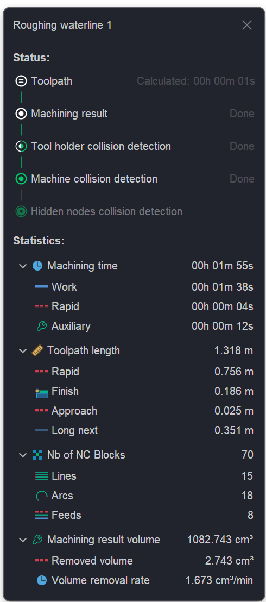

# Operation status panel

## Application area:

When clicking on the operation status icon inside technology tree next to the operation name then the status panel appears.

The <strong>Status panel</strong> is a mandatory element of the interface, designed to visualize the current status of technological operations execution.

It performs the following functions:

- displays the processing stages (toolpath calculation, machining result, collision detection);
- provides statistical data on tool movement time at different feed rates;
- allows viewing key metrics of the control program (Number of NC blocks for each node type).

You can refer to the following section for a more detailed description of <strong>operation statuses</strong>. [Details](1118119.md)
