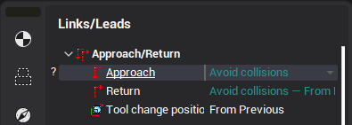
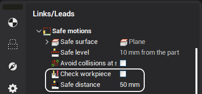
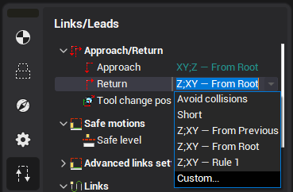

# Approach and return rules

The Approach and return rules define an additional tool approach/return path to/from the first/last machining point. When used together with the tool change position approach rule determines a tool path from a tool change position to the first machining point, while the return rule determines a tool path from the last machining point to a tool change position.

#### Defining approach/return rule of an operation

The approach/return rule is specified under the Approach/Return section in the operation <strong>Links/Leads</strong> inspector panel. The check box indicates whether or not the approach/return is automatically generated to <strong>avoid collisions</strong>.<strong><em>Collision avoidance</em></strong> - generate approach/return trajectory automatically with special algorithm, while avoiding machine collisions. Disable the checkbox to select this approach/return type. If this type is chosen you can additionally define "<em>Safe distance</em>" and "<em>Check workpiece</em>" parameters for the approach/return.

If the approach/return check box is <strong>enabled</strong>, this means that the rule is defined explicitly or has one of the listed below special types. The edit field shows the actual rule, computed according to the approach/return (hidden) type. To adjust the approach/return used by the operation you can just edit the command directly.

#### Approach/return definition types

The approach/return can have one of the following definition type. This type is hidden, and is shown only in the [Approach return rules editing form](10072.md).

<em><strong>Default rule</strong></em> - the approach/return for a newly created operation has this type. To reset the rule back to the default one clear the edit field and press **Enter**. The following factors which are considered during the actual rule computation of the default type (in decreasing priority): if the <strong>submachine</strong> is defined for the operation's workpiece holder/tool holder pair, then use the <strong>submachine approach/return</strong>. See [Submachine definition in the machine schemas](10410.md) for more info about the submachines. if the operation has the same workpiece holder and tool connector as the previous operation, then the approach/return is taken <strong>from the previous operation</strong>. otherwise use the rule from operation's <strong>setup stage</strong> or the rule defined in the first operation of operations tree (<strong>the machine</strong>), in case there are no setup stages or the operation is a setup stage itself.

2. <em><strong>Rule from the previous operation</strong>.</em>

3. <strong><em>Rule from root operation</em></strong> - use the rule, specified in the root of operations tree on 'Technology' tab (not the single rule defined in the machine, as in previous legacy CAM system).

4. <strong><em>Custom</em></strong> - the rule is defined explicitly as the list of commands.

5. <strong><em>Short</em></strong> - no additional points are added into toolpath. A tool moves from a tool change position to the first point of a machining toolpath directly by the shortest distance. If the machine is robot, then this movement is done using physic axes (PhysicGOTO).

6. <strong><em>Rule(s) from the machine approach/return list</em></strong> - operation can reference one of the items in the machine's [approach/return list](10073.md). Several approaches/returns can be specified in the machine under meaningful names. First, the name of the rule is displayed, then, in the round brackets, the rule's sequence of commands. More information about the list is available in the separate article.

#### Approach/return rules syntaxis

A <strong>Custom</strong> approach/return rule defines explicitly the outputted <strong>CLData</strong> in the "Approach" or "return" section of the toolpath. A single approach or return rule consists of several <em>commands</em>, which are separated by the <strong>semicolons</strong>. A <em>command</em> is defined by the <em>keyword</em>, which may be followed by the list of machine axis names and values (coordinates).

*Axes value list* is defined as a whitespace separated list of machine axis ids (or addresses) with optional exact positions of machine axes in the state which corresponds to the given *command*. The axis value can be specified in brackets or directly after the axis id. Examples of the axis value definitions:X100 Y(200) Z A1 A2(253.2) A3(100.4) A4 A5 A6

The following **command types** (*keywords*) are supported:**MultiGOTO** (or no command) + *Axes value list* - defines multi coordinate movement ("Multigoto" CLData node). **PhysicGOTO** (or **G53**) + *Axes value list* - defines movement in physical axes coordinates ("Physicgoto" CLData node). **GOTO** + *Axes value list* (must be "X", "Y" or "Z") - defines simple linear movement ("Goto" CLData node). **GOHOME** + *Axes value list* - movement to the "Tool change" position ("GOHOME" CLData node). Intended for use in the return rules only. **LCS** - multi purpose command. The common logic is that some machining mode is enabled in the particular place in the approach, and then disabled using the same command in the return. The outputted CLData depends on the operation parameters: If the [Operation local coordinate system](726.md) is enabled, then the LCS enable command ("Origin LCS: On") is outputted inside the approach, and the LCS disable (Origin LCS: Off) in the return. If the "Tool center point management" is enabled, then the TCPM mode enable command ("Interp 5axis: On") is outputted inside the approach, and the TCPM disable (Interp 5axis: Off) in the return. Note: "TCPM" mode can't be used simultaneously with the Local coordinate system. [Polar interpolation](10083.md) enable/disable [U-axis turning](10409.md) mode enable/disable **SLCS(**...**)** - used for **temporary** enabling of the "Local coordinate system" inside the approach or return. See the "Approach for the TCPM enabled operations" section below for more info about this feature.

###### Approach/return for the TCPM enabled operations using Local CS

The "Tool change point management" mode is commonly used in the 5 axis machining, but some problems arise when the machine kinematics and workpiece mounting do not match completely the real machine kinematics and part mounting. This will most likely cause a collision. The solution is to perform some machine movements, which are inside the **SLCS(**...**)** block, in the specific "Local coordinate system" *before* the "TCPM" mode is enabled in the approach. If the **SLCS()** command is used the "TCPM" mode will be activated in the **end** of the approach; it will be deactivated in the beginning of the return, if the given command sequence is in the return rule.

The LCS used by this command is not defined by the operations' parameters, instead, it corresponds to the **first point** of the toolpath, if the **SLCS** command is inside the **approach section** and to the **last point** of the toolpath, if the command is inside the **return section**. The **rotary axes** movements should be done **before** enabling this LCS.

Inside the brackets one or more movement commands can be specified, e.g. SLCS(G53 X100; YZ). These movements will be performed in the given Local coordinate system. Example of the full approach rule using **SLCS()**: `G53 Z(-0.5); G53 X(0.5) Y(-0.5); AC; XY; SLСS(XYZ)`

#### Advanced approach/return rules editing

The edit field allows quick adjustment of the approach/return of the operation. If you need, for example, to link the operation's approach with the previous operation or specify a long sequence of commands, use the [approach/return edit form](10072.md). To open it use the ellipsis button of the edit field. It also allows to edit the machine approach/return list.

