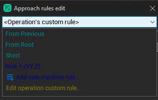
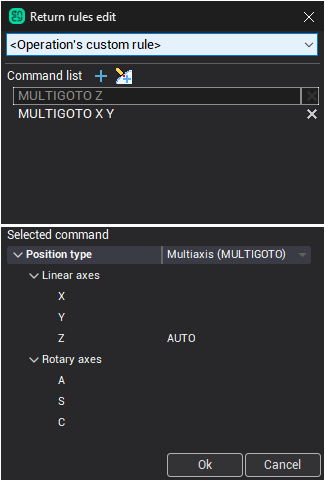
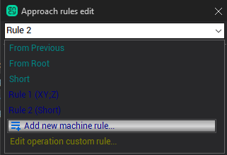

# Approach/return rules edit window

#### Selecting the approach/return type

Use the above combo box to select the definition type of the approach. For example, '<em>From Previous</em>' item means the approach will be the same as in <strong>the previous operation</strong>. See the [main article](10071.md) for more info about the approach/return types.

#### Interactive editing of approach/return

In the approach/return edit dialogue you can define the operation's approach/return tool path or edit the machine's rule list. The dialogue window is split into three areas.

1. In the top most combobox you can select to edit operation's own approach/return or one of the items in the rule list.

2. Below, in the center of the form, there is the list commands which define current selected rule. Each line (command) in that list represents a distinct point of the lead path. A point has the following format.If G53 is present in the beginning of a line the subsequent coordinates are the coordinates in the machine coordinate system, otherwise the coordinates are the coordinates of the tool tip in the current workpiece coordinate system. The subsequent text has the following format: Moved Axis 1 name, than optional moved axes 1 value in round brackets (e.g. X1 or X1 (30)), then space, than Moved axis 2 name, then optional moved axes 2 value, then space, and so on.

If no coordinate is specified after an axis name, it means the corresponding coordinate is calculated by CAM system automatically. For an approach path the coordinate is taken from the first point of the machining toolpath, for a return path the coordinate is taken from the tool change position. So, for example, if you set an approach path to "X Y; A;C; Z", the tool will move from a tool change position to the first point of the machining toolpath first by the X and Y axes simultaneously, than by A axis, than by C axis, the final motion will be a vertical plunging along the Z axis.To add a new empty command press the  button, and to add current machine state as a command press the  button next to previous. To delete command from rule click on 'X' icon in the right column. Use drag'n'drop to arrange commands in the desired order. Double click on command to set the tool position according to the defined coordinates in selected command Using popup menu (right click on the command) or corresponding hotkey you can cut, copy, paste or delete selected commands. You can edit the command's text directly using the 'Edit' popup item (or press Ctrl+E).

3. In the bottom area of the form there is a list of machine axes. To add a new reference point to the path you should either fill the coordinates of the appropriate axes with desired values, and/or set some of them to AUTO by clicking on the ellipses button next to an axis. To edit a reference point just click on it in the top list, the bottom list will be updated accordingly. After that you can change the reference point parameters.

The 'Position type' option in the middle of the inspector is used to set the mode of a reference point. When checked it turns a reference point to a G53 reference point. For a G53 reference point coordinates are specified in the machine coordinate system. Those points are output into a CLDATA using PhysicGOTO commands, while regular reference points are specified as coordinates of a tool tip in the current workpiece coordinate system. Those points are output into a CLDATA using GOTO and MULTIGOTO commands.

As approach and return reference points can be specified in terms of machine axes without explicit coordinates values, it is possible to define for an actual machine standard approach and return sequences. E.g. for a five axis milling machine a default approach sequence can look like XY; A C; Z, a return sequence can look like Z; XY; A C.

Editing the machine's rule list To interactively edit one of the approach/return rules in the machine first select it by it's name using the topmost combobox. The command tree will be refreshed according to the selected rule. Then the rule can be edited the same way as the operation's own rule. The combobox can be used as an edit to change the current rule's name. To delete rule from the list click on the 'X' icon which appears when hovering mouse over an item in the combobox. To add new empty rule to the list use <strong>Add new machine rule</strong> button in the dropped down combobox. To switch back to operation's rule click on <strong>Edit operation custom rule..</strong>

