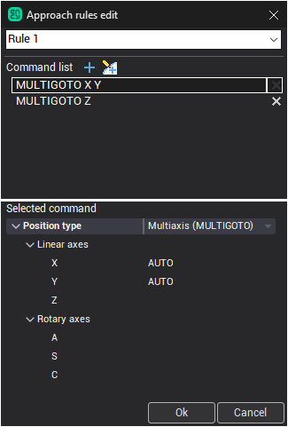

# Machine's approach/return list

## Approach/return list overview

In the "Leads" section of machine's xml file several rules for approach/return can be specified for convenient use. Each item of the list has a name to distinguish it from other rules. If the rule in the list was edited, it will affect all the operations which reference this rule. To assign a rule to operation, select the necessary item in the [Approach/return edit form](10072.md):



## Approach/return list alternative

There is an alternative way to have several rules for approach or return - create submachines for the workpiece holder/tool holder pairs used in the project and define appropriate approach and return rule for each submachine. See [Submachine definition in the machine schemas](10410.md) for more info about submachines in CAM system.

## Editing approach/return list

There are 2 ways of editing the machine's approach/return list.

1. Direct editing of machine's xml file (shown in this article)
2. Using the [approach/return edit form](10072.md). To display the form click the ellipsis button in the approach/return edit field.

## Editing machine's xml file

The machine's approach/return list is located in the <strong>Leads</strong> section (previously here could be specified just one approach/return rule). <strong>ApproachCommands</strong> and <strong>ReturnCommands</strong> are the names of the respective subsections. Each rule has 3 fields:

1. <strong>RuleID</strong> - unique GUID of the rule. It's used as a method for operations to reference a particular rule. See the operation's GUID as an example.
2. <strong>Name</strong> - name of the rule.
3. <strong>Command</strong> - the rule itself, the sequence of intermediate points of approach/return. To specify the approach/return with collision avoidance use keyword <strong>Auto</strong>.
4. <strong>Type</strong> - type of the rule which defines possible use case for the approach/return. Currently there are 4 available types:

- LCS - approach/return can be used only if the local coordinate system is enabled for the operation.
- TCPM - can be used only if the tool center point management (TCPM) is enabled (both LCS and TCPM cant be enabled at the same time).
- General - the rule can be used only if both LCS and TCPM are off.
- Undefined - the rule doesn't depend on LCS or TCPM state. If the type wasn't explicitly defined it is assumed to be 'Undefined'.

Below is the partial example of xml file:

```
                    MaxTurn65WithCounterSpindle
<SCType ID="MaxTurn65WithCounterSpindle" Caption="MaxTurn65 with Counter Spindle" type="MaxTurn65" Enabled="true">
	<GUID DefaultValue="{8E0CEF0A-8045-436D-89FD-BBE70D387AB1}"/>
	<Priority DefaultValue="172"/>
	<Name DefaultValue="MaxTurn 65 with Counter Spindle"/>
	<Comment DefaultValue="MaxTurn 65 with Counter Spindle"/>
	<Leads>
	<ApproachCommands>
		<SCArray>
			<Rule>
				<RuleID>{41D3BB1C-2F23-47AC-B5F9-5DAF7030A015}</RuleID>
				<Command>C;Z10;X;Z</Command>
				<Name>Left spindle approach</Name>
			</Rule>
			<Rule>
				<RuleID>{54FC19E5-8ACB-491A-8E94-FC9990FC8680}</RuleID>
				<Command>C2;Z-10;X;Z</Command>
				<Name>Right spindle approach</Name>
			</Rule>
		</SCArray>
	</ApproachCommands>
	<ReturnCommands>
		<SCArray>
			<Rule>
				<RuleID>{380D355A-6708-4C86-BA69-7521A0198A8E}</RuleID>
				<Command>Z10;X;Z;C</Command>
				<Name>Left spindle return</Name>
			</Rule>
			<Rule>
				<RuleID>{18B61D64-EEC9-4403-8922-CCFCC017E53E}</RuleID>
				<Command>Z-10;X;Z;C2</Command>
				<Name>Right spindle return</Name>
			</Rule>
		</SCArray>
	</ReturnCommands>
</Leads>
```

## Conversion of the older version machines/projects

When the older version machine is opened for the first time, the list consisting the machine's previous approach/return rule is created. Also the root operation references this rule (if no custom rule is assigned to it). As a result, operations having 'From root operation' rule type use the same approach/return as before.
