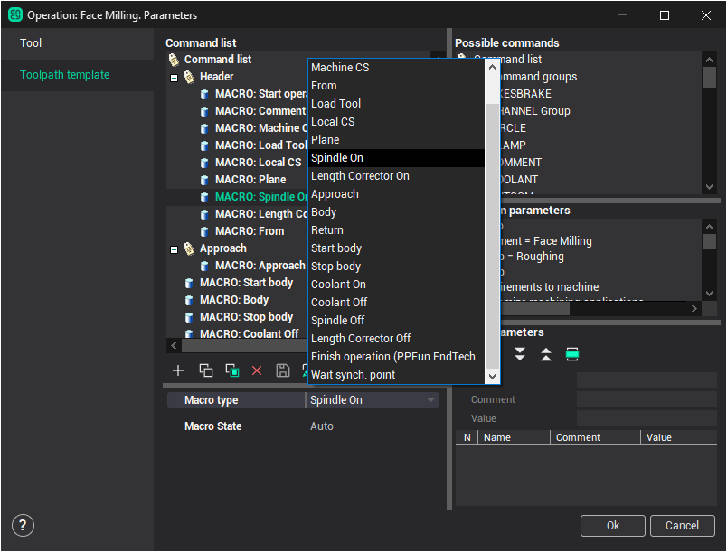
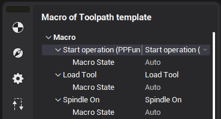

# Macro commands in the tool path template

Simple command in the tool path template directly outputs the corresponding command to the CLData. Unlike, the macro command runs the subroutine that is realized inside CAM system. Some commands can be output in CLData as the result of this routine running. Type and the sequence if these commands depends on the Macro type. The list of the macro subroutines is opened while selecting the macro type on the page of the template.

Besides the macro command has the State. State defines the running way of the subroutine. Auto state is the default state. In this mode the CLdata command are output if it is necessary.

If the state is disabled then the CLData commands is not output. It allows to exclude the unnecessary commands without the appreciably template editing. For example, it is possible to output coolant switch off command even if it was not disabled in the previous operation. For the comfortable editing of the macro commands states it is located on the additional page of the operations properties inspector.

