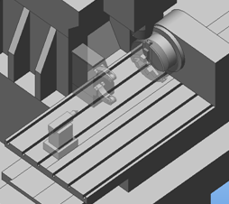
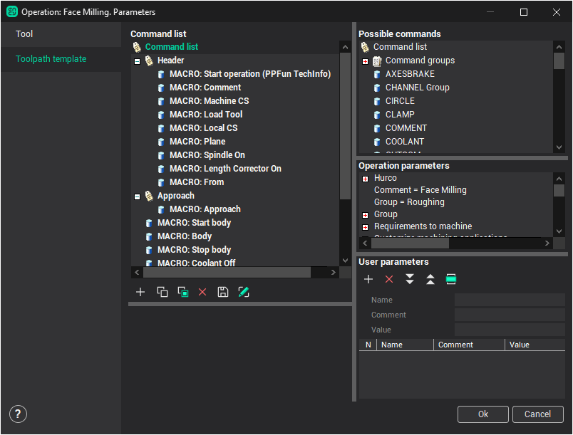

# Auxiliary operation

**Auxiliary operations** of CAM system designed to store the specific sequence of CLData commands (for specific types of machines, for particular company) into the named list, which can be saved and used many times in a process of work with the system. This, for example, may be such types of operations as clamping a chuck, tool interchange, approaching tail stock, part overturn, set of the active workpiece coordinate system G54-G59 and so on.

Instance of CAM system auxiliary operation is created as any other operation, on **Create** button click in the window of process, or with the help of contextual menu this button. In groups of operations equally with group **Roughing**, **Finishing** and **Rest milling** the **Auxiliary** become available. In this group enumerated the list of available operations for specific machine. By defaults for all types of machines only **Abstract auxiliary operation** is active, which presents by itself a semimanufactured article with empty set of CLData and list of parameters.

Editing of auxiliary operation properties are made in window, which is opening by pressing **Parameters** button in technological window on the [Toolpath template](500.md) tab.

