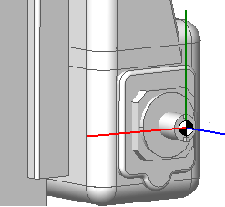
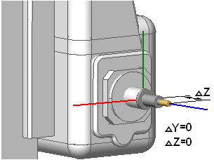
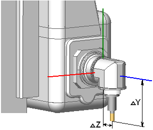
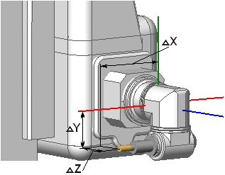
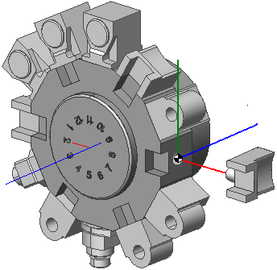
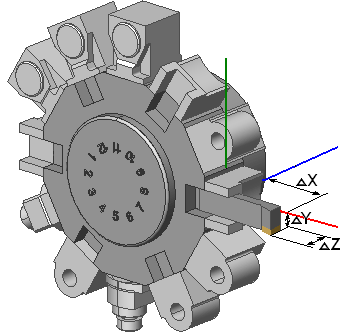
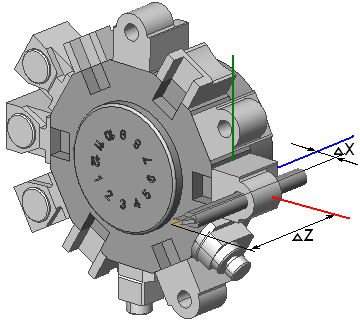
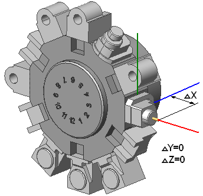
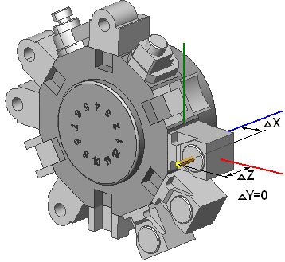

# Tool overhang

Tool overhang is distance from tool base point to tooling point.

Tool base point is base point of instrument block ( tool and tool holder) at machine coordinate system.

For mill machine tooling point lie along tool axis.

Some overhang definitions for mill machines are shows below.

Tool base point

Axial tool overhang

Overhang for rotary head

Overhang for 2 rotary heads

For lathe machines base point lie on turret base plane along tool fix system axis.

Some overhang definitions for mill-lathe machines are shows below.

Base tool point on turret

Straight turning tool overhang

Boring bit overhang

Base point for radial milling head

Base point for axial mill head
