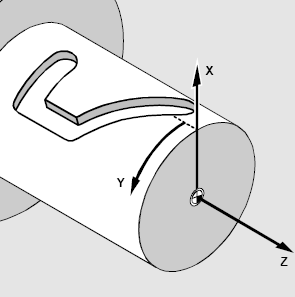
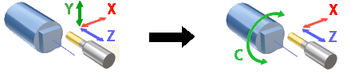
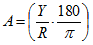

# Cylindrical interpolation

The cylindrical interpolation is available in operations: 2D contouring, pocketing, 2.5D pocketing, 2.5D wall machining.

The cylindrical interpolation gives the possibility to mill the side surface of cylinder by programming the unrolled curves. The unrolled curves are programmed in the [X,Y,Z] coordinates, but the cylinder milling is performed in [X,C,Z] coordinates. So the cylindrical interpolation makes the transformation [X,Y,Z] => [X,C,Z].

The possibility to perform the milling of the side surface of cylinder depends on the machine construction.

1. It must exist the **Rotary axis** (rotary table, lathe spindle) that rotates the workpiece.
2. The rotary axis must be located perpendicularly to the tool rotation axis.
3. The tool rotation axis have to intersect the workpiece rotation axis.
4. It must exist the **Rotary axis** that moves the tool in the plane that is perpendicular to the rotary axis.
5. It must exist the **Axial axis** that moves the tool along the rotary axis.

If all listed condition are performed and the machine variable Machine –> Control parameters –> Rotary transformations –> Cylindrical interpolation is available is set then the rotary transformation panel will be available on the transformations page.

The **Mode** field defines the rotary transformation mode: none, polar or cylindrical transformation. The tolerance defines the deviation of the transformed tool path from the ideal one. It is measured in millimeters (inches).

The cylindrical transformation performs the next calculation

,

where:

А – the position of the rotary axis in degrees,

Y – the position of the virtual unrolled axis that corresponds to the rotary axis,

R – the radius of the cylinder.

The corresponding fields defines the machine axes that are taken as the rotary axis, radial axis and etc. The default values for these parameters are defined in the machine schema.

The modern numerical controls have the possibility to perform the cylindrical transformation. So the described transformation is performed inside the control, not inside the CAM software. For such machines it is better to mark the **CNC interpolation** tick. In this case the G-code is generated in the [X,Y,Z] coordinates, and control makes the [X,Y,Z] => [X,C,Z] transformation. The G-code in the most cases looks like the next sequence:

1. The positioning to the start point that is programmed in the real machine axes.
2. Switch on the cylindrical interpolation mode with the specifying of the cylinder radius.
3. The motion along the profile that is programmed in the coordinates [X,Y,Z]
4. Switch off the cylindrical interpolation mode

The corresponding commands for the well known controls are shown in the table below.

| Numerical control | Command to switch on the cylindrical interpolation | Command to switch off the cylindrical interpolation |
|---|---|---|
| FANUC, Mоri Seiki, HAAS etc. | G07.1 (G107) | G07.1 (G107) |
| Sinumeric | TRACYL | TRAOFF |
| Heidenhain | Cycle 27 | - |

If the machine variable Machine –> Control parameters –> Rotary transformations –> CNC support cylindrical interpolation is set then CNC interpolation tick is available. If this parameter is on then the G-code generated with the commands to switch on/off the cylindrical interpolation. Else the G-code is generated in the [X,C,Z] coordinates.

If **Allow rapid motions inside interpolation block** is checked then the interpolation switch on in the beginning of the tool path and switch off in the end of tool path. Else CNC interpolation is started before the work feed and closed before the rapid feed motion.
