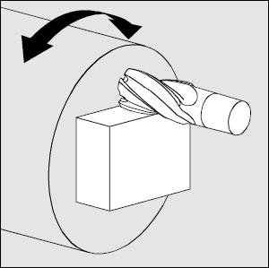
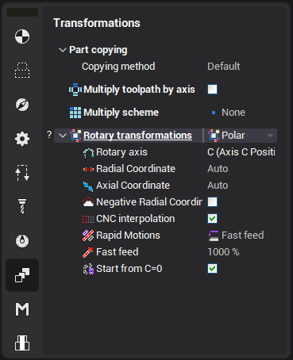
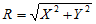
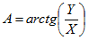

# Polar interpolation

The cylindrical interpolation is available in all milling operations if machine allows to use it.

Polar interpolation changes a linear axis to the rotary one in the simple 3-axes milling process. Usually it is necessary on the lathes that has the drive mill tool. Sometimes the polar interpolation is used with another king of machines. Ordinary lathe has two linear axes, usually its are X and Z, and the spindle rotation – usually axis C.

In simple mode CAM system generates the G-code in [X,Y,Z] coordinates. If polar transformation is active then the same g-code is generated in the [X,C,Z] coordinates. So polar interpolation transforms [X,Y,Z] => [X,C,Z]

The possibility to use the polar interpolation depends on the machine construction:

1. It must exist the **Rotary axis** (rotary table, lathe spindle) that rotates the workpiece.
2. The rotary axis must be located parallel to the tool rotation axis.
3. It must exist the **Radial axis** that moves the tool in the plane that is perpendicular to the rotary axis.
4. It must exist the **Axial axis** that moves the tool along the rotary axis.

If all listed condition are performed and the machine variable Machine –> Control parameters –> Rotary transformations –> Polar interpolation is available is set then the rotary transformation panel will be available on the transformations page.

The **Mode** field defines the rotary transformation mode: none, polar or cylindrical transformation. The tolerance defines the deviation of the transformed tool path from the ideal one. It is measured in millimeters (inches).

The polar transformation performs the next calculation:

,

where:

R – radial axis position,

A – rotary axis position,

X – position of the first linear axis,

Y – position of the second linear axis.

The corresponding fields defines the machine axes that are taken as the rotary axis, radial axis and etc. The default values for these parameters are defined in the machine schema.

The modern numerical controls have the possibility to perform the polar transformation. So the described transformation is performed inside the control, not inside the CAM software. In this case the G-code is generated in the [X,Y,Z] coordinates, and control makes the [X,Y,Z] => [X,C,Z] transformation. The G-code in the most cases looks like the next sequence:

1. The positioning to the start point that is programmed in the real machine axes.
2. Switch on the polar interpolation mode with the specifying of the cylinder radius.
3. The motion along the profile that is programmed in the coordinates [X,Y,Z].
4. Switch off the polar interpolation mode.

The corresponding commands for the well known controls are shown in the table below.

| Numerical control | Command to switch on the polar interpolation | Command to switch off the polar interpolation |
|---|---|---|
| FANUC, Mоri Seiki, HAAS etc. | G112 | G113 |
| Sinumeric | TRANSMIT | TRAOFF |
| Heidenhain | - | - |

If the machine variable Machine –> Control parameters –> Rotary transformations –> CNC support polar interpolation is set then CNC interpolation tick is available. If this parameter is on then the G-code generated with the commands to switch on/off the polar interpolation. Else the G-code is generated in the [X,C,Z] coordinates.
