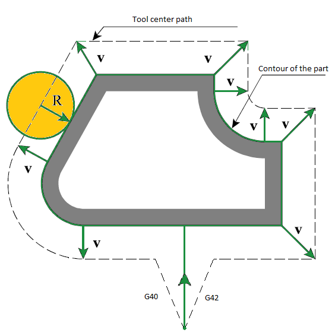
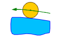
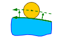
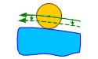
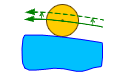
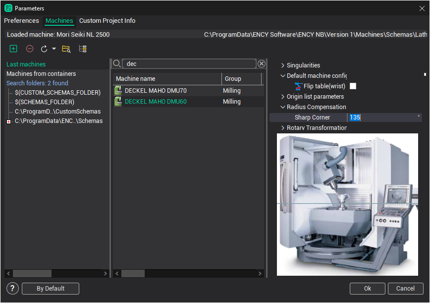
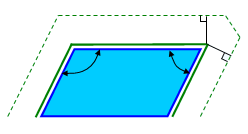

# Tool compensation in mill operations

The Tool Radius Compensation is a feature of CNC controls that allows programming of a part by specifying the contour of the part, the tool radius and the side of machining instead of the tool center path. The tool center path is calculated by the CNC control itself based on the given data.

In order to correctly calculate the trajectory of the tool center CNC needs to know the direction in which to move the tool for each frame of the trajectory. There are special commands that set the direction of correction in the NC-program. Usually this command G41 - the correction to the left of the programmed path and G42 - the correction to the right on the programmed path. To disable the correction the command G40 is used. The correction value is usually stored in a table of tool correctors on CNC.

However, the use of radius correction imposes some restrictions on the geometry of the contour, programmed in the NC-code. If the contour has bad elements such as an arc whose radius is less than the value of correction, or frames whose length considerably less than the value of correction, the CNC can not always build the correct trajectory of the tool center. As a result, the trajectory may contain loops, which usually leads to overcuts. You should also pay particular attention to elements of the trajectory, where the correction is switched on and off. In these areas, moving of the tool may differ significantly from the pre-programmed, because in one part of the correction is turned off and the other - is turned on. To avoid overcuts in these places usually add a special sections - compensation switch cuts.

CAM-system can generate a trajectory with tool radius correction. On the " [Lead In/Lead Out](/pages/createpage.action?spaceKey=SCUM20ENRC&title=Compound+approaches+and+retractions+of+mill+operations&linkCreation=true&fromPageId=157863232) " page is a panel where you can enable the use of correction, as well as to select [the types of compensation switch](/pages/createpage.action?spaceKey=SCUM20ENRC&title=Compound+approaches+and+retractions+of+mill+operations&linkCreation=true&fromPageId=157863232)lines.

There are 5 different types of the correction:

- **Computer**. In this case, the CAM-system itself calculates the trajectory with the size of the selected tool. In the program is generated a trajectory for the tool center. Correction turn on and of commands does not appear. This does not allow the operator to affect the correction at the machining time. However, the CAM-system when calculating the toolpath can correctly handle bad cases and remove the loops. That pretty much guarantee the accuracy of the trajectory and the absence of gouges. This type is installed by default.

- **NC control**. In this case, the trajectory calculation is made without taking into account tool radius. In the NC-program displays a contour of the part, as well as the turn on and off compensation commands of the appropriate sign. This allows the operator to adjust the trajectory, taking into account tool radius actually used at the machining time. In the simulation mode to simulate the behavior of CNC uses the correction value is equal to the radius of the tool.

- **Wear**. The calculation is made given the size of the tool, as with options **computer**. But in the NC-program will also appear the compensation switch commands. Correction is directed towards the part. This allows the operator to compensate the tool wear, setting the value of correction as the difference between the source tool radius and the actually used tool radius. In the simulation mode for emulating the behavior of CNC the zero correction value is used.

- **Reverse wear**. Similarly **Wear** type, but the sign of the correction is opposite (directed from the part).

Radius compensation simulation options

CAM system can calculate, view and simulate tool motion using compensation for the tool radius. When compensation is used, there are commands to turn compensation on and turn off included in the CLData. These are usually `G41`, `G42`, `G40` codes with a compensation number. CAM system will draw the path of the tool motion and can simulate the machining with compensation of the tool radius very similar to how it will happen on the machine.

Different NC machines can use different methods for applying / canceling compensation. CAM system have several options which can be used to 'tune' CAM system's tool radius compensation so that it matches those used by the machine control. These options are available in the `Machine:... Parameters` window on the **Machines** tab. There is a node called **Control parameters** –> **Radius compensation** a property editor, the properties are used for tuning the CAM system simulation of radius compensation.

Use these properties:

- **Sharp corner** – this value defines the method of rounding a corner. If the angle between the moves is greater than this value then the motion will be extended to intersect. Otherwise, if the angle is less, then each motion will extended by the value of the radius compensation and connected by a linear move. In the drawing below are shown an example where the "left" corner is greater than the sharp corner value, but the one on the "right" is less.

<strong>Related reference:</strong>

[The motions of CRC switch on/off](/pages/createpage.action?spaceKey=SCUM20ENRC&title=Compound+approaches+and+retractions+of+mill+operations&linkCreation=true&fromPageId=157863232)
