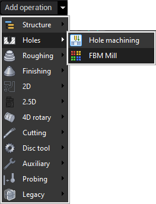

# FBM Mill

Feature Based Machining

A Manufacturing Feature is a component of a part that can be manufactured with a standard machining process. Examples of features include holes, pockets, slots, grooves, chamfers.

The Feature Based Machining (FBM) is a CAM approach based on feature recognition and either automatic or automated generation of machining processes based on the information extracted from the recognized features and a Machining Knowledge Base.

FBM Mill group

The FBM Mill Group is a group operation in CAM system that allows you to do the Feature Based Machining.

When you create a new FBM Mill Group operation CAM system automatically recognizes all the known features in the part. After that you can easily select either predefined or stored machining procedures for the features from the FBM Procedure Library and CAM system will automatically generate the operations required to machine the features and sort them based on the current rules (one strategy is to sort operations in order to minimize the tool changes).

Creating a new FBM Mill group operation is as simple as creating a regular operation. Just select the corresponding item from the New.. menu.
