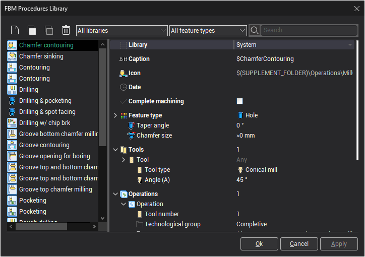
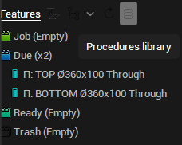
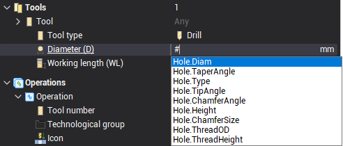

# FBM Procedure Library UI

The FBM Procedure Library is the storage for the machining procedures. There are four folders in the library:

- System;
- All users;
- Personal;
- History.

The System folder is read only, it comes together with the CAM system installation to provide the most universally used complete and atomic procedures.

The All Users folder contains procedures accessible to all users of the PC.

The Personal folder is for your own procedures.

The History folder contains procedures that are auto-saved with every project. In the course of work with CAM system FBM Mill the user dynamically creates new procedures directly in the UI simply by editing parameters of the existing procedures, inserting or removing operations into them. When the user saves the project all the new and modified procedures are automatically saved to the History folder for the possible future reuse. The feature allows the user to grow his machining knowledge base effortlessly.

Opening the library

To open the library press the Procedures library button at the Features toolbar.

Filtering procedures

Use the Libraries drop-down to switch between libraries.

Use the Feature Type selector to filter procedures by feature type

Type text in the Search box to filter procedures by name.

Creating, Deleting, Copying procedures

- To create a new procedure press the New button.
- To delete a procedure, select it and press the Delete button.
- To copy a procedure press the Copy button, then press the Paste button.

Editing a procedure

The editing of a procedure is done in the Inspector. The inspector is slightly unusual though: the usual node expanding/collapsing works differently here:

- when the node is expanded, all the inner nodes are displayed. There is nothing new here.
- however, when the node is collapsed, the inner nodes that have overridden values are still visible.

By default all the nodes are collapsed, so you see only the overridden parameters. This makes sense as the overridden parameters define what the procedure is.

- To edit a parameter, expand the corresponding node in the inspector, enter the value, then collapse the node.
- To reset the parameter value to its default state, just clear its value by Selecting All and pressing either the BackSpace or Del key on the keyboard, then hit Enter

The value fields of parameters with default values are colored gray.

The parameters with invalid values are marked red.

Changing the library of a procedure

You can change the library of the procedure by selecting from the Library drop-down in the inspector.

Changing the type of a procedure

To switch between Atomic/Complete procedure types check/uncheck the Complete machining box in the inspector.

Editing the Feature Constraints

1. Select the Feature Type.
2. Expand the Feature Type
3. Specify the constraints for the feature parameters. The default value for a constraint is Any. It means that there are no constraints on the parameter.

Editing the tool queries

- To change the number of tools in the Tool query list enter the value in the Tools field and hit Enter.
- To reference a feature parameter in the tool query just type #. The parameter completion panel should appear. Select the needed parameter from it either with the mouse or with the Up/Down keys.

Editing the Operations

- To change the number of operations in the list just enter the value in the Operations field and hit Enter.
- For every operation you have to set the Tool Number, the Cycle type and the Cycle parameters. The default tool number of the operation is the same as its sequence number.

Applying/canceling the changes

Edited procedures are marked with the bold font in the list.

- To apply changes press the Apply button at the bottom.
- To apply changes and close the FBM Procedure Library click Ok at the bottom.
- To cancel changes and close the FBM Procedure Library click Cancel at the bottom.
