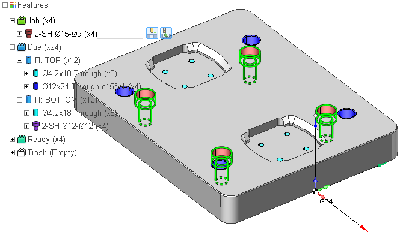
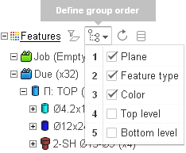
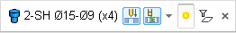

# Feature Tree UI

After CAM system recognizes features, it sorts and organizes them into a hierarchical tree structure. At the highest level the Feature Tree consists of the four groups:

- Job;
- Due;
- Ready;
- Trash.

The Job features are the features that are machined in the current FBM Mill Group. In the graphic view you can easily distinguish them by the glowing lime outline.

The Due folder contains features that are not machined in any FBM Mill group yet.

The Ready folder contains features that are already machined in other FBM Mill group operations of the project.

The Trash folder contains the deleted features.

When one of those folders is collapsed then the features from it are not displayed in the graphic view. By default the Job and the Due folders are expanded while the Ready and the Trash folders are collapsed. So you see on the screen only the features that are subject to machining.

<strong>Counting features. Alternate features</strong>

Next to every node in the Feature tree the number of features of the node is shown in the parenthesis. You may notice that the number of features shown in the tree is bigger than the number of features you may expect. You also may notice that some of the features appear in the tree twice. This is not an error, but rather a feature. It happens because some features have alternate features. For example, a through hole can be drilled from two sides. In this case CAM system recognizes not one but two holes: one with the positive axis direction and the other with the negative axis direction. These are distinct features, however they are interconnected: when you machine one of the two alternate features, CAM system marks the other one as Ready automatically.

<strong>Changing the grouping scheme</strong>

CAM system groups features in accordance with the current grouping scheme. It is possible to group the features based on their:

- type;
- plane (principal orientation);
- top and bottom levels;
- color.

Furthermore, the features that are similar or identical are assigned the same distinct color and grouped together as well.

To change the grouping scheme of the Feature tree click the Grouping Scheme drop-down at the Features toolbar. Check/uncheck the items in the scheme to enable/disable them, drag the items to change their order. All the changes are immediately reflected in the tree.

<strong>Selecting features</strong>

There are two ways of selecting features.

1. By clicking on a node in the tree.
2. By clicking on a feature in the graphic view.

To select multiple features hold either Ctrl or Shift key.

<strong>The Action Bar</strong>

When you select a feature in the graphic view rather than in the tree view, the Feature Action Bar appears under the cursor. The action bar contains the frequently used commands for the features:

1. The Feature Machining Procedure combo.
2. The Visibility switch.
3. The Filter command.
4. The Delete button.

<strong>Showing/Hiding features</strong>

To show or hide the selected features you can either click on the feature icon in the tree or press the corresponding button in the Action Bar.

<strong>Filtering features</strong>

It is possible to filter features by plane. Just select a feature lying in the plane of interest and press the Filter By Plane button. As a result only the features that have the same plane orientation with the selected feature will be displayed, the other features will be filtered out both from the tree view and the graphic view. This command comes in handy when working with a 3d machine tool, when you only want to see features lying in the horizontal plane.

<strong>Deleting features</strong>

When you select a feature in the tree or in the graphic view, a small cross icon appears next to the first selected node in the tree. Press this icon to delete the selected features. You can also delete a feature by pressing the Delete button in the action bar

The Delete Features operation is context aware.

- When you delete a feature from the Job group, the feature is not deleted, it is just moved from the Job folder into the Due folder.
- When you delete a feature either from the Due or the Ready folder it is moved to the Trash folder.
- When you delete a feature from the Trash folder it is actually not deleted, but restored: it reappears in the Due folder again.
