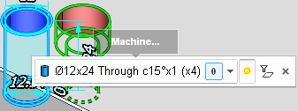
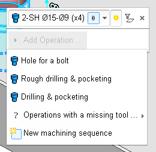
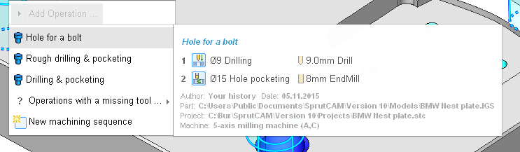
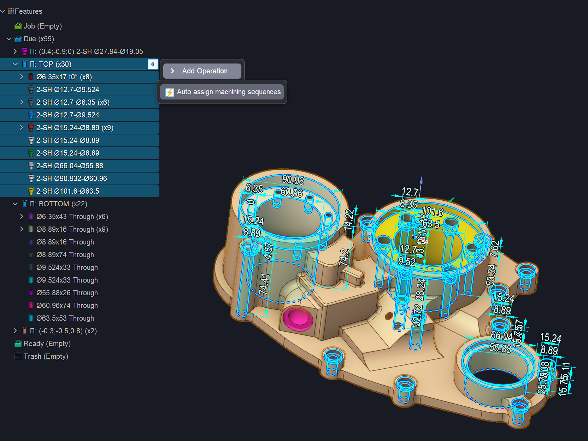

# Assigning procedures to features UI

To select a machining procedure for a feature,

- Either click on the  icon in the tree. This icon appears when you highlight a node in the tree;

- Or click on the Machining procedure combo in the action bar.

- Then hover the cursor over the Add Operation… menu and you'll see the list of the machining procedures applicable to the selected features.

- Hover the cursor over a procedure in the menu and you'll see the list of the constituting operations together with the tools selected for them.

Along with that you will see some additional information about the origins of the suggested procedure: the author, the date of creation, the part it was created for, the project it was used in, the machine which was used in that project.

The operations for which CAM system can not find tools are put into a separate sub-menu, the Operations with a missing tool… When you select a machining sequence from this menu, the tools missing in the Tool Library are created.

To create a new machining sequence rather than using an existing one, choose the New Machining Sequence command.

After you select the machining procedure for a feature or create a new one, the feature is moved to the Job folder, and CAM system updates the resulting operation list, while the selected procedure becomes available for editing.

The ability to automatically assign processing rules to a group of holes in a specific plane

