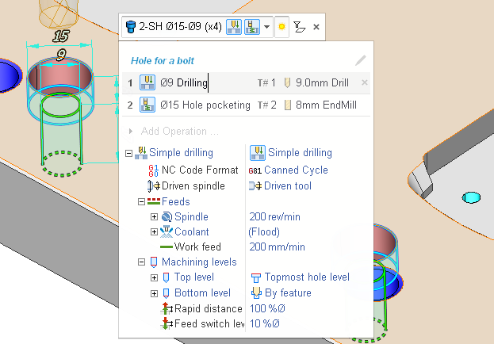
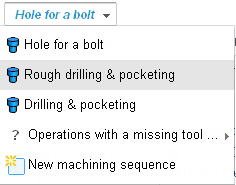
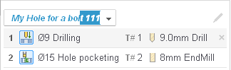
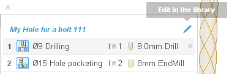
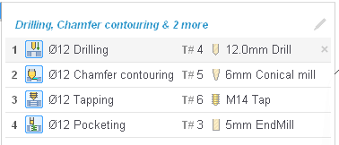
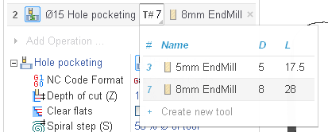
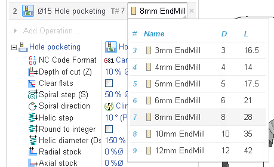
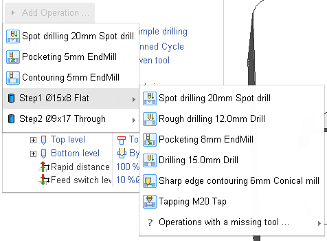
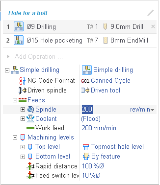

# Procedure Editing UI

The editing of machining procedures is done in this little panel you can see above.

<strong>The Machining procedure selector</strong>

At the top of the panel there is the machining procedure selector ( Hole for a bolt at the image). It's a combobox. You can quickly select a different procedure for the feature from it. In this combobox in the inner edit-box you can also change the name of the current procedure.

 

<strong>The Edit in the Library button</strong>

At the right of the procedure selector there is the Edit in the Library button. Clicking on it saves the current machining sequence to the Procedure Library and opens the Library with the procedure selected.

<strong>The operation list</strong>

Under the header there is the list of the operations constituting the machining sequence.

Each entry in the list consists of the following fields.

1. The sequence number. You can drag and drop operations by this number.
2. The Icon.
3. The subfeature prefix (present only if an operation machines a subfeature inside a composite feature).
4. The Operation name, It's an edit-box, you can change the operation name any time you want.
5. The tool number selector. This is a combobox. With it you select the tool from the Used Tool List for the operation of the machining sequence. Only applicable tools that satisfy the tool query are available for selection. The same tool can be used in several operations. In this case the number of operations the tool is used by is displayed in the parenthesis.

To add a new tool to the Used Tool List select the Create new tool command.

6.The tool selector. In this combobox you change the tool selected in the previous field. If the tool is used in several operations, all those operations are affected.

7.The Delete button.

<strong>The Add Operation… menu</strong>

Under the operation list there is the Add Operation… menu.

From this menu you can add new operation to the machining sequence. Only applicable operations are suggested in this menu. The operations with missing tools are put into a separate sub-menu. If the feature has subfeatures, operations for the subfeatures are available in separate submenus as well.

<strong>The operation parameters inspector</strong>

The parameters of the selected operation are displayed in the inspector ready for editing. The first parameter is the cycle type. You can select the cycle type from the list of the cycles available for the selected feature. The rest of parameters are the parameters of the cycle.

<strong>Using the editing procedures UI to create new FBM procedures</strong>

The editing procedures UI is a very simple and efficient way of adding new machining procedures to the library. You just select a feature, select an applicable or create a new machining sequence for it, edit the machining process, then you click the Edit in the library button, make some adjustments to the procedure already in the library and that's it, the new procedure is ready.

With the History feature the process of expanding your machining knowledge base simplifies even further. When you save a project with FBM Mill group operations in it, all the machining sequences of the project are saved to the library automatically to the History folder.
