# Hole machining

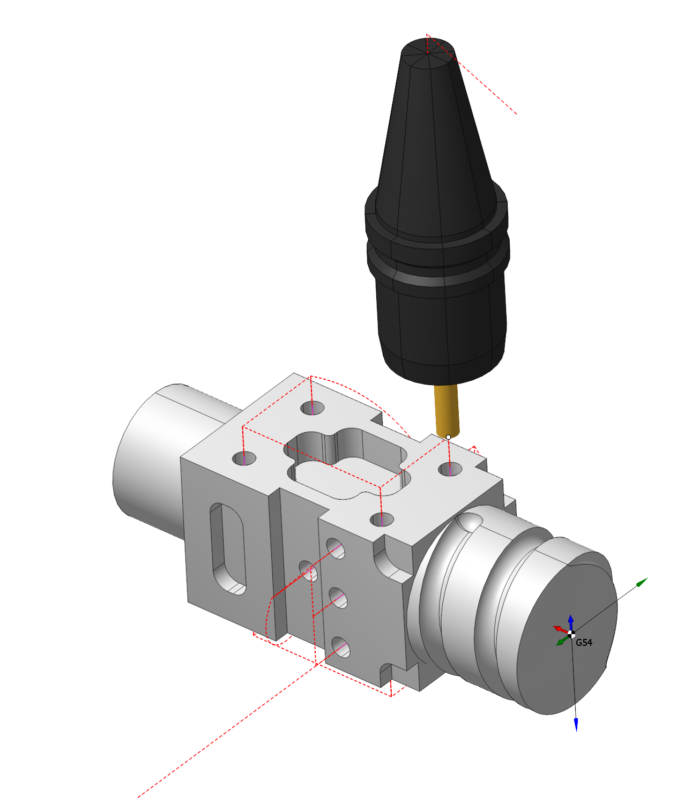

## Application area:

The hole machining operations are designed for drilling, centering, boring, countersinking, tapping, thread milling and hole pocketing. It can machine holes that are not lying in the same plane and that are not lying in orthogonal planes. The operation can be used both for the machining of holes in a model, or for pre-drilling of the tool plunge points for the pocketing and operations.

### Setup:

The <strong>Setup</strong> tab is used to configure the primary parameters of the project. This can involve the positioning of the part on the equipment, the coordinate system of the part, and more. [Details](1022.md)

### Job assignment:

<strong>Center.</strong> Create hole by center point.

<strong>Create.</strong> Create hole by coordinates input. [Details](706.md)

<strong>Recognize.</strong> Automatically recognize holes in the part. [Details](406.md)

<strong>Pattern.</strong> Create holes array by pattern. [Details](407.md)

<strong>Properties.</strong> Displays the properties of an element. You can also call this menu by double clicking on an item in the list. [Details](706.md)

<strong>Sorting.</strong> Sorting using some parameters to sort holes list. [Details](10158.md)

<strong>Delete.</strong> Removes an item from the list.

<strong>Restrictions.</strong> It allows you to restrict areas that should not be machined. [Details](101231.md)

### Strategy:

#### Drilling Type.

This group defines the basic parameters of various types of hole processing.

Click here to expand..

<strong>Drilling Type:</strong>

<strong>Simple drilling.</strong> Drilling cycle drills holes with rapid approach to the safe level and rapid retract the safe plane level.

Click here to expand..

.png)

The cycle consists of:

- Rapid tool motion to the hole center at the <strong>Rapid distance(RD)</strong> level, that is located on the tab <strong>Links.</strong>
- Rapid descend to the <strong>Feed distance(FD)</strong> level, that is located on the tab <strong>Links.</strong>
- Work feedrate motion to the Z min level, that is located on the tab <strong>Job assignment</strong> in the <strong><strong>Properties</strong></strong> hole<strong>.</strong> In absolute values. If you want to use relative values use the parameter <strong>H = Zmax - Zmin.</strong>
- Tool return to the <strong>Rapid distance(RD)</strong> level at the rapid feed.

<strong>Drilling with dwell.</strong> Drilling cycle drills holes with rapid approach to the safe level, dwell at hole bottom level and rapid retract the safe plane level

Click here to expand..

.png)

The cycle consists of:

- Rapid tool motion to the hole center at the <strong>Rapid distance(RD)</strong> level, that is located on the tab <strong>Links.</strong>
- Rapid descend to the <strong>Feed distance(FD)</strong> level, that is located on the tab <strong>Links.</strong>
- Work feedrate motion to the Z min level, that is located on the tab <strong>Job assignment</strong> in the <strong><strong>Properties</strong></strong> hole<strong>.</strong> In absolute values. If you want to use relative values use the parameter <strong>H = Zmax - Zmin.</strong>
- <strong>Bottom Dwell (DWB)</strong> at the Z min level.
- Tool return to the <strong>Rapid distance(RD)</strong> level at the rapid feed.

<strong>Chip removing.</strong> Drilling with chip removing cycle performs tool motion to the hole center at the <strong>Rapid distance(RD)</strong> level and consequent cyclic drill with tool retraction to the <strong>Feed distance(FD)</strong> level.

Click here to expand..

.png)

The cycle consists of:

- Rapid tool motion to the hole center at the <strong>Rapid distance(RD)</strong> level, that is located on the tab <strong>Links.</strong>
- Rapid descend to the <strong>Feed distance(FD)</strong> level, that is located on the tab <strong>Links.</strong>
- Work feedrate motion to the <strong>Step (S).</strong>
- <strong>Bottom Dwell (DWB)</strong> at this level.
- Rapid return to <strong>Feed distance(FD)</strong> level.
- Dwell for the <strong>Top Dwell (DWT)</strong> time.
- Rapid motion to the previous depth level, with a <strong>Deceleration (Dcl)</strong>.
- Work feedrate to the <strong>Deceleration (Dcl)</strong> with <strong>Step (S).</strong>
- Dwell for the <strong>Top Dwell (DWT)</strong> time.
- Repeat previous five iterations until the full hole depth is reached.
- Tool return to the <strong>Rapid distance(RD)</strong> level at the rapid feed.

<strong>Chip breaking.</strong> Drilling with chip breaking cycle performs tool approach to the hole center at the <strong>Rapid distance(RD)</strong>. When cyclic drilling is performed with tool retraction for chip breaking.

Click here to expand..

.png)

The cycle consists of:

- Rapid tool motion to the hole center at the <strong>Rapid distance(RD)</strong> level, that is located on the tab <strong>Links.</strong>
- Rapid descend to the <strong>Feed distance(FD)</strong> level, that is located on the tab <strong>Links.</strong>
- Work feedrate motion to the <strong>Step (S).</strong>
- <strong>Bottom Dwell (DWB)</strong> at this level.
- Rapid tool retraction for the <strong>Lead-out</strong> (Ld).
- Dwell for the <strong>Top Dwell (DWT)</strong> at the bottom time.
- Rapid motion to the previous depth level, with a <strong>Deceleration (Dcl)</strong>.
- Work feedrate to the <strong>Deceleration (Dcl</strong>) with <strong>Step (S).</strong>
- <strong>Bottom Dwell (DWB)</strong> at this level.
- Repeat previous five iterations until the full hole depth is reached.
- Tool return to the <strong>Rapid distance(RD)</strong> level at the rapid feed.

<strong>Tapping.</strong> Tapping cycle performs rapid approach to the <strong>Rapid distance(RD)</strong> level, thread tapping with subsequent retraction at work feedrate with reverse spindle rotation.

Click here to expand..

.png)

Drilling cycle `G84` consist of the following steps:

- Rapid tool motion to the hole center at the <strong>Rapid distance(RD)</strong> level, that is located on the tab <strong>Links.</strong>
- Rapid descend to the <strong>Feed distance(FD)</strong> level, that is located on the tab <strong>Links.</strong>
- Work feedrate motion to the <strong>Z min</strong> level with <strong>M3(M4)</strong> and then <strong>Spindle reverse M4(M3)</strong>.
- Tool return to the <strong>Rapid distance(RD)</strong> level at the rapid feed.
- Restore spindle rotation direction and speed.

<strong>Bore 5.</strong> Boring cycle performs tool approach to the hole center, hole boring with stop at minimum level and work feedrate retract to the <strong>Rapid distance(RD)</strong> level.

Click here to expand..

.png)

The cycle consists of:

- Rapid tool motion to the hole center at the <strong>Rapid distance(RD)</strong> level, that is located on the tab <strong>Links.</strong>
- Rapid descend to the <strong>Feed distance(FD)</strong> level, that is located on the tab <strong>Links.</strong>
- Work feedrate motion to the Z min level, that is located on the tab <strong>Job assignment</strong> in the <strong><strong>Properties</strong></strong> hole<strong>.</strong> In absolute values. If you want to use relative values use the parameter <strong>H = Zmax - Zmin.</strong>
- <strong>Spindle stop (M5).</strong>
- <strong>Bottom Dwell (DWB)</strong> at this level.
- Tool return to the <strong>Rapid distance(RD)</strong> level at the rapid feed.
- Restore the spindle rotation direction and speed.

<strong>Bore 6.</strong> Boring cycle performs tool approach to the hole center, hole boring with stop at minimum level and rapid retract to the <strong>Rapid distance(RD)</strong> level.

Click here to expand..

.png)

The cycle consists of:

- Rapid tool motion to the hole center at the <strong>Rapid distance(RD)</strong> level, that is located on the tab <strong>Links.</strong>
- Rapid descend to the <strong>Feed distance(FD)</strong> level, that is located on the tab <strong>Links.</strong>
- Work feedrate motion to the Z min level, that is located on the tab <strong>Job assignment</strong> in the <strong><strong>Properties</strong></strong> hole<strong>.</strong> In absolute values. If you want to use relative values use the parameter <strong>H = Zmax - Zmin.</strong>
- <strong>Spindle stop (M5).</strong> If <strong>Oriented tool retract</strong> check box enabled, then spindle stops with the fixed angle of orientation and then the tool shifts slightly sideways in accordance with a given displacements.
- <strong>Bottom Dwell (DWB)</strong> at this level.
- Tool return to the <strong>Rapid distance(RD)</strong> level at the rapid feed.
- Restore the spindle rotation direction and speed.

<strong>Bore 7.</strong> Boring cycle performs tool approach to the hole center, hole boring with stop at minimum level and manual retract to the <strong>Rapid distance(RD)</strong> level.

Click here to expand.

.png)

The cycle consists of:

- Rapid tool motion to the hole center at the <strong>Rapid distance(RD)</strong> level, that is located on the tab <strong>Links.</strong>
- Rapid descend to the <strong>Feed distance(FD)</strong> level, that is located on the tab <strong>Links.</strong>
- Work feedrate motion to the Z min level, that is located on the tab <strong>Job assignment</strong> in the <strong><strong>Properties</strong></strong> hole<strong>.</strong> In absolute values. If you want to use relative values use the parameter <strong>H = Zmax - Zmin.</strong>
- <strong>Spindle stop (M5).</strong> If <strong>Oriented tool retract</strong> check box enabled, then spindle stops with the fixed angle of orientation and then the tool shifts slightly sideways in accordance with a given displacements.
- At the bottom of the pit, command <strong>M1</strong> is called - wait for the operator. The operator can remove the drill manually.
- Tool return to the <strong>Rapid distance(RD)</strong> level at the rapid feed.
- Restore the spindle rotation direction and speed.

<strong>Bore 8.</strong> Drilling cycle type drills holes with rapid approach to the safe level, dwell at hole bottom level, spindle stop and manual retract to the safe plane level.

Click here to expand..

.png)

The cycle consists of:

- Rapid tool motion to the hole center at the <strong>Rapid distance(RD)</strong> level, that is located on the tab <strong>Links.</strong>
- Rapid descend to the <strong>Feed distance(FD)</strong> level, that is located on the tab <strong>Links.</strong>
- Work feedrate motion to the Z min level, that is located on the tab <strong>Job assignment</strong> in the <strong><strong>Properties</strong></strong> hole<strong>.</strong> In absolute values. If you want to use relative values use the parameter <strong>H = Zmax - Zmin.</strong>
- <strong>Bottom Dwell (DWB)</strong> at the Z min level.
- <strong>Spindle stop (M5).</strong>
- At the bottom of the pit, command <strong>M1</strong> is called - wait for the operator. The operator can remove the drill manually.
- Tool return to the <strong>Rapid distance(RD)</strong> level at the rapid feed.
- Restore the spindle rotation direction and speed.

<strong>Bore 9.</strong> Boring cycle type bores holes with rapid approach to the safe level, dwell at hole bottom level, spindle stop and manual retract to the safe plane level.

Click here to expand.

.png)

The cycle consists of:

- Rapid tool motion to the hole center at the <strong>Rapid distance(RD)</strong> level, that is located on the tab <strong>Links.</strong>
- Rapid descend to the <strong>Feed distance(FD)</strong> level, that is located on the tab <strong>Links.</strong>
- Work feedrate motion to the Z min level, that is located on the tab <strong>Job assignment</strong> in the <strong><strong>Properties</strong></strong> hole<strong>.</strong> In absolute values. If you want to use relative values use the parameter <strong>H = Zmax - Zmin.</strong>
- <strong>Bottom Dwell (DWB)</strong> at the Z min level.
- Tool return to the <strong>Feed distance(FD)</strong> level at the work feed.
- Tool return to the <strong>Rapid distance(RD)</strong> level at the rapid feed.

<strong>By spiral (thread milling).</strong> Thread milling cycle is used to machine external or internal threading or to machine hole by a helix. Spiral machining is used then hole diameter is larger than the tool diameter. The tool rotates around the hole axis and simultaneously travels along the axis. spiral diameter is chosen according to the hole and the tool dimensions. Machining can be done in several passes to mill holes of desired diameter.

Click here to expand..

.png)

The cycle consists of:

- Rapid tool motion to the hole center at the <strong>Rapid distance(RD)</strong> level, that is located on the tab <strong>Links.</strong>
- Rapid descend to the <strong>Feed distance(FD)</strong> level, that is located on the tab <strong>Links.</strong>
- Work feedrate travel to the spiral start with <strong>Thread step (TS).</strong>
- Work feedrate motion to the <strong>Z min</strong> level, that is located on the tab <strong>Job assignment</strong> in the <strong>Properties</strong> hole. In absolute values. If you want to use relative values use the parameter <strong>H = Zmax - Zmin.</strong>
- Return to the hole center.
- Tool return to the <strong>Feed distance(FD)</strong> level at the work feed.
- Rapid travel to the <strong>Rapid distance(RD)</strong> level.

<strong>Hole pocketing.</strong> The cycle is used to machine holes which diameter is greater than the tool diameter. The pocketing is performed by layers. The tool cuts in along a spiral to each layer and then expands the hole to the desired diameter by moving along Archimedes spiral with finishing pass along the circle. The Archimedean spiral is approximated by the circle arcs.

Click here to expand..

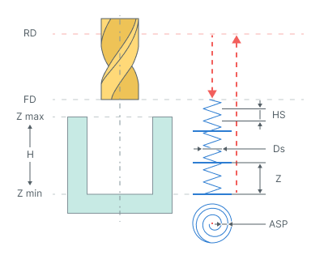

The cycle consists of:

- Rapid tool motion to the hole center at the <strong>Rapid distance(RD)</strong> level, that is located on the tab <strong>Links.</strong>
- Rapid descend to the <strong>Feed distance(FD)</strong> level, that is located on the tab <strong>Links.</strong>
- Work feedrate spiral cut-in to the <strong>Depth of cut (Z)</strong><strong>.</strong> <strong>Helic diameter (Ds)</strong> is specified in the percents of the tool diameter. The <strong>Helic step (HS)</strong> is defined by the <strong>Ramp angle a, mm (Hi) or tool pitch count.</strong>
- Archimedes spiral with <strong>Spiral step (ASP)</strong> motion at that level until the tool axis has reaches the circle with diameter equal to hole diameter reduced by the tool diameter.
- Finishing pass along specified above circle without level change.
- Repeat previous three steps until desired hole depth is machined with travel to the next cut-in point without level change.
- Return to the hole center.
- Tool return to the <strong>Feed distance(FD)</strong> level at the rapid feed.
- Rapid travel to the <strong>Rapid distance(RD)</strong> level.

<strong>Tapping with chip removing.</strong>

Click here to expand..

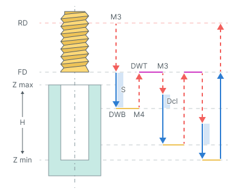

The cycle consists of:

- Rapid tool motion to the hole center at the <strong>Rapid distance(RD)</strong> level, that is located on the tab <strong>Links.</strong>
- Rapid descend to the <strong>Feed distance(FD)</strong> level, that is located on the tab <strong>Links.</strong>
- Work feedrate motion to the <strong>Step (S).</strong>
- Restore spindle rotation direction and speed (<strong>M4</strong>)
- <strong>Bottom Dwell (DWB)</strong> at this level.
- Rapid return to <strong>Feed distance(FD)</strong> level.
- Dwell for the <strong>Top Dwell (DWT)</strong> time.
- Restore spindle rotation direction and speed (<strong>M3</strong>)
- Rapid motion to the previous depth level, with a <strong>Deceleration (Dcl)</strong>.
- Work feedrate to the <strong>Deceleration (Dcl)</strong> with <strong>Step (S).</strong>
- Restore spindle rotation direction and speed <strong>(M4).</strong>
- <strong>Bottom Dwell (DWB)</strong> at this level.
- Repeat previous seven iterations until the full hole depth is reached.
- Tool return to the <strong>Feed distance(FD)</strong> level at the work feed.
- Tool return to the <strong>Rapid distance(RD)</strong> level at the rapid feed.

<strong>Tapping with chip breaking.</strong>

Click here to expand..

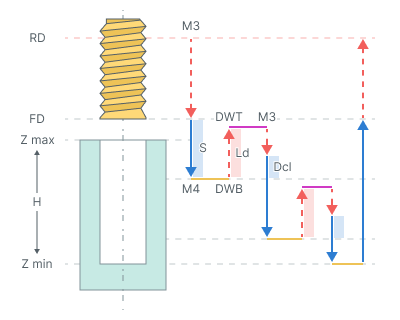

The cycle consists of:

- Rapid tool motion to the hole center at the <strong>Rapid distance(RD)</strong> level, that is located on the tab <strong>Links.</strong>
- Rapid descend to the <strong>Feed distance(FD)</strong> level, that is located on the tab <strong>Links.</strong>
- Work feedrate motion to the <strong>Step (S).</strong>
- Restore spindle rotation direction and speed (<strong>M4</strong>)
- <strong>Bottom Dwell (DWB)</strong> at this level.
- Rapid tool retraction for the <strong>Lead-out (Ld).</strong>
- Dwell for the <strong>Top Dwell (DWT)</strong> time.
- Restore spindle rotation direction and speed (<strong>M3</strong>)
- Rapid motion to the previous depth level, with a <strong>Deceleration (Dcl)</strong>.
- Work feedrate to the <strong>Deceleration (Dcl)</strong> with <strong>Step (S).</strong>
- Restore spindle rotation direction and speed <strong>(M4).</strong>
- <strong>Bottom Dwell (DWB)</strong> at this level.
- Repeat previous seven iterations until the full hole depth is reached.
- Tool return to the <strong>Feed distance(FD)</strong> level at the work feed.
- Tool return to the <strong>Rapid distance(RD)</strong> level at the rapid feed.

<strong>Groove boring.</strong> For this operation recommended to use the <strong>Oriented Tool Retract parameter.</strong>

Click here to expand..

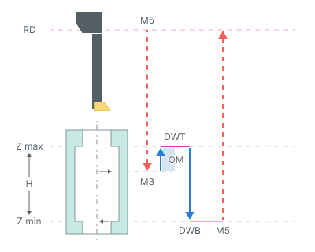

The cycle consists of:

- Rapid tool motion at the <strong>Rapid distance(RD)</strong> level, that is located on the tab <strong>Links.</strong>
- Rapid tool motion to the <strong>Zmax - Opposite move length(OM).</strong>
- On spendle rotation <strong>(M3)</strong>
- Work feedrate motion to the <strong>Zmax + Opposite move length(OM).</strong>
- Dwell for the <strong>Top Dwell (DWT)</strong> time.
- Work feedrate motion to the <strong>Z min</strong> level, that is located on the tab <strong>Job assignment</strong> in the <strong>Properties</strong> hole. In absolute values. If you want to use relative values use the parameter <strong>H = Zmax - Zmin.</strong>
- <strong>Bottom Dwell (DWB)</strong> at this level.
- <strong>Spindle stop (M5).</strong>
- Tool return to the <strong>Rapid distance(RD)</strong> level at the rapid feed.

<strong>Below are the parameters that may differ from the verification type</strong>

<strong>Top Dwell (<strong>DWT</strong>).</strong> Defines the delay at the <strong>top level</strong> of the hole <strong>.</strong>(<strong>See drilling type hint</strong>).

<strong>Bottom Dwell (<strong>DWB)</strong>.</strong> Defines the delay at the <strong>bottom level</strong> of the hole. (<strong>See drilling type hint</strong>).

<strong>Step (S).</strong> In deep hole drilling refers to the distance or increment between successive passes of the drill bit when drilling deep holes (<strong>See drilling type hint</strong>).

<strong>Deceleration (Dcl).</strong> This value is required for the idle movement to the previous depth level. The tool doesn't reach the prior cut at a distance entered in this value. Once the tool reaches the specified value, the movement will occur during the working stroke until the next level (<strong>See drilling type hint</strong>).

<strong>Lead-out (Ld).</strong> Retraction value from previous cutting step (<strong>See drilling type hint</strong>).

<strong>Helic step.</strong> Defines the plunge helix step (<strong>See drilling type hint</strong>).

<strong>Helic diameter (Ds).</strong> Determines the helix diameter of the plunge (<strong>See drilling type hint</strong>).

<strong>Spiral step (S).</strong> Archimedes spiral with Spiral step <strong>(ASP</strong>) motion at that level until the tool axis has reaches the circle with diameter equal to hole diameter reduced by the tool diameter (<strong>See drilling type hint</strong>).

<strong>Depth of cut (Z).</strong> Defines the distance between the horizontal layers for <strong>(ASP</strong>) (<strong>See drilling type hint</strong>).

<strong>Opposite move length (OM)</strong> Working movement length (<strong>See drilling type hint</strong>).

<strong>Thread step (TS)</strong> Defines the spiral step for the spiral hole machining or the thread pitch in the case of the thread milling (<strong>See drilling type hint</strong>).

<strong>Degression (DG). <strong>If enabled:</strong></strong> the depth of every following peck is reduced on the defined value. The step reduction occurs until its value is not less than <strong>Minimal step</strong>. The subsequent steps will be equal to the minimum step.

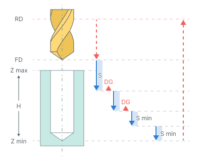

<strong><strong><strong>If disabled:</strong></strong></strong> the step is constant. The final step is executed to cover the remaining depth of the hole.

<strong>Minimal step (Smin).</strong> Minimal step is a percentage of the first step value.

<strong>Thread pitch.</strong> Defines the pitch in millimeters or inches. It depends on the current measurement units.

<strong>Spindle position (<strong>Initial angular position</strong>).</strong> Used for the multistart threads and defines the start <strong>Spindle position</strong> in degrees.

<strong>Socket type.</strong> Numerical controls in machining often offer various cycles tailored for different socket types, which can be categorized as either <strong>floating</strong> or <strong>fixed</strong>.

<strong>Floating.</strong>

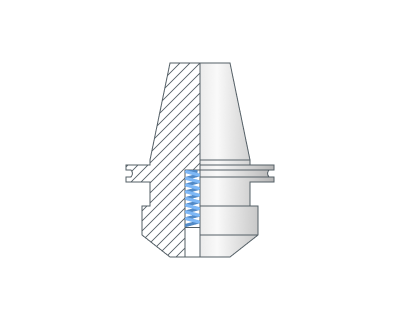

<strong>Fixed.</strong>

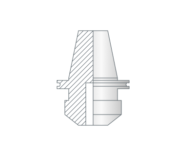

<strong>Oriented tool retract.</strong> Options on the Oriented retract panel allow retraction without contact the tool with machined surface at the exit. To do this, after the final depth of hole is reached the spindle stops with a strictly defined angle and a slightly shifts to the side. Then tool returns to the top level with a stationary spindle.

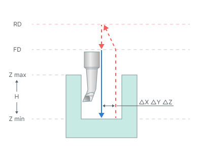

<strong>Spindle orientation angle.</strong> Defines the start Spindle position in degrees.

<strong>ΔX, ΔY, ΔZ</strong> - Offset from hole center (<strong>See <strong>Oriented tool retract</strong> hint</strong>).

<strong>Thread type.</strong> Parameter specifies whether the threading is <strong>External(OD)</strong> or <strong>Internal(ID)</strong>.

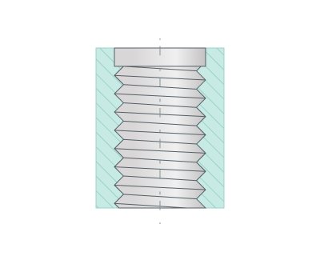 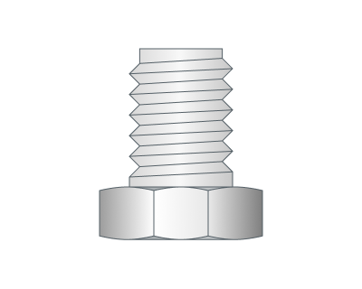

<strong>Taper angle.</strong> Necessary for cutting tapered threads. Through the parameter you can set the <strong>Taper angle.</strong>

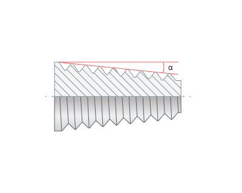

<strong>Compensation mode.</strong> Similar to the <strong>Output</strong> group in <strong>2D contouring</strong>. [Details](404.md)

<strong>Thread direction (<strong>Spiral direction</strong>).</strong> Thread kind, right or left, is determined by the <strong>Thread direction.</strong> It can also determine the direction of milling Forward or Reverse.

Conventional. <strong>Use for hole pocketing</strong>. Parameter group works similarly to the <strong>Waterline roughing operation - <strong>Milling type</strong></strong>. [Details](736.md)

Climb. <strong>Use for hole pocketing</strong>. Parameter group works similarly to the <strong>Waterline roughing operation - <strong>Milling type</strong></strong>. [Details](736.md)

CW (Right). The Spiral is twisted right. The tool is rotating clockwise if watched from above. <strong>Use for thread milling.</strong>

_(1).png)

<strong>CWW(Left).</strong> The spiral is twisted left. The tool is rotating counter clockwise if watched from above. <strong>Use for thread milling.</strong>

_(1).png)

<strong>Round thread count to integer (<strong>Round to integer</strong>)</strong> Try rounding to a smaller or larger number of revolutions.

.png) .png)

<strong>Thread depth (Td).</strong> Defines the distance between the inner and outer diameters of the thread. In all cases (inner and outer threads) the diameter that is defined in the job assignment defines the outer (maxiaml) diameter of the thread. The inner diameter of the thread is calculated as the difference between the outer diameter and the `*<THREAD depth>*`.

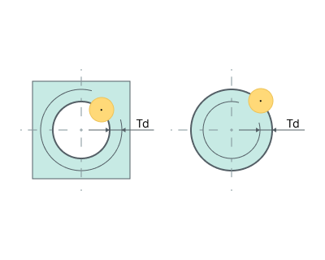

<strong>Start count.</strong> Number of thread starts.

<strong>Thread Mill Path.</strong> Parameter is used defines the toolpath type according to the used tool type. It can be one of the following: <strong>Continuous</strong> or <strong>Axial Divide</strong>.

<strong>Continuous.</strong> This toolpath type is used for the single-cutter tool, which forms only one thread turn with each turn of the spiral. Geometrically the trajectory is a continuous spiral with <strong>Thread step (TS).</strong>

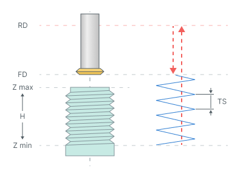

<strong>Axial Divide.</strong> This type is used for multi-cutter tool which forms multiple thread turns for one turn of the trajectory spiral. The trajectory consists of subsequent spiral turns connected with rapid cutting-edge long transitions along the spiral axis with <strong>Thread step (TS)</strong> and <strong><strong>Tool working length (TWL).</strong></strong>

.png)

<strong>Turn count.</strong> Number of threads.

<strong>Tool working length (TWL).</strong> It specifies the length of transitions between adjacent spiral turns. This value must be calculated as the thread pitch multiplied on the coils number that can be created by the tool per one spiral turn (<strong>See Axial Divide hint</strong>).

<strong>Machining sequence (<strong>Direction</strong>)</strong> Processing order.

<strong>Top-down.</strong> Processing is carried out from top to bottom.

<strong>Bottom-up.</strong> Processing is carried out from bottom to top.

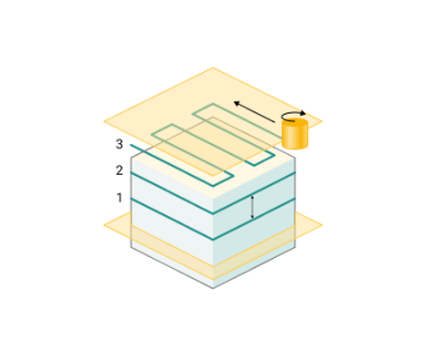

<strong>Rough passes.</strong> Toolpath is offset in plane by the 'Roughing passes' thickness amount.

<strong>Finish pass.</strong> The pass becomes finishing. An additional roughing pass is added to it at a distance specified in the parameter.

<strong>Last circle pass.</strong> Adds a circular passage at the bottom of the hole.

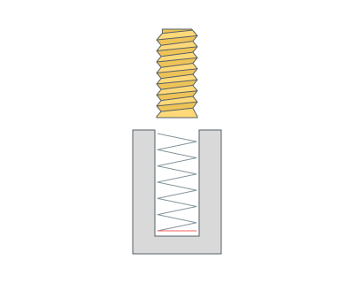

#### Tool contact point.

Tool Contact Point (TCP) is a specific location on a cutting tool that defines the primary interaction point between the tool and the workpiece surface or geometric entities during machining operations.

The parameters of this group are the same as in the <strong>5D Surfacing operation</strong>. [Details.](10135.md)

#### Hole sorting.

Hole processing order

Click here to expand.

<strong>Optimal.</strong> The system minimizes the length of the idle motions.

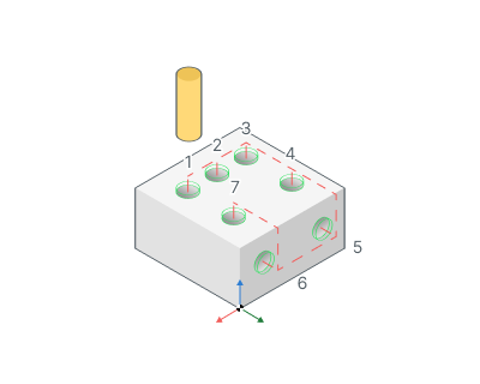

<strong>By list.</strong> The order of the holes machining depends on the order in the <strong>Job assignment</strong> list.

<strong>Group holes with the same plane.</strong> Item selected then system will optimize machining order inside groups of holes that lie at the same planes.

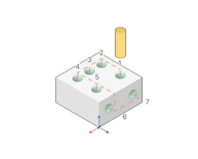

#### Use holes coordinate system.

Click here to expand..

<strong>If enabled: ORIGIN</strong> command is output before the hole machining. So every hole is machined with it's own local coordinate system. Read the operation coordinate system topic for detailed information about <strong>ORIGIN</strong>. So the hole machining cycle is applied for the XY plane. Most of the CNC supports the cycles in this plane.

<strong>If disabled:</strong> All the holes are machined in a common coordinate system operations.

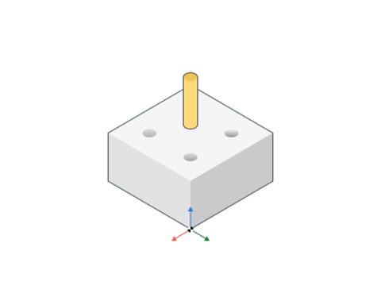 

#### NC Code Format

Defines how the drilling operation is output.

Click here to expand..

<strong>Long Hand.</strong> Only simple NC commands like ISO G0, G1 will be used in the CLData.

<strong>Canned Cycle.</strong> Canned cycles like ISO G81 will be used in the generated CLData.

<strong>Cycle format.</strong> For compatibility with older versions of postprocessors.

Default (as specified in system Setup). The cycle format will be used, which is specified in the system settings [Details](740.md). The default setting in the system Setup window has a value EXTCYCLE.

EXTCYCLE (recommended). The new format of the cycle EXTCYCLE will be used. This cycle has an advanced set of parameters, including all machining strategies that are implemented in the system, and allows a realistic simulation of the tool movements according to the chosen strategy.

CYCLE (for old postprocessors). The old format of the cycle CYCLE will be used. This cycle cannot be used for some of the strategies available in the system (e.g., hole pocketing or machining by spiral). Also this cycle simulates any machining strategy only as a simple movement to the lower level of the hole. This format is required for compatibility with older versions of postprocessors, where EXTCYCLE technological command handler is not implemented.

<strong>Start cycle at air move safety level.</strong> Option defines the position at which the each cycle toolpath will start.

<strong>If enabled:</strong> the first cycle point is at the air move safety level which depends on the part top level or origin of CS. It can help you to reduce the number of intermediate link points when you want to have the modal cycles output mode at the each next movement (whithout redundant G80 cycle off commands).

.png)

<strong>If disabled:</strong> the the first cycle point located at the Rapid distance from the top level of hole.

.png)

<strong>By Default.</strong> Canned Cycle.

#### Optimize feed in cross holes

Programming feed rate reduction at hole intersections <strong>(work only with NC Code Format - Long Hand</strong> )

Click here to expand..

.png) .png)

<strong>Blue</strong> - working feed <strong>Yellow</strong> - minimum feed <strong>Green</strong> - medium feed

<strong>Min feed.</strong> The minimum allowable feed rate to which the speed is reduced when entering or exiting <strong>the hole's</strong> cutting zone

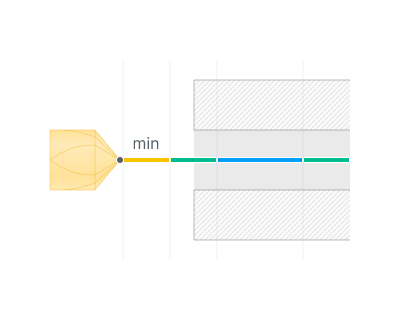

<strong>Step count.</strong> The number of steps before the main cut when entering or exiting <strong>the hole's</strong> cutting zone

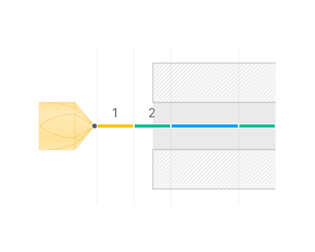

<strong>Step distance.</strong> Step length

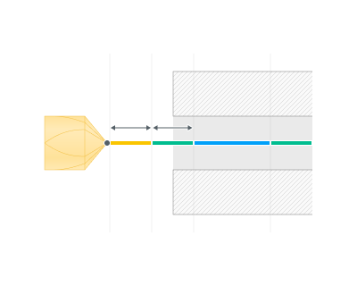

<strong>Reduce spindle speed.</strong> Reducing the spindle speed decreases the frequency and intensity of these vibrations, which lowers the stress on the cutting edges of the drill bit when entering or exiting <strong>the hole's</strong>

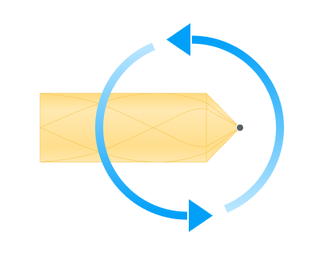

<strong>Always finish with reduced feed.</strong> If the trajectory ends at the working feed (not at the minimum), then steps are added to reduce it to the minimum (the trajectory is extended).

<strong>Void feed (disabled).</strong> This parameter allows you to set individual feed in cross holes.

.png) .png)

<strong>Offset inside cross-hole.</strong> Allows you to add distance in a cross hole from the walls of the crossing hole

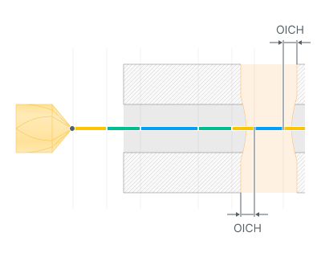

<strong>OICH</strong> - Offset inside cross-hole

<strong>Special part entry/exit feed.</strong> Allows you to make a separate feed/spindle speed for entering/exiting the part.

.png) .png)

.png) .png)

<strong>Step count.</strong> The number of steps before the main cut when entering or exiting <strong>the part.</strong>

 .png)

<strong>Step distance.</strong> Step length

 .png)

<strong>Reduce spindle speed.</strong> Reducing the spindle speed decreases the frequency and intensity of these vibrations, which lowers the stress on the cutting edges of the drill bit when entering or exiting <strong>the part.</strong>

### Parameters:

This tab contains the main parameters for controlling the part, workpiece, fixture and other items, which allow you to change the trajectory. [Details](100112.md)

### Links/Leads:

In the Links/Leads tab, you define the parameters for rapid movements. These movements include tool approach from the tool change position, engage to the start of the working stroke, retraction after the final cutting motion, transitions between working passes, and return to the tool change point. You can configure the sequence of movements along the coordinates, the trajectory of these motions, and the magnitude of displacements.

Click here to expand..

<strong>Сonsists of:</strong>

<strong>Approach/Return.</strong> This group of parameters manages the tool movements from the tool change position to the start of the engage toolpathes, and back. [Details](100116.md).

<strong>Safe motions.</strong> Defines the type of Safety Surface and the distance from the workpiece to it. This surface facilitates transitions between the processed surfaces or tool paths, and the first stage of approach or return occurs toward it. [Details](100117.md).

<strong>Advanced links settings.</strong> This group of parameters specifies the features of trajectory formation for primarily five-axis operations, considering optimal movements of rotational axes. [Details](100118.md).

<strong>Links.</strong> Defines the rules governing Entry/Exit links and links between work moves. [Details](100133.md).

<strong>Distances.</strong> Distances used in Links rules [Details](100141.md).

### Feeds/Speeds:

Using this dialogue the user can define the spindle rotation speed; the rapid feed value and the feed values for different areas of the toolpath. Spindle rotation speed can be defined as either the rotations per minute or the cutting speed. The defining value will be underlined. The second value will be recalculated relative to the defining value, with regard to the tool diameter. [Details](100142.md)

### Transformations:

Parameter's kit of operation, which allow to execute converting of coordinates for calculated within operation the trajectory of the tool. [Details](10168.md)

### Part:

A Part is a group of geometrical elements that defines the space to check for gouges. [Details](330.md)

### Workpiece:

A workpiece model of an operation defines the material to be machined. [Details](738.md)

### Fixtures:

As the Fixtures the fixing aids such as chucks, grips, clamps, etc., and the restriction areas of any other nature are usually specified. [Details](10283.md)
