# Leads for countouring operations

<strong>Sl</strong> - Safe level

<strong>LD</strong> - Leads

## Application Area:

Allows you to add additional engage and retract to the working moves using their feed.

<strong>Engage.</strong>

Click here to expand..

<strong>OFF.</strong> The <strong>Engage</strong> and <strong>Retract</strong> toolpath parts is not generated.

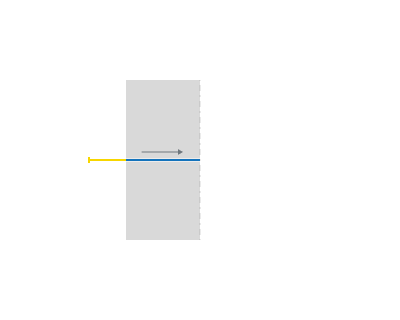

<strong>By Line.</strong>

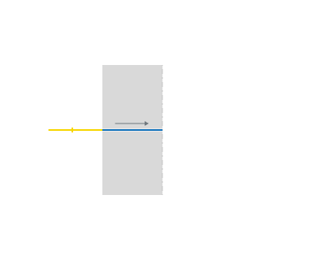

<strong>Length.</strong>

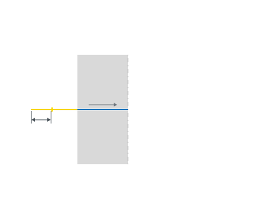

<strong>Angle.</strong>

<strong>By Arc.</strong>

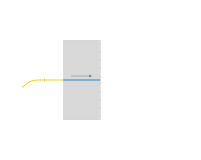

<strong>Radius.</strong>

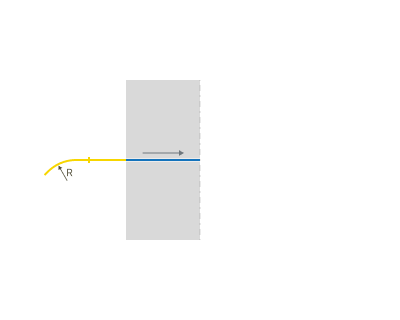

<strong>Angle.</strong>

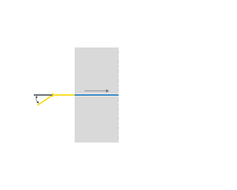

<strong>Retract.</strong>

Click here to expand..

<strong>OFF.</strong> The <strong>Engage</strong> and <strong>Retract</strong> toolpath parts is not generated.

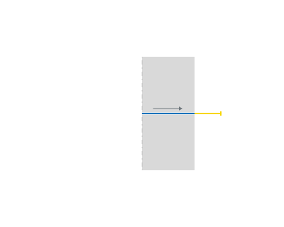

<strong>By Line</strong>

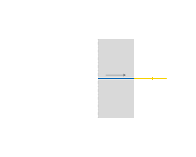

<strong>Length.</strong>

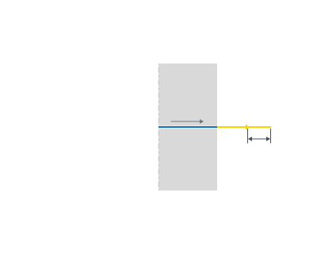

<strong>Angle.</strong>

<strong>By Arc.</strong>

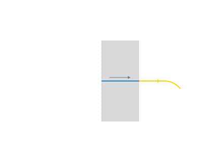

<strong>Radius.</strong>

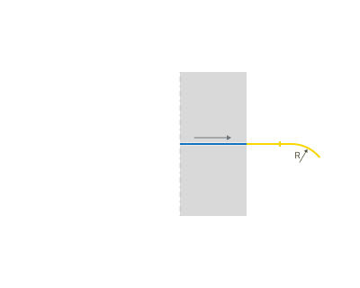

<strong>Angle.</strong>

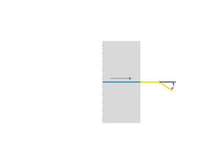

<strong>Exit overlap.</strong> An overlap is used to extend a toolpath beyond the contour itself. To change the overlap value you can either drag the yellow marker with the mouse or click on it and edit the dimension value which appears.

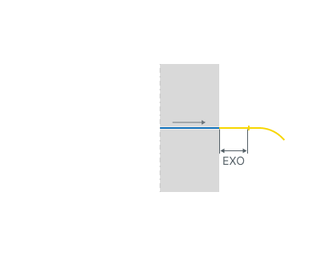

<strong>EXO</strong> - Exit overlap

<strong>Entry overlap.</strong> An overlap is used to extend a toolpath beyond the contour itself. To change the overlap value you can either drag the yellow marker with the mouse or click on it and edit the dimension value which appears.

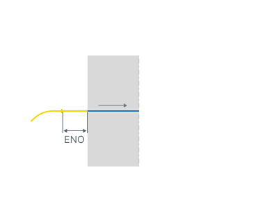

<strong>ENO</strong> - Entry overlap

<strong>Compensation on cut. Inlet segments</strong> are automatically added to the main approach paths of the compensated contour when the <strong>Compensation type</strong> is not set to <strong>Computer</strong>. By default, input/output segments are not added directly to the straight feed paths, as this would be technically impractical.

Click here to expand..

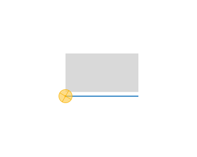 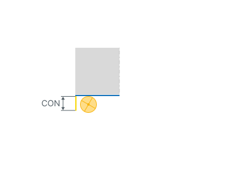

<strong>CON -</strong> Compensation on cut.

<strong>Length.</strong> Allows increasing inlet segment length.

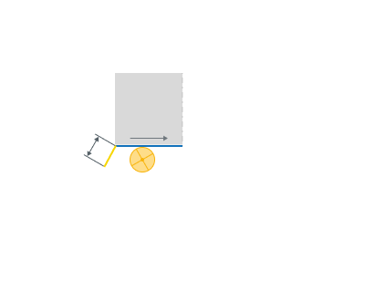

<strong>Angle.</strong> Allows increasing inlet segment angle.

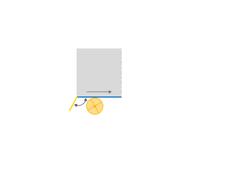

<strong>Compensation off cut. Outlet</strong> <strong>segments</strong> are automatically added to the main approach paths of the compensated contour when the <strong>Compensation type</strong> is not set to <strong>Computer</strong>. By default, input/output segments are not added directly to the straight feed paths, as this would be technically impractical.

Click here to expand..

 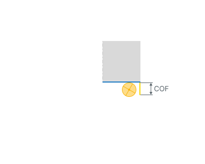

<strong>COF</strong> - Compensation on cut.

<strong>Length.</strong> Allows increasing outlet segment length.

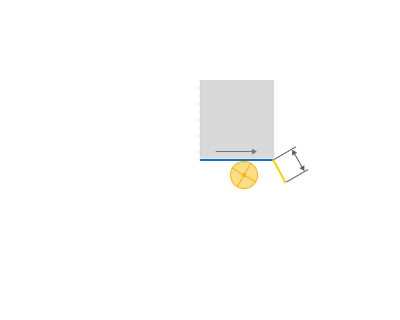

<strong>Angle.</strong> Allows increasing outlet segment angle.

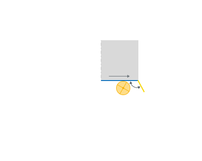

