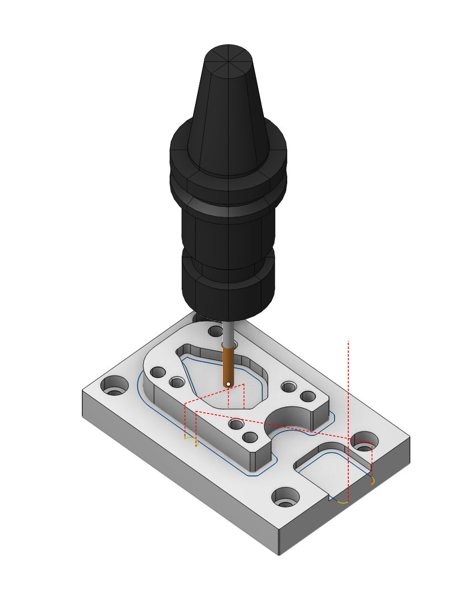

# 2.5D contouring

## Application area:

This operation extends the capabilities of the <strong>2D contouring</strong> operation in terms of machining multi-level contours of parts. Main the functionality of the <strong>2D contouring</strong> operation was preserved.

### Setup:

The <strong>Setup</strong> tab is used to configure the primary parameters of the project. This can involve the positioning of the part on the equipment, the coordinate system of the part, and more. [Details](1022.md)

### Job assignment:

<strong>Curve.</strong> Set work order along curve <strong>.</strong> [Details](707.md)

<strong>Pocket.</strong> A typical prismatic or turn-milling part consists of many simple shapes.To simplify this task, we can recognize the parts elements in a 3d model and automatically convert them to basic job assignment items, such as job zones and machining levels. [Details](10154.md)

<strong>Properties.</strong> Displays the properties of an element. It is possible to add the stock. You can also call this menu by double clicking on an item in the list.

<strong>Add tabs.</strong> Adds tabs along the contour.[Details](102012.md)

<strong>Delete.</strong> Removes an item from the list

<strong>Restrictions.</strong> It allows you to restrict areas that should not be machined. [Details](101231.md)

### Strategy:

The main parameters of the operation <strong>Strategy</strong> are described in the <strong>2D contour section</strong>. [Details](404.md)

### Parameters:

This tab contains the main parameters for controlling the part, workpiece, fixture and other items, which allow you to change the trajectory. [Details](100112.md)

### Links/Leads:

In the Links/Leads tab, you define the parameters for rapid movements. These movements include tool approach from the tool change position, engage to the start of the working stroke, retraction after the final cutting motion, transitions between working passes, and return to the tool change point. You can configure the sequence of movements along the coordinates, the trajectory of these motions, and the magnitude of displacements.

Click here to expand..

<strong>Сonsists of:</strong>

<strong>Approach/Return.</strong> This group of parameters manages the tool movements from the tool change position to the start of the engage toolpathes, and back. [Details](100116.md).

<strong>Safe motions.</strong> Defines the type of Safety Surface and the distance from the workpiece to it. This surface facilitates transitions between the processed surfaces or tool paths, and the first stage of approach or return occurs toward it. [Details](100117.md).

<strong>Advanced links settings.</strong> This group of parameters specifies the features of trajectory formation for primarily five-axis operations, considering optimal movements of rotational axes. [Details](100118.md).

<strong>Links.</strong> Defines the rules governing Entry/Exit links and links between work moves. [Details](100132.md).

<strong>Leads.</strong> Allows you to add additional engage and retract to the working moves using their feed. [Details](101147.md)

<strong>Distances.</strong> Distances used in Links rules. [Details](100138.md)

### Part:

A Part is a group of geometrical elements that defines the space to check for gouges. [Details](330.md)

### Workpiece:

A workpiece model of an operation defines the material to be machined. [Details](738.md)

### Fixtures:

As the Fixtures the fixing aids such as chucks, grips, clamps, etc., and the restriction areas of any other nature are usually specified. [Details](10283.md)
