# Face milling

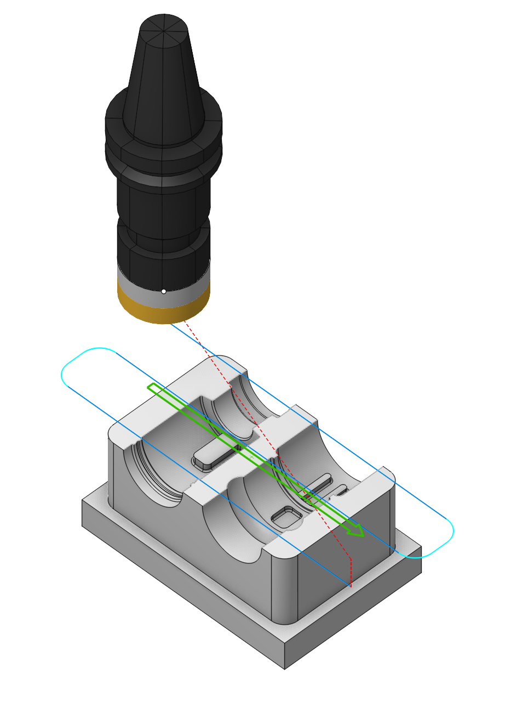

## Application area:

A facing operation removes workpiece material on a specified horizontal plane using one of the following strategies:

- One pass
- Parallel,
- Zigzag,
- Optimized zigzag,
- Spiral.

<strong>The geometry of the part is ignored, only the shape of the workpiece is taken into account during the operation calculation process.</strong> The part is not controlled for undercuts.

Material can be removed in multiple passes. In this case, the lower processing level is determined by default by the highest point of the part, and the upper level is determined by the highest point of the workpiece. The number of passes is calculated automatically depending on the distance between the upper and lower processing levels, the size of the finishing and the depth of the roughing passes. It is also possible to set the number of passes manually. In this case, the processing step will be recalculated.

### Setup:

The <strong>Setup</strong> tab is used to configure the primary parameters of the project. This can involve the positioning of the part on the equipment, the coordinate system of the part, and more. [Details](1022.md)

### Strategy:

<strong>Strategy.</strong>

This group allows the user to modify the primary parameters of the parallel passes strategy.

Click here to expand..

<strong>Type of Machining Strategy:</strong>

Click here to expand..

<strong>Spiral.</strong> The tool rolls into the workpiece using the so-called roll-in technique, then moves along the boundary of uncut material removing it like a round lawn mower. The maximum allowed width of cut and the tool engagement angle are never exceeded. The strategy is very good for removing large volumes of material in minimal time.

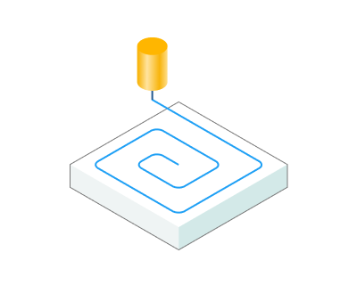

<strong>Optimized zigzag.</strong> The tool moves along zigzag trajectory. The link moves between zig- and zag- passes are also made in-material on the work feed to reduce machining time. The strategy is good for roughing and semi-finishing.

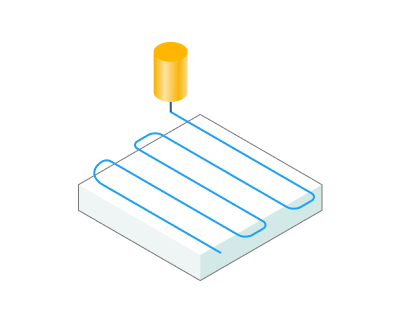

<strong>Zigzag.</strong> The tool moves along zigzag trajectory. The link moves between zig- and zag- passes are also made in-material on the work feed to reduce machining time. The strategy is good for roughing and semi-finishing.

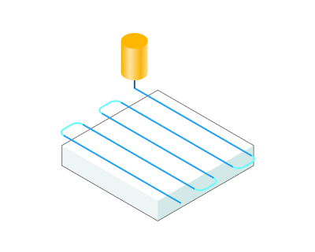

<strong>One way.</strong> The tool moves in parallel passes always in one direction depending on the milling type (climb/conventional). A work pass starts and ends outside the workpiece boundary. The link moves are made on the safe plane. With this strategy the best possible surface finish can be achieved.

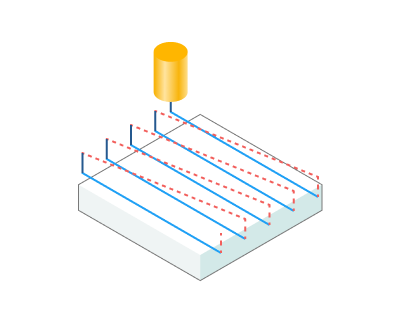

<strong>One pass.</strong> The tool makes exactly one pass in the center of the workpiece. The work pass starts and ends outside the workpiece boundary. Use this strategy when the diameter of the tool is bigger than the width of the workpiece.

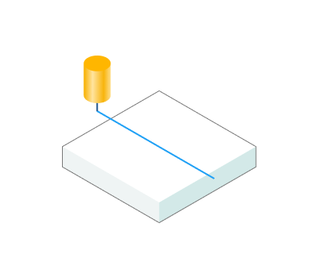

Here are the key parameters, the set of which may vary <strong>depending</strong> on the chosen strategy in the <strong>strategy</strong> section:

<strong>Step.</strong> The maximum allowed width of cut.

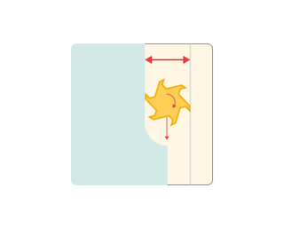

<strong>Smooth corners.</strong> Sharp corners in the toolpath are smoothed using the given radius.

.png) .png)

<strong>Angle.</strong> Assigns the cut angle direction for the plane operations.

<strong>Finall pass overlap.</strong> How much the periphery of the tool overlaps the workpiece at the final pass.

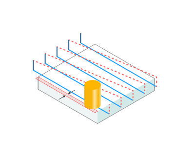

<strong>Milling type</strong>

Сan be assigned in almost all operations, except for the curve machining operations. This allows the user to control the required milling type (climb or conventional) during the toolpath calculation process. This parameter group works similarly to the <strong>Waterline roughing operation.</strong> [Details](736.md)

<strong>Sorting.</strong>

Controls the sequence of toolpath passes during the surface machining.

Click here to expand..

<strong>Start Point.</strong> The point defining the beginning of the plunge.

 

<strong>Machining levels.</strong>

It defines the range along tool axis for the machining. This parameter group works similarly to the <strong>Waterline roughing operation.</strong> [Details](736.md)

Click here to expand..

<strong>Axial stock.</strong> Stock to leave on the final level. Use positive values to leave excess material for subseqent machining or negative values if you want to remove material from the Part (gouge).

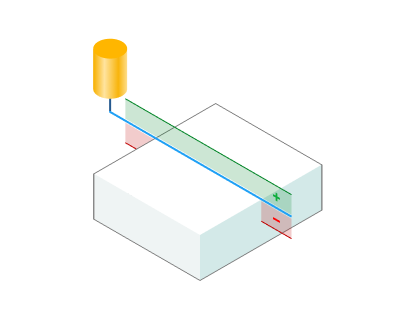

<strong>Nb. of passes</strong>

The number of machining passes. By default this is computed automatically based upon the top and the final levels for machining, the Cleanup height and the Depth Step.

Click here to expand..

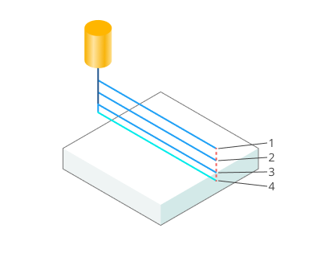

<strong>Cleanup height.</strong> The depth of the final pass can be controlled. Using a smaller final pass amount usually enables a better surface finish.

.png) .png)

<strong>Depth step.</strong> The maximum allowed stepover for the roughing passes.

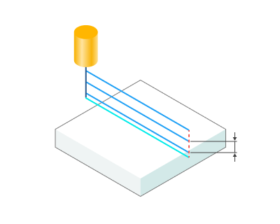

### Parameters:

This tab contains the main parameters for controlling the part, workpiece, fixture and other items, which allow you to change the trajectory. [Details](100112.md)

### Links/Leads:

In the Links/Leads tab, you define the parameters for rapid movements. These movements include tool approach from the tool change position, engage to the start of the working stroke, retraction after the final cutting motion, transitions between working passes, and return to the tool change point. You can configure the sequence of movements along the coordinates, the trajectory of these motions, and the magnitude of displacements

Click here to expand..

<strong>Сonsists of:</strong>

<strong>Approach/Return.</strong> This group of parameters manages the tool movements from the tool change position to the start of the engage toolpathes, and back. [Details](100116.md).

<strong>Safe motions.</strong> Defines the type of Safety Surface and the distance from the workpiece to it. This surface facilitates transitions between the processed surfaces or tool paths, and the first stage of approach or return occurs toward it. [Details](100117.md).

<strong>Advanced links settings.</strong> This group of parameters specifies the features of trajectory formation for primarily five-axis operations, considering optimal movements of rotational axes. [Details](100118.md).

<strong>Leads.</strong> Allows you to add additional engage and retract to the working moves using their feed. [Details](100148.md).

<strong>Distances.</strong> Distances required to switch feeds [Details](100146.md).

### Feeds/Speeds:

Using this dialogue the user can define the spindle rotation speed; the rapid feed value and the feed values for different areas of the toolpath. Spindle rotation speed can be defined as either the rotations per minute or the cutting speed. The defining value will be underlined. The second value will be recalculated relative to the defining value, with regard to the tool diameter. [Details](100142.md)

### Transformations:

Parameter's kit of operation, which allow to execute converting of coordinates for calculated within operation the trajectory of the tool. [Details](10168.md)

### Part:

A Part is a group of geometrical elements that defines the space to check for gouges. [Details](330.md)

### Workpiece:

A workpiece model of an operation defines the material to be machined. [Details](738.md)

### Fixtures:

As the Fixtures the fixing aids such as chucks, grips, clamps, etc., and the restriction areas of any other nature are usually specified. [Details](10283.md)
