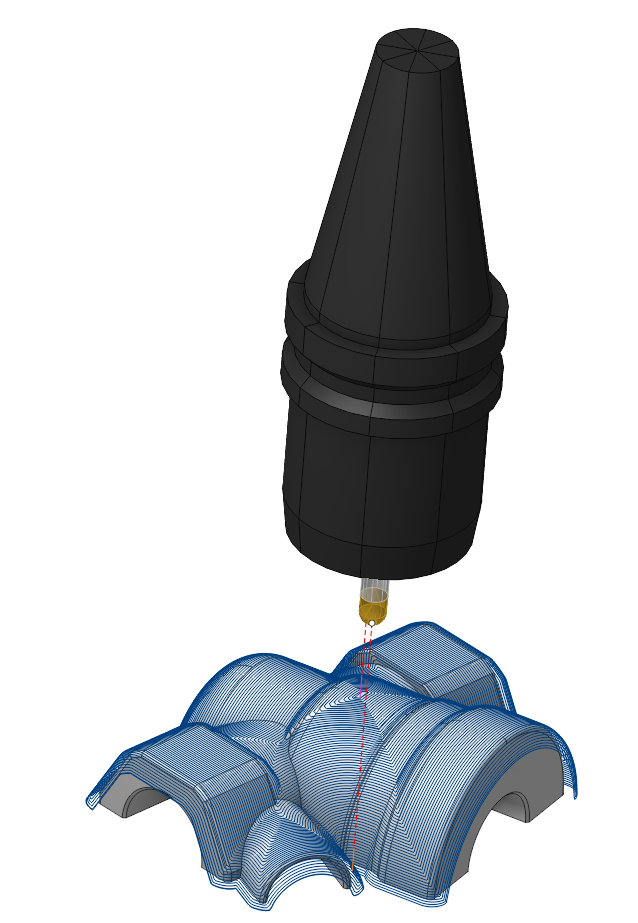
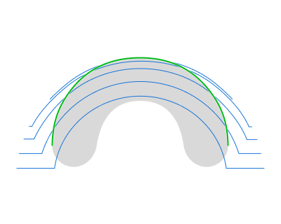
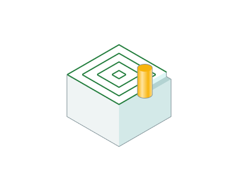
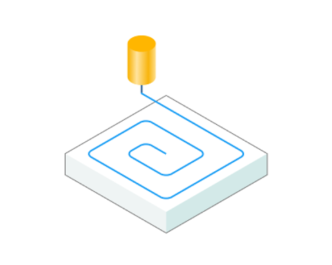

# Scallop

## Application area:

The Scallop toolpath starts from the curves lying on the part surfaces and is generated by repeatedly offsetting those curves inwards until the curves collapse. This method creates a toolpath similar to equidistant strategy So basically it is an equidistant toolpath except the offsetting occurs t in 3d space on the machining surfaces, not on a plane. The toolpath achieves a consistent scallop height regardless of the steepness of machining surfaces. Another advantage is the minimal amount of linking moves together with respected climb/conventional milling type. The operation is best suited for semi-finishing and finishing.

### Job assignment:

<strong>Machining Surfaces.</strong> Select various surfaces of the part as the working task. The system detects the starting curves as the curves of contact of the cutter with those surfaces.

<strong><strong>Tilt Curve.</strong></strong> This is t he curve that the tool axis vector aims at when setting <strong><strong>Tool Orientation</strong></strong> specification <strong><strong>Through Curve.</strong></strong>

<strong>Job Zone.</strong> Use the job zone to trim the passes outside the specified 2d containment areas. [Details](10151.md).

<strong>Restrict Zone.</strong> In addition to Job Zones in system you can use Restrict Zones geometry from curves and edges to specify the workpiece areas that should avoid machining in the current operation. The system generates restricted or cutted toolpath depending on the option you choose. [Details.](10152.md)

<strong>Properties.</strong> Displays the properties of an element. It is possible to add the stock. You can also call this menu by double clicking on an item in the list.

<strong>Delete.</strong> Removes an item from the list.

<strong>Restrictions.</strong> It allows you to restrict areas that should not be machined. [Details](101231.md)

### Strategy:

#### Strategy:

These parameters allows the user to achieve a required geometry of toolpath:

Click here to expand..

<strong>Start From.</strong> Parameters determining the construction of the initial toolpath curves.

<strong>Bottom</strong>. The toolpath begins at the <strong>Bottom Level</strong> of machining.

<strong>Top of Vertical Faces.</strong> The process begins with the <strong>silhouette</strong> <strong>curves</strong>, omitting the vertical walls.

<strong>Step.</strong> The maximum allowed width of cut

<strong>Spiral Machining</strong>. Setting the flag configures the toolpath as a continuous spiral to minimize links.

 

<strong>Smooth Corners.</strong> Setting the flag smooths sharp corners in the toolpath.

.png) .png)

<strong>Motph Passes.</strong> Activating the flag alters the strategy for creating the toolpath, resulting in a path with a consistent step. Also, w hen unprocessed "islands" exist within the <strong>Machining Surfaces</strong>, setting the flag enables the generation of toolparhes with smooth transitions from the "island" contours to the outer contours of the <strong>Machining Surfaces.</strong>

#### Milling Type:

This feature enables users to select the necessary milling direction (climb or conventional) during the toolpath calculation process.

The parameters of Milling Type are the same as in the <strong>Waterline Roughing operation</strong>. [Details.](736.md)

#### Sorting:

Controls the sequence of toolpath passes during surface machining.

Click here to expand..

<strong>Machining Direction.</strong> Controls the direction of tool motion on toolpath curves.

<strong>Inside-out.</strong> The tool transitions from the central toolpath curves to the outer ones.

<strong>Outside-in.</strong> The tool transitions from the outer toolpath curves to the central ones.

<strong>Start Point.</strong> The point defining the beginning of the plunge.

 

#### Machining Levels:

It defines the range along tool axis for the machining. Specify the <strong>Bottom Level</strong> as in the <strong>Waterline Roughing operation</strong>. [Details.](736.md)

#### 5 Axis Conversion:

You can control the tool's position when executing operations on a five-axis machine. [Details.](10141.md)

The parameters of <strong>Tool orientation</strong> are the same as in the <strong>5D Surfacing operation</strong>. [Details.](10135.md)

#### Limit Rotation Angles:

When the flag is set and the <strong>5 Axis Conversion</strong> option is on, it specifies the limit values of the tool's angular position relative to the axes. The parameters of <strong>Limit Rotation Angles</strong> are the same as in the <strong>5D Surfacing operation.</strong> [Details.](10135.md)

#### Trimming:

Allows for the skipping of surfaces not intended for machining and allows for the extension of the toolpath. The parameters of <strong>Trimming</strong> are the same as in the <strong>Waterline Roughing operation</strong>. [Details.](736.md)

### Parameters:

This tab contains the main parameters for controlling the part, workpiece, fixture and other items, which allow you to change the trajectory. [Details](100112.md)

### Links/Leads:

In the Links/Leads tab, you define the parameters for rapid movements. These movements include tool approach from the tool change position, engage to the start of the working stroke, retraction after the final cutting motion, transitions between working passes, and return to the tool change point. You can configure the sequence of movements along the coordinates, the trajectory of these motions, and the magnitude of displacements.

Click here to expand..

<strong>Сonsists of:</strong>

<strong>Approach/Return.</strong> This group of parameters manages the tool movements from the tool change position to the start of the engage toolpathes, and back. [Details](100116.md).

<strong>Links.</strong> Defines the rules governing Entry/Exit links and links between work moves. [Details](100130.md).

<strong>Leads.</strong> Allows you to add additional engage and retract to the working moves using their feed. [Details](100136.md).

<strong>Safe motions.</strong> Defines the type of <strong>Safety Surface</strong> and the distance from the workpiece to it. This surface facilitates transitions between the processed surfaces or tool paths, and the first stage of approach or return occurs toward it. [Details](100117.md).

<strong>Advanced links settings.</strong> This group of parameters specifies the features of trajectory formation for primarily five-axis operations, considering optimal movements of rotational axes. [Details](100118.md).

<strong>Distances.</strong> Distances used in Links rules [Details](100140.md).

### Feeds/Speeds:

Using this dialogue the user can define the spindle rotation speed; the rapid feed value and the feed values for different areas of the toolpath. Spindle rotation speed can be defined as either the rotations per minute or the cutting speed. The defining value will be underlined. The second value will be recalculated relative to the defining value, with regard to the tool diameter. [Details](100142.md)

### Transformations:

Parameter's kit of operation, which allow to execute converting of coordinates for calculated within operation the trajectory of the tool. [Details](10168.md)

### Part:

A Part is a group of geometrical elements that defines the space to check for gouges. [Details](330.md)

### Workpiece:

A workpiece model of an operation defines the material to be machined. [Details](738.md)

### Fixtures:

As the Fixtures the fixing aids such as chucks, grips, clamps, etc., and the restriction areas of any other nature are usually specified. [Details](10283.md)
