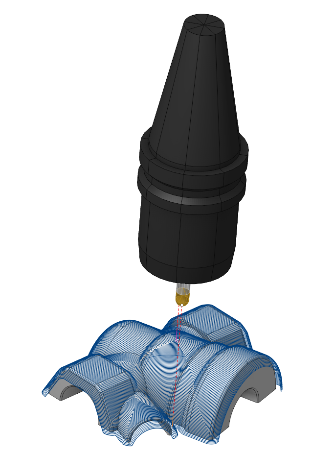
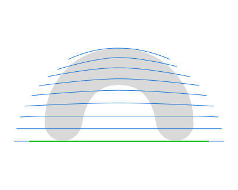
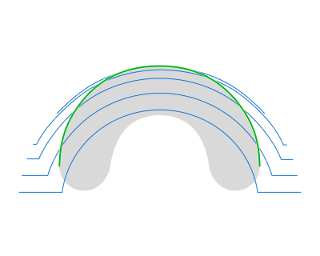
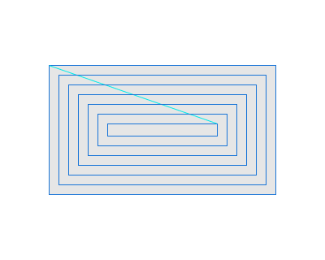
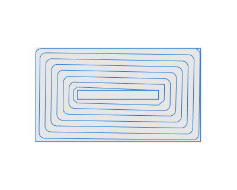
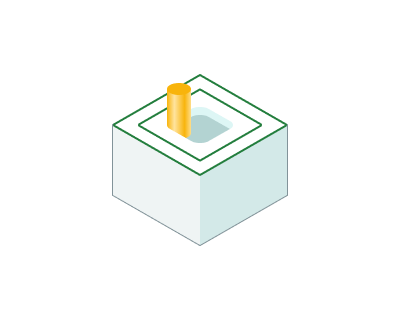
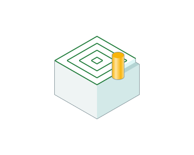
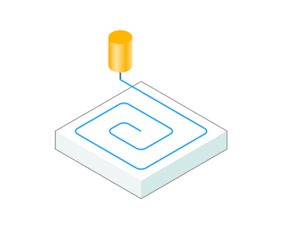
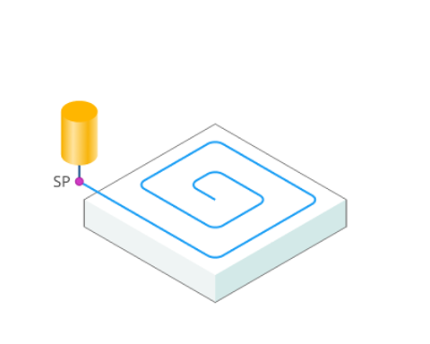

# スキャロップ仕上げ加工

## 適用分野：

スキャロップツールパスは、部品サーフェス上にある曲線から開始され、これらの曲線を内側に繰り返しオフセットしていき、最終的に曲線が消滅するまで生成されます。 この方法は等距離方法に似たツールパスを作成します。 基本的には等距離ツールパスですが、 オフセット は平面上ではなく、 加工面上の3次元空間で行われます。 このツールパスは、加工面の急峻さに関係なく、一貫したスキャロップの高さを実現します。もう一つの利点は、ダウンカット／アップカット加工タイプに応じた最小限のリンク移動量です。このオペレーションは中仕上げと仕上げに最適です。

## ジョブ割り当て：

<strong>加工面</strong> 部品のさまざまな面を加工対象として選択します。システムは、工具と対象面が接触する曲線をスタート曲線として検出します。

<strong>チルトカーブ</strong> 工具の向き を 通過カーブに設定した際に、工具軸ベクトルが向かう曲線です。

<strong>ジョブゾーン</strong>（加工領域） ジョブゾーンを使用して、指定された2D範囲外のパスをトリミングします。[詳細を見る](10151.md)

<strong>制限領域</strong> システム内のジョブゾーンに加えて、曲線やエッジから制限領域を使用して、現在のオペレーションで加工を避けるべきワーク領域を指定できます。システムは、選択したオプションに応じて、制限付きまたは切り取られた工具パスを生成します。 [詳細を見る](10152.md)

<strong>プロパティ</strong> 要素のプロパティを表示します。ストックを追加することも可能です。リスト内の項目をダブルクリックすることでも、このメニューを呼び出すことができます。

<strong>削除</strong> リストから項目を削除します。

<strong>制限</strong> 加工してはいけない領域を制限することができます。[詳細を見る](101231.md)

## 加工設定：

### 加工設定：

これらのパラメータにより、ユーザーは所望のツールパス形状を実現できます。

拡大

<strong>開始</strong> 初期ツールパス曲線の構築を決定するパラメータ

<strong>下から</strong> ツールパスは<strong>底部高さ</strong>から 加工を開始します 。

<strong>垂直面の上部</strong> ツールパスの開始には、シルエット曲線（ <strong>ジョブ割り当て</strong> の外部限界の輪郭を描くエッジと曲線のグループ）が含まれます。

<strong>ステップ</strong> 切削の最大許容幅

<strong>渦巻き加工</strong> このフラグを設定すると、ツールパスは連続的な渦巻きとして構成され、リンクを最小限に抑えます。

 

<strong>コーナーの円滑化</strong> フラグを設定することで、ツールパスの鋭角部分を滑らかにします。

 

<strong>モーフパス</strong> このフラグを有効にすると、ツールパスの作成方法が変更され、一貫したステップを持つパスが作成されます。また、 <strong>加工面</strong>内に未加工の「島」が存在する場合、このフラグを設定すると、「島」輪郭から<strong>加工面</strong>の外側輪郭へのスムーズな移行を伴うツールスが生成されます。

### ミーリングタイプ：

この機能により、ツールパス計算中に必要なフライス加工方向（ダウンカットまたはアップカット）を選択できます。

ミーリングタイプのパラメータは<strong>ウォータライン荒加工オペレーション</strong>と同様です。 [詳細を見る](736.md)

### 並べ替え

面加工中のツールパス順序を制御します。

拡大

<strong>加工方向</strong> ツールパス曲線上の工具の動作方向を制御します。

<strong>内側から外側</strong> 工具は中心のツールパス曲線から外側の曲線に移行します。

<strong>外側から内側</strong> 工具は外側のツールパス曲線から中心の曲線へ移動します。

<strong>開始点</strong> プランジの始まりを定義する点です。

 

### 加工深さ：

工具軸に沿った加工範囲を定義します。<strong>ウォータライン荒加工オペレーション</strong>のように<strong>底部高さ</strong>を指定します。[詳細を見る](736.md)

### 5軸変換：

5軸加工機で加工を実行する際に、工具の位置を制御することができます。[詳細を見る](10141.md)

<strong>工具方向</strong>のパラメータは、 <strong>5Dサーフェシングオペレーション</strong>と同様です。[詳細を見る](10135.md)

### 回転角度の制限：

<strong>回転角度の制限</strong>のパラメータは、 <strong>5Dサーフェシングオペレーション同様です。</strong> [詳細を見る](10135.md)

### トリミング

加工対象外の面をスキップすることを可能にし、 またツールパスの延長も可能にします。 <strong>トリミング</strong>のパラメータは、<strong>ウォータライン荒加工オペレーション</strong>と同様です。[詳細を見る](736.md)

<strong>パラメータ:</strong>

このタブには、部品、ワーク、治具、およびその他の項目を制御するための主要なパラメータが含まれており、工具軌跡（ツールパス）を変更できます。 [詳細を見る](100112.md)

<strong>リンク／リード</strong>

リンク／リードタブでは、早送り動作のパラメータを定義します。これらの移動には、工具交換位置からのアプローチ、切削パス開始点までの位置決め、最終切削後の退避動作、各パス間の移行移動、そして工具交換位置への復帰が含まれます。座標軸ごとの動作順序、各移動の軌跡、および移動量を設定できます。

拡大

<strong>次の項目で構成されます。</strong>

<strong>アプローチ／リターン</strong> このパラメータグループは、工具交換位置から切込み開始パスへの工具の移動、そして戻りの動作を管理します。[詳細を見る](https://confluence.encycam.com/pages/viewpage.action?pageId=131904799)

<strong>リンク</strong> 進入／退出リンクおよび加工パス間のリンクに関するルールを定義します。[詳細を見る](https://confluence.encycam.com/pages/viewpage.action?pageId=137006979)

<strong>リード</strong> 移動動作に対して、送り速度を使用して追加の突き込みおよび退避を追加できます。 [詳細を見る](https://confluence.encycam.com/display/SC1/.Leads+for+5-axis+operation+v19)

<strong>安全動作</strong> <strong>安全サーフェス</strong>のタイプとワークから安全サーフェスまでの距離を定義します。加工面またはツールパス間の移行を容易にし、アプローチまたはリターンの第1段階は、この面に向かって行います。[詳細を見る](100117.md)

<strong>高度なリンク設定</strong> このパラメータグループは、回転軸の最適な動きを考慮した、主に5軸オペレーションのための軌道形成の特徴を規定します。[詳細を見る](100118.md)

<strong>距離</strong> リンクのルールで使われる距離です。 [詳細を見る](https://confluence.encycam.com/pages/viewpage.action?pageId=137012802)

## 送り速度設定

このダイアログを使用して、ユーザーは主軸回転速度、早送り値、ツールパスの異なる領域の送り値を定義することができます。主軸回転速度は、毎分回転速度または切削速度として定義することができます。設定値は下線で示されます。第2の値は、工具径に関する定義値に対して再計算されます。[詳細を見る](https://confluence.encycam.com/pages/viewpage.action?pageId=137012551)

## 変換：

オペレーション内で計算された工具の軌跡に対して座標変換を実行できる工程のパラメータグループです。[詳細を見る](10168.md)

## パーツ：

パーツは、干渉をチェックする空間を定義する幾何要素のグループです。[詳細を見る](330.md)

## ワーク：

加工のワークモデルは、加工する素材を定義します。[詳細を見る](738.md)

## 治具：

治具として、チャック、グリップ、クランプなどの固定補助具と、その他の性質の制限領域が通常指定されます。[詳細を見る](10283.md)
