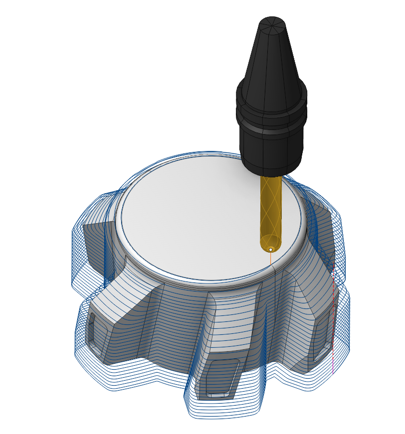

# 3D Helical

## Application area:

The operation generates continuous helical passes with the given vertical stepover between the top and the bottom level. It is effective when machining slope or vertical surfaces.

### Job assignment:

<strong><strong>Machining Surfaces.</strong></strong> Select various surfaces of the part as the working task. The system will calculate the trajectory based on the chosen surfaces.

<strong>Job Zone.</strong> Use the Job Zone to form the passes within or outside the specified 2d containment areas. [Details.](10151.md)

<strong>Restrict Zone.</strong> In addition to <strong>Job Zones</strong> in system you can use <strong>Restrict Zones</strong> geometry from curves and edges to specify the workpiece areas that s hould avoid machining in the current operation. [Details](10152.md)

<strong>Properties.</strong> Displays the properties of an element. It is possible to add the stock. You can also call this menu by double clicking on an item in the list.

<strong>Delete.</strong> Removes an item from the list.

<strong>Restrictions.</strong> It allows you to restrict areas that should not be machined. [Details](101231.md)

### Strategy:

These parameters allows the user to achieve a required toolpath:

#### Milling Type:

This feature enables users to select the necessary milling direction (climb or conventional) during the toolpath calculation process.

The parameters of the <strong>Milling Type</strong> are the same. as in the <strong>Waterline Roughing</strong> <strong>operation</strong>. [Details.](736.md)

#### Sorting:

Controls the sequence of toolpath passes during the surface machining.

Click here to expand..

<strong>Start from.</strong> Specifies the starting level for tool motion:

<strong>Bottom</strong>. The tool moves from the bottop to the top of the <strong>Job Assignment</strong> areas.

<strong>Top</strong>. The tool moves from the top to the bottom of the <strong>Job Assignment</strong> areas.

#### Step.

Material removed in one pass along the tool axis between the Top and Bottom levels. It i s a vertical distance between any two adjacent complete helix turns. This parameter group works similarly to the <strong>Waterline Roughing operation</strong>. [Details](736.md)[.](256.md)

#### Adjust Step:

The parameter changes the tool passes to allow machining to the defined level.

#### Smooth Radius:

When there is a sudden change of the tool direction, the milling control performs deceleration before starting the turn, and then accelerates again. This fact can lead to vibrations and high tool and milling machine wear. The problem can be solved if the toolpath has very few or no breaks. For this reason, in the system there is the toolpath smoothing function using the defined radius for machining inner or outer corners of the model.

#### Machining Levels:

It defines the range along tool axis for the machining. These parameters are the same as in the <strong>Waterline roughing operation</strong>. [Details.](736.md)

#### Trimming:

Allows for the skipping of surfaces not intended for machining. The parameters of <strong>Trimming</strong> are the same as in the <strong>Waterline Roughing operation</strong>. [Details.](736.md)

### Parameters:

This tab contains the main parameters for controlling the part, workpiece, fixture and other items, which allow you to change the trajectory. [Details](100112.md)

### Links/Leads:

In the Links/Leads tab, you define the parameters for rapid movements. These movements include tool approach from the tool change position, engage to the start of the working stroke, retraction after the final cutting motion, transitions between working passes, and return to the tool change point. You can configure the sequence of movements along the coordinates, the trajectory of these motions, and the magnitude of displacements.

Click here to expand..

<strong>Сonsists of:</strong>

<strong>Approach/Return.</strong> This group of parameters manages the tool movements from the tool change position to the start of the engage toolpathes, and back. [Details](100116.md).

<strong>Links.</strong> Defines the rules governing Entry/Exit links and links between work moves. [Details](100130.md).

<strong>Leads.</strong> Allows you to add additional engage and retract to the working moves using their feed. [Details](100136.md).

<strong>Safe motions.</strong> Defines the type of <strong>Safety Surface</strong> and the distance from the workpiece to it. This surface facilitates transitions between the processed surfaces or tool paths, and the first stage of approach or return occurs toward it. [Details](100117.md).

<strong>Advanced links settings.</strong> This group of parameters specifies the features of trajectory formation for primarily five-axis operations, considering optimal movements of rotational axes. [Details](100118.md).

<strong>Distances.</strong> Distances used in Links rules [Details](100140.md).

### Feeds/Speeds:

Using this dialogue the user can define the spindle rotation speed; the rapid feed value and the feed values for different areas of the toolpath. Spindle rotation speed can be defined as either the rotations per minute or the cutting speed. The defining value will be underlined. The second value will be recalculated relative to the defining value, with regard to the tool diameter. [Details](100142.md)

### Transformations:

Parameter's kit of operation, which allow to execute converting of coordinates for calculated within operation the trajectory of the tool. [Details](10168.md)

### Part:

A Part is a group of geometrical elements that defines the space to check for gouges. [Details](330.md)

### Workpiece:

A workpiece model of an operation defines the material to be machined. [Details](738.md)

### Fixtures:

As the Fixtures the fixing aids such as chucks, grips, clamps, etc., and the restriction areas of any other nature are usually specified. [Details](10283.md)
