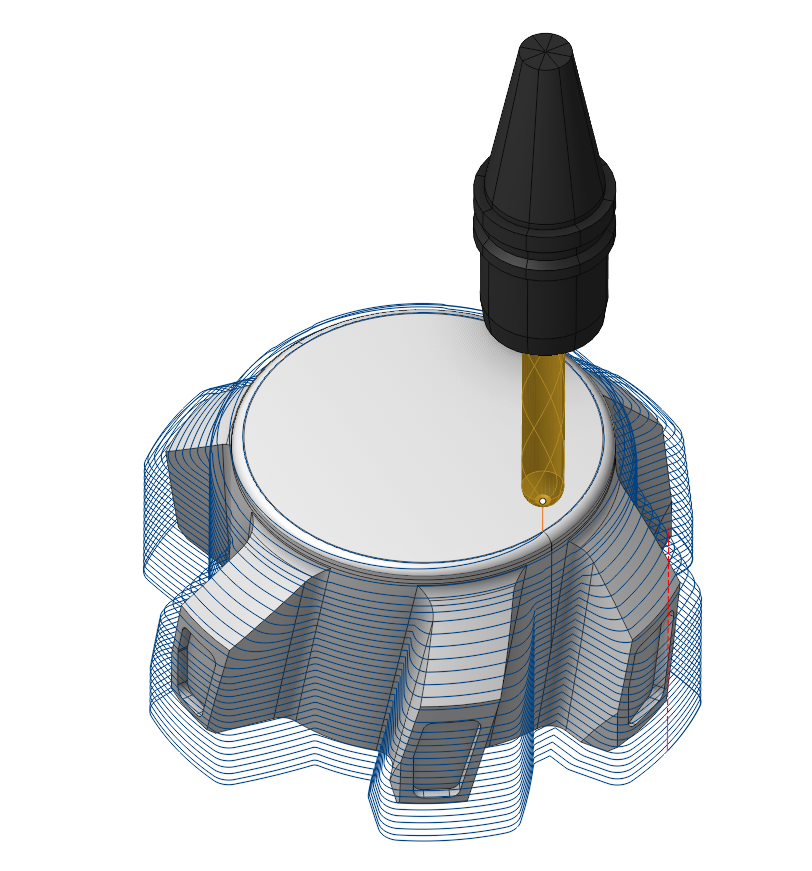

# 3Dヘリカル加工

## 適用分野：

このオペレーションは、上部高さと底部高さの間で指定された垂直切削ピッチを用いて、連続したヘリカルパスを生成します。傾斜面や垂直面の加工に適しています。

### ジョブ割り当て：

<strong>加工面</strong> 部品の任意の面を加工対象として選択します。システムは、選択されたサーフェスに基づいて軌道を計算します。

<strong>ジョブゾーン</strong>（加工領域） ジョブゾーンは、指定された2D範囲内または範囲外にパスを生成します。[詳細を見る](10151.md)

<strong>制限領域</strong> <strong>ジョブゾーン</strong> に加えて、曲線やエッジから作成した <strong>制限領域</strong> の要素を使用することで、現在のオペレーションで加工加工しないワーク領域を指定できます。 [詳細を見る](10152.md)

<strong>プロパティ</strong> 要素のプロパティを表示します。ストックを追加することも可能です。また、リスト内の項目をダブルクリックすることでも、このメニューを表示できます。

<strong>削除</strong> リストから項目を削除します。

<strong>制限</strong> 加工してはならない領域を制限することができます。[詳細を見る](101231.md)

### ミーリングタイプ：

次のパラメータで、必要なツールパスを設定できます。

#### ミーリングタイプ：

この機能により、ツールパスの計算プロセス中に、必要なフライス加工タイプ（ダウンカットまたはアップカット）を設定することができます。

ミーリングタイプのパラメータは <strong>ウォータライン荒加工オペレーション</strong>と同様です。[詳細を見る](736.md)

#### 並べ替え：

面加工中のツールパス順序を設定します。

詳細を表示

<strong>開始</strong> 工具動作の開始高さを指定します。

<strong>下から</strong> 工具は<strong>ジョブ割り当て</strong>領域の下から上に移動します。

<strong>上から</strong> 工具は<strong>ジョブ割り当て</strong>領域の上から下移動します。

#### ステップ。

上部高さと底部高さの間で、工具軸方向に一回のパスで除去される材料量を設定します。これは、隣接する２つのヘリカル加工１周分の回転間における垂直距離です。 このパラメーターグループは <strong>ウォーターライン荒取りオペレーション</strong>と同様に機能します。[詳細を見る](736.md)[ポケット加工](256.md)

#### ステップの調整：

このパラメータは、指定した 高さ まで加工できるように、 工具パスを調整 します。

#### 円滑化半径：

工具方向が急変する場合、フライス制御は回転開始前に減速し、その後再び加速します。この動作により、振動が発生しやすくなり、工具およびフライス盤の摩耗が増大する可能性があります。ツールパスの途切れを極力減らすことで、この問題は解決できます。このため、システムにはモデルの内側や外側のコーナーを加工する際に、指定された半径を用いてツールパスを滑らかにする機能があります。

#### 加工高さ：

工具軸に沿った加工範囲を定義します。このパラメータは、<strong>ウォータライン荒加工オペレーション</strong>と同様です。[詳細を見る](736.md)

#### トリミング：

加工対象外のサーフェスを スキップすることができます 。<strong>トリミング</strong>のパラメータは、<strong>ウォータライン荒加工オペレーション</strong>と同様です。[詳細を見る](736.md)

### パラメータ：

このタブには、部品、ワーク、治具、およびその他の軌跡に影響を与える要素を制御するための主要なパラメータが含まれており、ツールパスを変更できます。 [詳細を見る](100112.md)

### リンク／リード：

リンク／リードタブでは、早送り動作のパラメータを設定します。これらの移動には、工具交換位置からのアプローチ、切削パス開始点までの位置決め、最終切削後の退避動作、各パス間の移行移動、そして工具交換位置への復帰が含まれます。座標軸ごとの動作順序、各移動の軌跡、および移動量を設定できます。

詳細を表示

<strong>次の項目で構成されます。</strong>

<strong>アプローチ／リターン。</strong> このパラメータグループは、工具交換位置から進入動作の開始位置までの工具移動と、その復帰動作を管理します。[詳細](100116.md)。

<strong>リンク。</strong> 進入／退出リンクと加工動作間のリンクのルールを設定します。[詳細](100130.md)。

<strong>リード。</strong> 加工動作に、その送り速度を使用した追加の進入・退避動作を設定できます。[詳細](100136.md)。

<strong>安全動作</strong> <strong>安全サーフェス</strong>のタイプとワークから安全サーフェスまでの距離を設定します。このサーフェスは、加工サーフェスまたはツールパス間の移動を円滑にし、アプローチまたはリターンの最初の段階は、この面に向かって行います。[詳細を見る](100117.md)

<strong>高度なリンク設定</strong> このパラメータグループは、主に5軸加工において、回転軸の最適な動きを考慮した軌道形成の特性を指定します。[詳細を見る](100118.md)

<strong>距離。</strong> リンクのルールで使用する距離です。[詳細](100140.md)。

### 送り速度設定：

このダイアログでは、主軸回転速度、早送り速度、およびツールパスの各領域の送り速度を設定できます。主軸回転速度は、毎分回転数または切削速度のいずれかで指定できます。基準となる値には下線が表示されます。もう一方の値は、工具径を考慮して基準値から再計算されます。[詳細](100142.md)

### 変換：

オペレーション内で計算された工具の軌跡に対して座標変換を行うためのパラメータグループです。[詳細を見る](10168.md)

### パーツ：

パーツは、干渉をチェックする空間を定義する幾何要素のグループです。[詳細を見る](330.md)

### ワーク：

加工のワークモデルは、加工する素材を定義します。[詳細を見る](738.md)

### 治具：

治具には通常、チャック、グリップ、クランプなどの固定補助具と、その他の種類の制限領域を指定します。[詳細を見る](10283.md)
