# Pencil

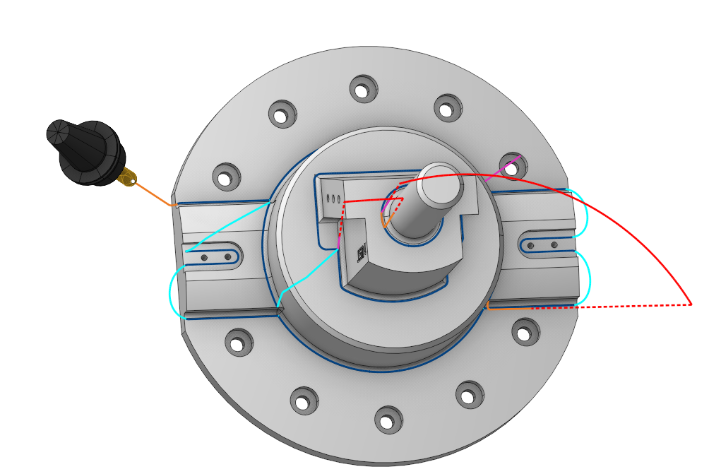

## Application Area:

The rest machining operation generates passes along inner corners of the part.

### Job Assignment:

<strong>Machining Surfaces.</strong> The passes are generated only on places where the tool contacts the machining surfaces. If the machining surfaces are missing, the toolpath is generated within the whole part.

<strong>Job Zone.</strong> Job zones are used to define the part areas that have to be machined by roughing and finishing milling operations. [Details](10151.md)

<strong>Restrict Zone.</strong> In addition to <strong>Job Zones</strong> in system you can use <strong>Restrict Zones</strong> to specify the workpiece areas that have not to be machined in the current operation. [Details](10152.md).

<strong><strong><strong>Tilt Curve.</strong></strong></strong> This is t he curve that the tool axis vector aims at when setting <strong><strong><strong>5 Axis Conversion</strong></strong></strong> specification <strong><strong>Through Curve.</strong></strong>

<strong>Properties.</strong> Displays the properties of an element. It is possible to add the stock. You can also call this menu by double clicking on an item in the list.

<strong>Delete.</strong> Removes an item from the list.

<strong>Restrictions.</strong> It allows you to restrict areas that should not be machined. [Details](101231.md)

### Strategy:

#### Strategy:

This group of parameters allows the user to achieve a required toolpath:

Click here to expand..

<strong>Angle Processing Method:</strong>

<strong>One pass.</strong> The system generates a single pass along every inner corner.

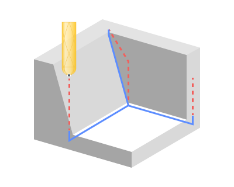

<strong>Parallel passes.</strong> The system g enerates multiple passes during the processing of a single inner corner. Each additional pass means a lateral shift of a one-pass strategy toolpath across the machining surface by a <strong>Step</strong> value. The maximum allowed width of cut

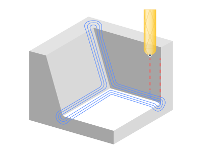

<strong>Bitagency Angle.</strong> This parameter is used to limit the edges detect by the operation. It is the angle between two points where the part's surfaces and the tool's cutting edges simultaneously make contact. The tool will operate within zone inside this angle.

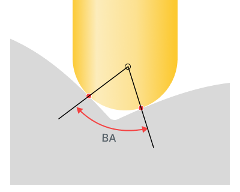

<strong>Step.</strong> The maximum allowed width of cut.

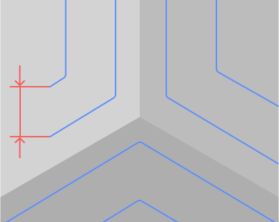

<strong>Nb. of passes.</strong> The number of passes along the corner. This number of passes extends on each side from the middle of the corner.

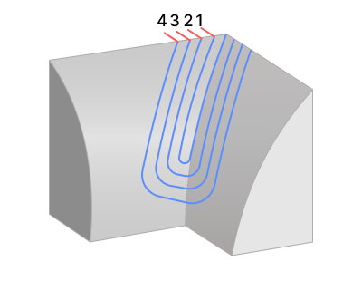

Machine by strokes. When the option is disabled, CAM system attempts to consolidate the machining of multiple corners in areas permitting a smooth transition.

Activating the flag separates the toolpath into regions, allowing for the independent processing of different corners wherever a smooth transition between corners can occur.

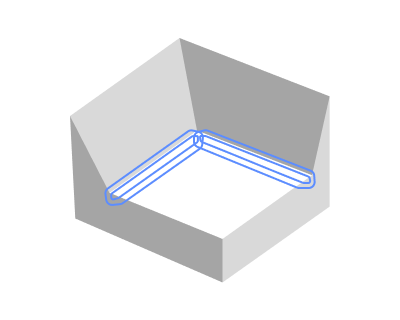

<strong>Connection angle.</strong> It is the sharpest angle between connected passes. If the angle between the corners being machined is greater than this value, the toolpath for these corners will be separated.

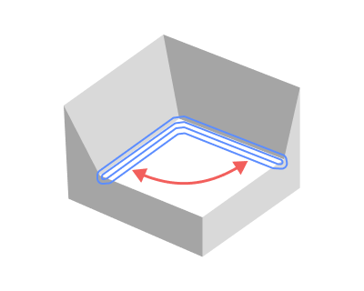

#### Milling type:

Сan be assigned in almost all operations, except for the curve machining operations. This allows the user to control the required milling type (climb or conventional) during the toolpath calculation process. This parameter group works similarly to the <strong>Waterline roughing operation.</strong> [Details](736.md)

#### Sorting:

Controls the sequence of toolpath passes during the surface machining.

#### Machining Slopes:

Determines areas for machining based on the gradient of the corners generatrix lines.

Click here to expand..

<strong>All.</strong> The system p rocesses both shallow and steep areas.

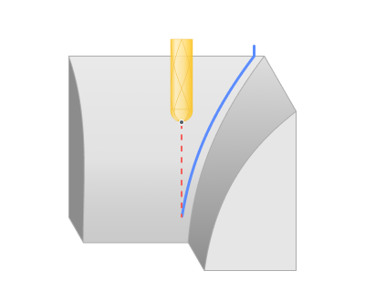

<strong>Shallow.</strong> The system p rocesses only the shallow areas.

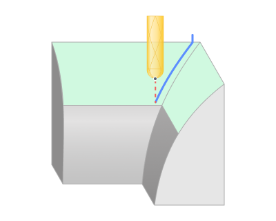

<strong>Steep.</strong> The system p rocesses only the steep areas.

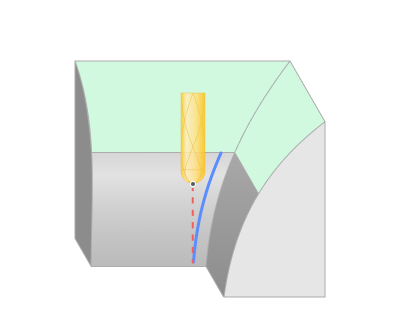

<strong>Steep/shallow split angle.</strong> The angle that separates the shallow from the steep areas.

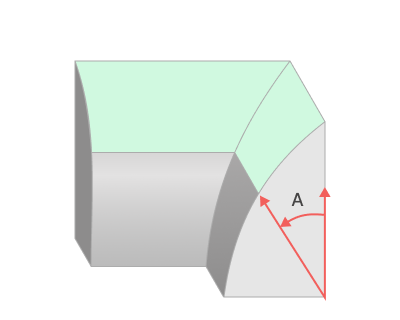

#### Machining Levels:

It defines the range along tool axis for the machining. [Details](10153.md). Specify the <strong>Bottom Level</strong> as in the <strong>Waterline Roughing operation</strong>. [Details](736.md)

#### 5 axis conversion:

Controls tool axis orientation. [Details](10141.md). The principal parameters of this function are the same as in the <strong>5D Surfacing operation</strong>. [Details](10135.md)

#### Trimming:

Allows for the skipping of surfaces not intended for machining and allows for the extension of the toolpath. The parameters of <strong>Trimming</strong> are the same as in the <strong>Waterline Roughing operation</strong>. [Details](736.md)

### Parameters:

This tab contains the main parameters for controlling the part, workpiece, fixture and other items, which allow you to change the trajectory. [Details](100112.md)

### Links/Leads:

In the Links/Leads tab, you define the parameters for rapid movements. These movements include tool approach from the tool change position, engage to the start of the working stroke, retraction after the final cutting motion, transitions between working passes, and return to the tool change point. You can configure the sequence of movements along the coordinates, the trajectory of these motions, and the magnitude of displacements.

Click here to expand..

<strong>Сonsists of:</strong>

<strong>Approach/Return.</strong> This group of parameters manages the tool movements from the tool change position to the start of the engage toolpathes, and back. [Details](100116.md).

<strong>Links.</strong> Defines the rules governing Entry/Exit links and links between work moves. [Details](100130.md).

<strong>Leads.</strong> Allows you to add additional engage and retract to the working moves using their feed. [Details](100136.md).

<strong>Safe motions.</strong> Defines the type of <strong>Safety Surface</strong> and the distance from the workpiece to it. This surface facilitates transitions between the processed surfaces or tool paths, and the first stage of approach or return occurs toward it. [Details](100117.md).

<strong>Advanced links settings.</strong> This group of parameters specifies the features of trajectory formation for primarily five-axis operations, considering optimal movements of rotational axes. [Details](100118.md).

<strong>Distances.</strong> Distances used in Links rules [Details](100140.md).

### Feeds/Speeds:

Using this dialogue the user can define the spindle rotation speed; the rapid feed value and the feed values for different areas of the toolpath. Spindle rotation speed can be defined as either the rotations per minute or the cutting speed. The defining value will be underlined. The second value will be recalculated relative to the defining value, with regard to the tool diameter. [Details](100142.md)

### Transformations:

Parameter's kit of operation, which allow to execute converting of coordinates for calculated within operation the trajectory of the tool. [Details](10168.md).

### Part:

A Part is a group of geometrical elements that defines the space to check for gouges. [Details](330.md)

### Workpiece:

A workpiece model of an operation defines the material to be machined. [Details](738.md)

### Fixtures:

As the Fixtures the fixing aids such as chucks, grips, clamps, etc., and the restriction areas of any other nature are usually specified. [Details](10283.md)
